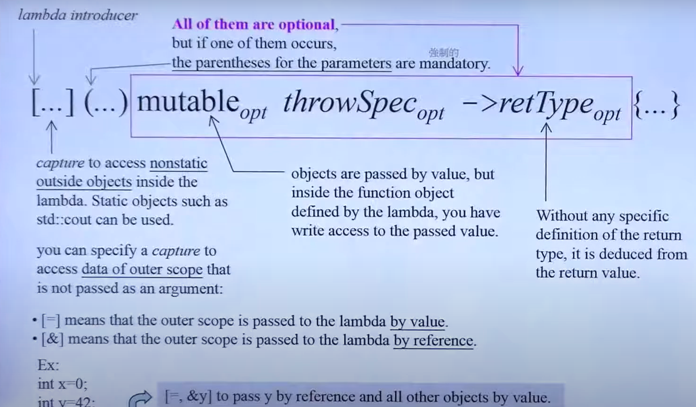

# C++ 新特性

## 四种类型转换

### static_cast

```c++
//基础数据类型之间的转换
int a = 65;
char ch = static_cast<char>(a);
cout << ch;//A

class Base{
    virutal test();
};
class Derived : Base{
    virtual test();
};
Derived *d = new Drived();
Base *b = static_cast<Base*>(d);

//父类和子类之间的转换，子类转父类是安全的，父类转子类是不安全的
```

类似与C语言的强制类型转换，可以用在基础数据类型之间的转换和父类和子类之间的转换 父类指针和子类指针之间的转换最好使用dynamic_cast.

### dynamic_cast

用于含有虚函数的类之间向上、向下和侧向之间的转换

```c++
Base* pb = new Sub();
Sub* ps1 = static_cast<Sub*>(pb);  //子类->父类，静态类型转换，正确但不推荐
Sub* ps2 = dynamic_cast<Sub*>(pb); //子类->父类，动态类型转换，正确

Base* pb2 = new Base();
Sub* ps21 = static_cast<Sub*>(pb2); //父类->子类，静态类型转换，危险！访问子类_name成员越界
Sub* ps22 = dynamic_cast<Sub*>(pb2);//父类->子类，动态类型转换，安全，但结果为NULL 
```

### const_cast

const_cast的作用就是将**常量指针转换为普通的指针**

### reinterpret_cast

`重新解释`，几乎什么都能转，但是可能会出问题。

## Variadic Templates

`...`就是一个pack(包)
用于模板参数就是模板参数包
用于函数参数类型就是函数参数类型包
用于函数参数就是函数参数包

`sizeof...(args)`获得参数数量
数量不定的模板参数

```c++
template<typename T, typename... Types>
void print(const T& firstArg, const Types&... args){
    cout << firstArg << endl;
    print(args);
}
```

### 递归函数调用

入口函数

```c++
template<typename... Types>
inline size_t hash_val(const Types&... args){
    size_t seed = 0;
    hash_val(seed, args...);
    return seed;
}
```

递归函数

```c++
template<typename T, typename... Types>
inline void hash_val(size_t& seed, const T& val, const Types&... args){
    hash_combine(seed, val);
    hash_val(seed, args...);
}
```

出口函数

```c++
template<typename T>
inline void hash_val(size_t& seed, const T& val){
    hash_combine(seed, val);
}
```

**从入口函数进入，通过递归函数对参数包解包直到调用到出口函数为止**

### 递归继承.Tuple

```c++
template<typename... Values> class tuple;//泛化模板
template<> class tuple<> {};//出口

template<typename Head, typename... Tail>
class tuple<Head, Tail...>
    :private tuple<Tail...>
{
    typedef tuple<Tail...> inherited;
public:
    tuple(){}
    tuple(Head v, Tail... vtail)
        :m_head(v), inherited(vtail...){}
    
    typename Head::type head() { return m_head;}
    inherited& tail() {return *this;}
        
protected:
    Head m_head;
}
```

## nullptr and std::nullptr_t, automatic type

`nullptr`是一个关键字，其类型是`nullptr_t`，而`NULL`内部定义是整数类型的0

```c++
void f(int);
void f(void*);

f(0);//调用f(int)
f(NULL);//调用f(int)
f(nullptr); //调用f(void*)
```

## 统一初始化

直接在变量名后加大括号

```c++
int values[] {1, 2, 3, 4};
vector<int> v{2, 3, 5, 5};
vector<string> cities{"sdf", "af", "adsf"};
```

编译器看到`{t1, ...,tn}`内部做出一个`initializer_list<T>`。 构造函数有一个版本接受这种形式。
**如果构造函数中不接受这种形式，编译器会将`initializer_list<T>`拆解**


`initializer_List<T>`实际上就是一个`array`

```c++
template<class _E>
class initializer_list{
public:
    typedef _E* iterator;
private:
    iterator _M_array;
    size_type _M_len;
    //私有的构造函数由编译器调用
    ctor()
    ....

};
```

## Range-based for statement

## `=default, =delete`

强制加上`=default`, 重新获得并使用**默认函数**

```c++
class Zoo
{
public:
    Zoo(int i): _i(i){}
    Zoo(Zoo&)=default;
    Zoo(Zoo&&)=default;//move ctor
    Zoo& operator=(const Zoo&)=default;
}

```

### Big Three
编译器为 **构造函数**、**赋值函数**、**析构函数**设置默认的函数

### No Copy, NoDtor

```c++
struct NoCopy{
    NoCopy(const NoCopy&)=delete;
    NoCopy& operator()=(const NoCopy&)=delete;
};
```

```c++
struct PrivateCopy{
private:
    PrivateCopy(const PrivateCopy&);
    PrivateCopy& operator()=(PrivateCopy NoCopy&);
public:
    ...
}

```

## Alias

### Alias Template
`typedef`不接受参数

```c++
template<T>
using vec=vector<T, myAlloc<T>>;
```

### Type Alias

类似与typedef

## noexpect

函数后`noexpect`表示该函数不会发出异常
```c++
void foo() noexpect;等价于 void foo() noexpect(true)
```

## override

让编辑器检查父类函数重写是否出错
```c++
class test{

    virtual void funtion(int) override{};
};
```

## final

- 不允许父类被重写
  ```c++
    struct base final{};
  ```
- 不允许函数被重写
    ```c++
    struct test{
        virtual void function() final;
    };
    ```

## decltype

得到一个表达式(可以是对象)的类型

**auto + decltype**

```c++
map<string, float> mp;
decltype<mp>::value_type elem;
```

- 声明返回类型
  ```c++
    template<typename T1, typename T2>
    auto add(T1 x, T2, y)->decltype(x + y);
  ```
- 元编程中使用
- 传递lambda的类型
  ```c++
    auto cmp=[](const Person &p1, const Person &p2)
    {
        return p1.name < p2;
    };
    ....
    std::set<Person, decltype(cmp)> coll(cmp);
  ```

  ## Lambdas！！！

  Lambdas相当于一个匿名的**仿函数**，其返回值是一个对象

  **语法**：[...](...) mutable throwSpec ->retType {...}

  
