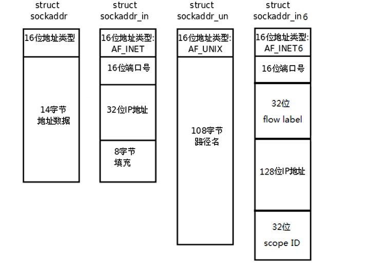

# 概述

- 预备   Linux
- 第一章 Linux系统编程入门
- 第二章 Linux多进程开发
- 第三章 Linux多线程开发
- 第四章 Linux网络编程
- 第五章 项目实战

# Linux系统编程入门

## Linux开发环境搭建

**公钥私钥** 
> 避免频繁登录账号密码

```shell
ssh-keygen -t ras//.ssh目录下生成公钥和私钥
```

将本地的公钥注册到服务器`.ssh`目录下的`authorized_keys`文件中


## 静态库的制作
静态库是程序在链接阶段被复制到了程序里

动态库是程序运行时动态加载内存中供程序调用

**命名规则**：

- Linux：`libxxx.a`
  - lib前缀固定
  - xxx库名
  - .a后缀固定
- Windos:libxxxx.lib    

**Linux静态库的制作**
- `gcc`获得`.o`文件
- 将`.o`文件打包，使用`ar`工具（archive）
  `ar rcs libxxx.a xxx.o xxx.o`
  - r 将文件插入备存文件中
  - c 建立备存文件
  - s 索引

`gcc`参数
- c：只汇编不链接
- I：指定头文件路径
- l：指定库名
- L：指定库文件路径

## 动态库的制作


**命名规则**：

- Linux：`libxxx.so`
  - lib前缀固定
  - xxx库名
  - .so后缀固定
- Windos：libxxxx.dll   

**Linux动态库的制作**
- `gcc`获得`.o`文件，得到和位置无关的代码
  `gcc -c -fpic/-fPIC a.o b.o`
- `gcc`得到动态库
  `gcc -shared a.o b.o -o libcalc.so`
  
- 可以通过`ldd`查看动态库依赖关系
- 在`LD_LIBRARY_PATH`中配置动态库路径

## Makefile

> Makefile文件定义了一系列规则来指定哪些文件先编译，哪些文件后编译，以及哪些文件重新编译等

**Makefile规则**:

- 一个Makefile文件可以有一个或多个规则
  目标 ...: 依赖 ...
       命令 (Shell 命令)
       ...
  - 目标：最终要生成的文件
  - 依赖：生成目标所需要的文件或是目标
  - 命令：通过执行命令对依赖操作生成目标
- Makefile中的其他规则都是为第一条规则服务的

**Makefile工作原理**：

- 查找目标的依赖是否存在
  - 存在则执行命令
  - 不存在，向下查找能生成该依赖的规则
- 检测更新
  - 如果依赖文件比目标文件时间晚，则重新执行命令
  - 否则不执行

**Makefile扩展**：

- 预定义变量：
  - `AR`
  - `CC`
  - `$@`：目标的完整名称
  - `$<`：第一个依赖文件的名称
  - `$^`：所有依赖文件的名称
- 函数
  - `$(wildcard PATTERN...)` 获取指定目录下指定类型的文件列表
  - `$(patsubst <pattern>, <replacement>, <text>)` 查找`<text>`中的单词是否匹配`<pattern>`如果匹配则替换成`<replacement>`

## 标准C库IO函数和Linux系统IO函数对比

- C库IO函数是跨平台的， 比如`fopen`函数底层调用了不同操作的`open`函数。所以Linux系统IO函数更底层
- C库IO函数实现了缓存区，减少了读取磁盘的次数

## 文件描述符

PCB（进程控制块）存放在内核区，其中存放了**文件描述符表**
文件描述表默认1024个文件，前三个分别是：
- `STDIN_FILENO` 标准输入
- `STDOUT_FILENO` 标准输出
- `STDERR_FILENO` 标准错误
均指向当前终端，默认是打开状态

## Linux IO函数

**打开关闭文件函数**
```c
#include <sys/types.h>
#include <sys/stat.h>
#include <fcntl.h>
//打开一个存在的文件
int open(const char *pathname, int flags);
    /*
      参数：
          flags: O_RDONLY, O_WRONLY, O_RDWR

      返回值：文件描述符
            失败返回- 1
        errno是Linux的一个全局变量，记录最近的错误序号
        perror(char*)打印错误信息
    */

//创建一个新文件
int open(const char *pathname, int flags, mode_t mode);
```

**读写文件函数**：

```c
  #include <unistd.h>
  ssize_t read(int fd, void *buf, size_t count);
  /*
      参数：
          fd:文件描述符，用来操作文件通过open函数获取
          buf：指定一个缓存区（通常是数组）存放读取的数据
          count：指定缓存区的大小
      返回值：
          成功: > 0 读到数据
               = 0 已经读完数据
          失败：-1 
  */
  #include <unistd.h>
  ssize_t write(int fd, const void *buf, size_t count);
  /*
      参数：
          fd:文件描述符，用来操作文件，通过open函数获取
          buf:指定一个缓存区，将其中的内容写入到fd指定的文件中
          count:缓存区大小
      返回值：
          成功：> 0
          失败： - 1
  */
```

**lseek函数**：

```c
  #include <sys/types.h>
  #include <unistd.h>
  off_t lseek(int fd, off_t offset, int whence);
  /*
      参数： 
          fd：文件描述符，通过open函数获取
          offset：偏移量，用来指定文件读写指针的偏移
          whence: 
                SEEK_SET: 将文件偏移设置到offset处
                SEEK_CUR: 将文件偏移设置到当前位置+offset处
                SEEK_END: 将文件偏移设置到文件末尾+offset处
      返回值：文件当前偏移

      作用：1、获取文件头
            lseek(fd, 0, SEEK_SET)
            2、获取文件长度
            lseek(fd, 0, SEEK_END)
            3、扩展文件
            lseek(fd, offset, SEEK_END)
  */
```


# Linux多线程开发

## 进程创建

```c
  #include <sys/types.h>
  #include <unistd.h>
  pid_t fork(void);
  /*
      参数：无
      返回值: 返回两次

            父进程：成功时，返回子进程的p_id，失败返回-1
            子进程: 返回 0
  */

```

## 父子进程虚拟地址空间

从**低地址到高地址**，一个程序由**代码段**、**数据段**、**BSS段**、**堆**、**共享区**、**栈**等组成。

- 代码段：存放程序的机器指令
- 数据段：存放**已被初始化的**全局变量和静态变量
- BSS段：存放**未被初始化的**全局变量和静态变量
- 运行时有**堆**、**栈**
- 共享库：位于堆和栈中间

父进程`fork()`一个子进程时，子进程与父进程具有相同的用户区空间，不同的内核区（比如pid不同，但是文件描述符相同）。

`fork()`函数采用了**读时共享写时复制**的技术。即读数据的时候，子进程与父进程共享一个用户区空间，只有写数据时，系统再给子进程复制一份父进程的用户区空间

**总结**：

- 不同点:
  - 返回值不一样
    - 父进程 > 0 : 返回的时子进程的pid
    - 子进程 = 0
  - 内核区一些数据
    - pid、ppid等
- 相同点：某些状态下相同
  - 读时共享，写时拷贝

## GDB多线程调试

**添加gdb调试**
`gcc xxx.c -o xxx -g`

**gdb常见命令**：

- l：显示代码
- b x : 在x行添加断点
- i b ：显示断点信息
- r ：调试运行
- n : 下一步
- c : 继续调试
  
**设置调试父进程或子进程**：`set follow-fork-mod`

**设置调试模式**：`set detach-on-fork [on | off]`

- `on` 表示调试当前进程的时候，其它的进程继续进行
- `off`表示调试当前进程的时候，其它进程被GDB挂起

**查看调试的进程**：`info inferiors`
**切换当前调试的进程**：`inferiors id`
**使进程脱离GDB调试**：`detach inferiors id`

## exec函数族

exec函数族的作用是根据指定的文件名找到可执行文件，并用它来取代调用进程的内容

```c
#include <unistd.h>
int execl(const char *path, const char *arg, ...)//l(list) 参数地址列表，以空指针结尾
/*
    参数:
        path: 文件路径（绝对路径或相对路径）
        arg: 可执行文件的参数，第一个参数无意义通常是文件名， 最后要以NULL结尾
    返回值: 失败时返回-1
*/


int execlp(const char *file, const char *arg, ...)//p(path) 存有各参数地址的指针数组的地址
/*
    参数:
        file: 文件名(从环境变量中找可执行文件)
        arg: 可执行文件的参数，最后要以NULL结尾
    返回值: 失败时返回-1
*/
```

## 孤儿进程、僵尸进程、进程回收

孤儿进程：子进程尚未运行结束，但父进程已经运行结束了。将子进程的管理委托给init进程。无危害

僵尸进程：子进程结束后，父进程还未回收子进程的PCB资源。有危害

```c
#include <sys/types.h>
#include <sys/wait.h>

pid_t wait(int *wstatus);
/*
  wait函数将调用的父进程挂起，直到其某一个子进程状态改变
  参数：
      *wstatus： 退出相关的宏函数
  返回值:
      > 0 ： 状态改变的子进程的pid
      - 1 : 所有的子进程都已经结束
*/

pid_t waitpid(pid_t pid, int *wstatus, int options);
  /*
    参数：
        pid : > 0 指定回收的pid
              = -1 回收任意一个子进程pid(wait函数)
              = 0  回收调用进程所在组的pid
              > - 1 指定回收的进程组pid
        options : = 0 阻塞
                WNOHANG 不阻塞，立刻返回
                。。。

  */
```

**总结** :

- 进程的创建
  - fork()
  - 父子进程的虚拟地址空间
  - 多线程调试
- exec函数族
- 孤儿进程、僵尸进程、进程回收
  - wait
  - waitpid

## 进程通信

### 匿名管道

```c
#include <unistd.h>
int pipe(int pipefd[2]);
/*
    参数 : 
        pipefd[2] ： 返回值， pipefd[0]读端, pipefd[1]写端

    返回值:
        成功 : 0
        失败 : -1 
*/

```

### 有名管道

**注意点**：一个为只读打开管道的进程会被阻塞，直到另一个进程为只写打开管道；一个为只写打开管道的进程会被阻塞，直到另一个进程为只读打开管道；


有名管道是一个特殊的文件（伪文件-不占用硬盘的空间，只是在内存中作用。通过内核去管理调用）。
- 读管道:
  - 读到数据时：返回实际读到的大小
  - 读不到数据时: 
    - 如果写端全部关闭，返回0
    - 如果没有全部关闭，读端阻塞
- 写管道：
  - 如果读端全部关闭， 进程异常终止
  - 读端没有全部关闭
    - 管道满，写端阻塞
    - 管道没满，返回实际写入的大小

### 内存映射

```c
#include <sys/mman.h>

void *mmap(void *addr, size_t length, int prot, int flags,int fd, off_t offset);
/*
    在进程的虚拟地址空间创建文件的内存映射
    参数: 
        addr: NULL表示由操作系统指定映射区
        length: 映射区大小
        prot: 映射区的读写权限
              PROT_EXEC  Pages may be executed.
              PROT_READ  Pages may be read.
              PROT_WRITE Pages may be written.
              PROT_NONE  Pages may not be accessed.
        flags: 
              MAP_SHARED: 表示内存映射区与磁盘文件同步(进程通信必选)
              MAP_PRIVATE: 表示不同步
        fd: 映射的文件描述符
        offset: 0， 一般不指定
    返回值:
        映射区的内存地址
        - 1: 映射区创建失败
*/

int munmap(void *addr, size_t length);

/*
    关闭创建的内存映射
*/
```


# 线程

## 线程创建

**线程之间共享的资源**：

- 共享
  - 进程ID和父进程ID
  - 文件描述表
- 非共享资源
  - 线程ID
  - 线程特有的数据


**pthread**

```c
#include <pthread.h>
int pthread_create(pthread_t *thread, const pthread_attr_t *attr, void *(*start_routine) (void *), void *arg);
```

- 作用: 创建一个线程
- 参数: 
  - *thread: 传出参数， 创建线程的tid
  - *attr: 选择创建线程的属性，NULL表示默认属性
  - *start_routine: 子线程执行的入口函数地址
  - *arg: 子线程执行的入口函数的参数
- 返回值：
  - 成功: 0
  - 失败: errnum
  - 获取错误: char* strerror(int errnum)
  
## 线程终止

```c
#include <pthread.h>

void pthread_exit(void *retval);
```
跟子线程中`return`一样

## 线程分离

```c
#include <pthread.h>
int pthread_detach(pthread_t thread);
```

- 功能: 分离一个线程，该线程资源由系统自动回收。
- 注意点: 不可以重复分离一个线程，不可以连接已经分离的线程

## 线程取消

```c
int pthread_cancel(pthread_t thread);
```

- 功能：取消一个线程

## 线程属性

```c
int pthread_attr_init(pthread_attr_t *attr);
int pthread_attr_destroy(pthread_attr_t *attr);
....
```

- `man pthread_attr_` 查看线程属性

## 互斥锁

```c
pthread_mutex_t=xx

...

```

## 读写锁

```c
pthread_rwlock_xx
```

## 条件变量

```c
pthread_cond_xxx
```
不是锁，满足条件的线程唤醒，不满足则阻塞

## 信号量

```c
sem_xxx
```

## 总结

- 线程创建`int pthread_create(pthread_t *thread, const pthread_attr_t *attr, void *(*start_routine) (void *), void *arg);`
- 线程连接
- 线程分离
- 线程取消
- 线程属性
- 锁
  - 互斥锁
  - 读写锁
  - 信号量
  - 条件变量

# 网络编程

## socket

在Linux环境下，`socket`用来表示进程间网络通信的特殊文件类型（伪文件）。

```c
主机A——socket
  ip:xxx, port:xxx
  //内核
  读缓存区
  写缓存区

主机B——socket
  ip:xxx, port:xxx
  //内核
  读缓存区
  写缓存区
```

**Linux系统将其封装成文件的目的是为了统一接口，使得读写套接字与读写文件一致**

## 字节序转换函数

规定网络字节序都是大端  

```c
//从主机字节序到网络字节序
uint16_t htons(uint16_t hostshort);
uint16_t htonl(uint16_t hostlong);


//从网络字节序转换到主机字节序
uint16_t ntohs(uint16_t netshort);
uint16_t ntohl(uint16_t netlong);

```

## socket地址

### 通用socket地址

socket网络编程接口中表示socket地址的是结构体`sockadrr`

```c
#include <bits/socket.h>
struct sockaddr{
  sa_family_t sa_family;
  char sa_data[14];
};
typedef unsigned short int sa_family_t;
```

sa_family成员是地址族类型`sa_family_t`的变量。地址族类型同样与协议族类型对应

| 协议族      | 地址族    | 描述 |        地址值含义和长度|
| ----------- | ---------|------| --------------------|
| PF_UNIX     | AF_UNIX  | UNIX本地域协议族| 文件的路径名，长度可达108字节|
| PF_INET     | AF_INET  | TCP/IPV4协议族|16bit端口号，32bit IPV4地址，共6字节 |
| PF_INET6    | AF_INET6 | TCP/IPV6协议族|16bit端口号，32bit 流标识，128bit IPV6，32bit范围ID, 共26字节|

`sockaddr`只能支持到IPV4地址，`sockaddr_storage`能够支持IPV6，而且是内存对齐的

```c
#include <bits/socket.h>
struct sockaddr_storage{
  sa_family_t sa_family;
  unsigned long int __ss_align;
  char __ss_padding[128 - sizeof(__ss_align)];
};
typedef unsigned short int sa_family_t;
```

### 专用socket地址

为了向以前兼容，`sockaddr`退化成了(void*)的作用， 传递一个地址给函数， 至于这个函数是`sockaddr_in`还是`sockaddr_in6`,由地址族决定，然后函数内部再强制类型转化为所需要的地址类型。




## IP地址转换函数

编程的过程中我们需要的ip地址是二进制的形式，而记录日志时我们需要的是点分十进制形式

```c
#include <arpa/inet.h>
//从点分十进制转换为二进制
int inet_pton(int af, const char *src, void* dst);
//从二进制转换为点分十进制
const char* inet_ntop(int af, const char *src, char *dst, socklen_t size);
```

## TCP通信流程


**服务端通信流程**：

- 创建一个监听的套接字
  - 套接字 : Linux特殊的文件
- 套接字绑定 IP 和 端口
- 设置监听
- 阻塞等待，当客户端发起连接时，解除阻塞，接收客户端的连接，得到一个和客户端通信的套接字
- 通信
  - 发送数据
  - 接收数据
- 通信结束，断开连接

**客户端通信流程**：

- 创建一个连接的套接字
- 连接服务器，需要指定服务器的 IP 和端口
- 通信
- 通信结束，断开连接

## socket函数

```c
#include <sys/types.h>          /* See NOTES */
#include <sys/socket.h>
int socket(int domain, int type, int protocol);
```

- 作用：创建一个用于通信的套接字文件
- 参数：
  - domain：指定通信使用的协议族，如`AF_INET6`(IPV6)、`AF_INET`(IPV4)
  - type: 指定通信协议，`SOCK_STREAM`、`SOCK_DGRAM`等
  - protocol : 一般为0
- 返回值：
  - 成功：返回套接字文件的fd
  - 失败：-1

```c
#include <sys/types.h>          /* See NOTES */
#include <sys/socket.h>

int bind(int sockfd, const struct sockaddr *addr, socklen_t addrlen);
```

- 作用：socket命名
- 参数：
  - sockfd：需要被绑定的socket文件描述符
  - addr：绑定地址
  - addrlen
- 返回值：

## 多线程实现并发服务器

## I/O多路复用

I/O多路复用使程序能够同时监听多个文件描述符，能够提高程序的性能，Linux下实现I/O多路复用的系统调用主要有`select`、`poll`和`epoll`


### 几种常见的I/O模型

**1. 阻塞等待(BIO模型)**
比如`read`、`accept`函数

- 优点：不占用CPU资源
- 缺点: 同一时刻只能处理一个操作，效率低 **(多线程解决)**

```c
//服务端
int lfd = socket(...);
bind(lfd, ...);
listen(ldf, ...);
int cfd = accept(lfd, ...);//阻塞
read(cfd,...)//阻塞
```

**2. 非阻塞，忙轮询(NIO模型)**

不阻塞，每个一段时间询问一次。对于多个任务，需要依次遍历任务

- 优点：提高程序执行效率
- 缺点：需要占用更多的CPU资源

```c
//服务端
int lfd = socket(...);
bind(lfd, ...);
listen(ldf, ...);
int cfd = accept(lfd, ...);//非阻塞
if has client connect:
  read(cfd,...)//非阻塞
  if read data:
    print data
  else:
    do othres
else:
  do others
```

**3. IO多路转接技术**

第一种:`select/poll`

select/poll 委托内核检测是否有数据到达。只返回几个数据到达，不会返回哪几个到达

第二种:`epoll`
epoll 委托内核检测是否有数据快递。返回几个数据到达，并返回哪几个到达了

#### select

> 主旨思想：
> -  首先构造一个关于文件描述符的列表，将要监听的文件描述符添加列表中
> - 调用`select`系统函数，监听列表中的文件描述符，直到这些描述符中的一个或者多个进行I/O操作时，函数才返回
>   - 这个函数是阻塞
>   - 函数对于文件描述符的检测操作是由内核完成
> - 在返回时，会告知进程有多少描述符进行了I/O

```c
#include <sys/time.h>
#include <sys/types.h>
#include <unistd.h>

int select(int nfds, fd_set *readfds, fd_set *writefds, fd_set *exceptfds, struct timeval *timeout);
/*
  参数：
      nfd: 最大的文件描述符号+1
      readfds: 要检测的读文件描述集合
      writefds: 要检测的写文件描述集合
      excepetfds: 检测发送异常的文件描述集合
      timeout: 
              NULL： 永久阻塞，直到检测到I/O有变化
              
  返回值:
        - 1: 失败
        > 0： 检测到的文件描述符数量

*/

//清空fd在集合中的标志
void FD_CLR(int fd, fd_set *set);
//返回fd在集合中的标志
int  FD_ISSET(int fd, fd_set *set);
//设置fd在集合中的标志
void FD_SET(int fd, fd_set *set);
//清空集合中所有的标志
void FD_ZERO(fd_set *set);

```

**缺点**：

- 每次调用select，都需要将fd集合从用户态拷贝到内核态，再拷贝回来，需要一定开销
- 需要遍历select传递的fd集合，需要时间开销
- select只支持1024个文件描述符数量
- fds集合不能重用，每次都需要重置

#### poll

```c
 #include <poll.h>
struct pollfd {
    int   fd;         /* file descriptor */
    short events;     /* requested events */
    short revents;    /* returned events */

    //POLLIN检测读
    //POLLOUT检测写
};
int poll(struct pollfd *fds, nfds_t nfds, int timeout);
/*
    参数: 
        fds:要检测的文件描述符结构体数组
        nfds: 数组大小
        timeout: 
              0: 不阻塞
              - 1： 阻塞
              ...
    返回值:
        - 1: 失败
        > 0 : 检测到的文件描述符数量
*/
```

`poll`改进了`select`的第三和第四个缺点

#### epoll

1. `epoll_create`系统调用在内核区创建一个eventpoll（结构体）， 避免了select/poll将fds从用户区拷贝内核区的开销
2. `epoll_ctl`注册需要检测（监听）的事件（对文件描述符读/写的监听）
3. `epoll_wait`系统内核进行检测(监听)，将发送的事件记录在rdlist中，并将其拷贝回用户区返回结果

```c
#include <sys/epoll.h>
int epoll_create(int size);
/*
    参数: 
        size: 在内核区创建epoll实例，包含需要监听的事件(红黑树)， 检测结果（双向链表）
    返回值：
        -1 s失败
        > 0: fd, 一个用于epoll操作的文件描述符
*/
 typedef union epoll_data {
               void    *ptr;
               int      fd;
               uint32_t u32;
               uint64_t u64;
} epoll_data_t;
 struct epoll_event {
               uint32_t     events;    /* Epoll events */
               epoll_data_t data;      /* User data variable */
};
int epoll_ctl(int epfd, int op, int fd, struct epoll_event *event);
/*
    参数:
        epfd: 指明需要操作的fd
        op: 对epoll实例中的红黑树进行增加、删除、修改等。
        fd: 需要op操作的文件描述符
        event: 需要操作的文件描述符的事件（读、写、。。。）
*/
int epoll_wait(int epfd, struct epoll_event *events, int maxevents, int timeout);
/*
    参数：
        event: 返回所有发生的事件，数组
*/
```
