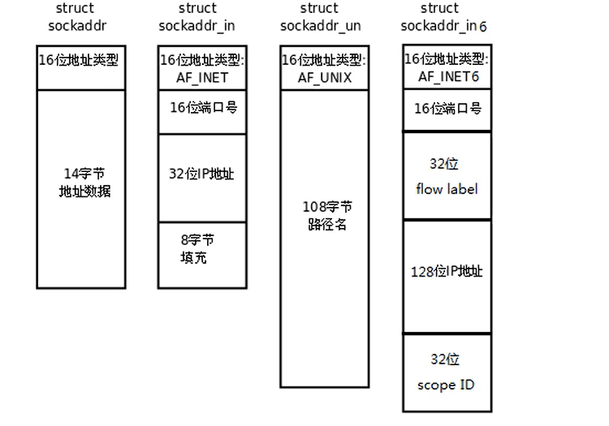
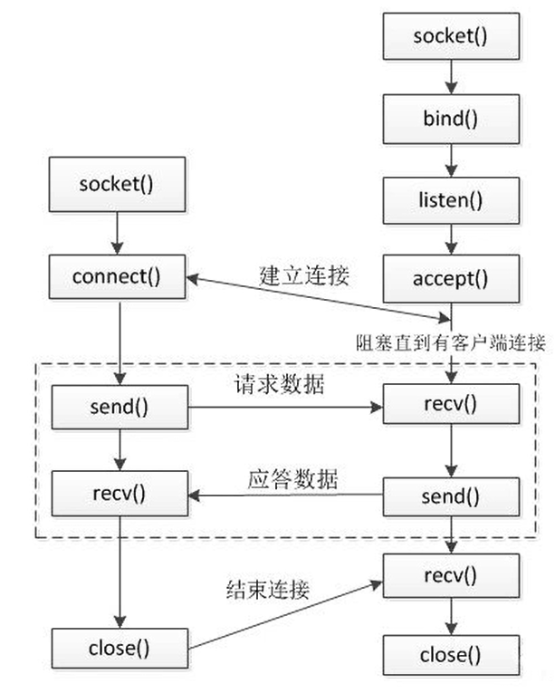

# 概述

- 预备   Linux
- 第一章 Linux系统编程入门
- 第二章 Linux多进程开发
- 第三章 Linux多线程开发
- 第四章 Linux网络编程
- 第五章 项目实战

# Linux系统编程入门

## 基础命令

### 系统管理

> 如何（自动）启动/关闭服务

计算机中，一个正在执行的程序或命令，被叫做“进程”（process）。
启动之后一只存在、常驻内存的进程，一般被称作“服务”（service）。

#### service服务管理

**基本语法**

```bash
service 服务名 start|stop|restart|status
```

**常用案例**

```bash
/etc/init.d/ # 查看服务

service ssh start # 启动ssh服务
```

#### systemctl

> 更加强大的service

**基本语法**

```bash
systemctl start | stop | restart | status 服务名 # 启动| 关闭 | 重启 | 查看 服务
systemctl list-unit-files # 查看服务开机启动状态
systemctl enable 服务名 # 开启指定服务的自动启动
systemctl disable 服务名 # 关闭指定服务的自动启动
```

**常用案例**

```bash
/usr/lib/systemd/system # 查看服务
systemctl enable ssh # 开启ssh服务的自动启动
systemctl disable ssh # 关闭ssh服务的自动启动
```


### 搜索查找

#### find

从指定目录递归地遍历满足条件的文件

**基本语法**

```bash
find [搜索范围，默认当前目录][选项]
```

**选项说明**

- `-name`：指定文件名查找文件

- `-user`：查找指定用户的文件

- `-size`：查找指定文件大小文件,单位略；

  - > 可以用来排查大文件

#### locate

利用事先建立的系统中所有文件名称及路径的locate数据库快速定位文件

> 由于locate指定基于数据库查询，第一次运行前，必须使用`updatedb`指令创建locate数据库

**基本语法**

```bash
locate 搜索文件
```


### 进程管理

#### ps

**选项说明：**

- a: 列出带有终端的所有用户的进程
- x: 列出当前用户的所有进程，包括没有终端的进程
- u: 面向用户友好的显示风格
- e: 列出所有进程
- u: 列出某个用户关联的所有进程
- f: 显示完整格式的进程列表

常用命令：

```bash
ps aux # 查看系统所有进程
ps -ef # 查看子父进程之间的关系
```

#### kill

常用命令

```bash
kill -9 PID # 向PID发送SIGINT信号，强制关闭进程
killall 进程名 # 通过进程名杀死进程
```

#### pstree 查看进程树

**基本语法**

```bash
pstree [-p/-u]
```

**常用选项：**

- p: 显示进程的PID
- u: 显示进程的所属用户

#### top

#### netstat 

**显示网络状态和端口占用信息**

**基本语法**

```bash
netstat -anp | grep 进程号 # 查看进程网络信息
netstat -nlp | grep 端口号 # 查看网络端口占用情况
```

**常用选项：**

- a: 显示所有正在监听（listen）和未监听的套接字（socket）
- n: 拒绝显示别名，能显示数字的全部转化成数字
- l: 仅列出在监听的服务状态
- p: 表示显示哪个进程在调用

### 文件目录管理

**常用命令**

```bash
pwd # 显示当前工作目录
ls -al # 列出当前目录下的所有文件信息（包括隐藏文件）
cd 
mkdir
rmdir	
touch
cp -r source target # -r表示递归复制文件目录下的所有文件
rm -rf 文件名 # -f 强制执行
mv 文件1 文件2 # 移动或重名文件(夹)
cat，more,less, head, tail # 查看文件内容

```

#### 输出重定向与追加

**基本语法**

```bash
ls -l > 文件 # 将ls -l的内容写入文件中（覆盖写）
ls -l >> 文件 # 追加写
```

#### 软连接

> ln 命令默认硬链接，-s表示软链接

**基本语法**

```bash
ln -s 原文件（目录） 连接名
```

### 用户管理

> /etc/passwd 

**常用命令**

```bash
useradd 用户名 # 添加用户
userdel 用户名 # 删除用户
passwd 用户名 # 为用户设置密码
id 用户名 # 判断用户名是否存在
su 用户名 # 切换用户
```


### 用户组管理

**常用命令**

```bash
groupadd 组名 # 新增组
groupdel 组名 # 删除组
groupmod -n 新名字 旧名字 # -n 指定工作组名字
usermod -g 用户组 用户名 # 修改用户的所属组
```


## Shell编程

shell脚本开头如下：

```bash
#!/bin/bash
```

脚本运行方法有以下两种方式:

```bash
bash 脚本 # 创建一个子shell运行脚本
. 脚本 # 在当前shell中运行脚本
```

单引号与双引号

```bash
var=1
echo '$var'
>>> $var # 单引号直接输出内部字符串，不解析特殊字符

echo "$var"
>>> 1 # 双引号解析特殊字符
```

内部字段分隔符（Internal Field Separator）,默认情况下，bash shell会将下面的字符当做字段分隔符：空格、制表符、换行符。

```bash
#!/bin/bash
# test IFS

# 以逗号分割字段
IFS=','
for number in $(cat file)
do
  echo "Number $number"
done

```

```bash
arr=(${line//./ }) # 以.作为分隔符划分字符串为数组
```


### 变量

变量按照两个角度分类:

1. 系统变量与用户自定义变量
2. 全局变量与局部变量

```bash
env # 查看系统全局变量
set | less # 查看全部的变量
```

#### **基本语法**

1. 定义变量：变量名=变量值

   > 注意，=前后没有空格

2. 撤销变量:`unset` 变量名

3. 声明静态变量：`readonly` 变量

   > 注意，不能unset

#### 全局变量

> 在子shell中更改的，父shell没有变化。比如子shell声明一个全局变量，父shell无法访问

将局部变量升级为全局变量

```bash
export 变量
```

`$PATH`环境变量是shell查找命令的目录。添加**自定义命令路径**，就可以直接调用shell脚本

#### 特殊变量

1. `$n`:代表第n个参数，9以上用大括号，如`${10}`

2. `$#`:获取参数个数
3. `$*`和`$@`：代表命令行中的所有参数
   1. `$*`：`"$*"`把所有参数看作一个整体
   2. `$@`：`"$@"`把所有参数作为一个集合
4. `$?`：最后一次执行命令的返回状态
   1. 返回0：命令执行成功
   2. 返回非0：命令执行失败

### 运算符

> 命令替换：指将命令的标准输出值赋值给某个变量。
>
> 命令替换方式：
>
> - `'命令'`
> - `$(命令)`

#### 基本语法

```bash
$((运算式)) 或 $[运算式]
```

### 条件判断

#### 基本语法

1. `test condition`

2. `[ conditioin ]`

   > condition前后要有空格

#### 常用判断条件

> 字符串之间的比较用`=`和`!=`

##### 整数比较

1. `-eq` equal
2. `-ne` not equal
3. `-lt` less than
4. `-le` less equal
5. `-gt` greater than
6. `ge` greater equal

##### 布尔运算

1. `!` 非
2. `-a` and
3. `-o` or

##### 文件权限

1. `-r` read
2. `-w` write
3. `-x` execute

##### 文件类型

1. `-e` existence
2. `-f` file
3. `-d` directory

```bash
# &&表示前一条命令执行成功，才执行后一条命令，||表示上一条命令执行失败，才执行下一条命令
$[ sdfadf ] && echo OK || echo notOK
```

### `流程控制`

> `；`用来分隔命令

#### if判断

##### 基本语法

1. 单支

```bash
if [ 条件 ]; then
	程序
fi
```

或

```bash
if [ 条件 ]
then
	程序
fi
```

2. 多分支

```bash
if [ 条件 ]
then
	程序
elif
then
	程序
else
	程序
fi
```

#### case语句

##### 基本语法

```bash
case $变量名 in
"值1")
	程序
;;
"值2")
	程序
;;
*)
	程序
esac
```

`;;`相当于break，`*`相当于default

#### for循环

##### 基本语法

```bash
for ((初始值;循环条件;变量变化))
do
	程序
done
```

```bash
for 变脸 in 值1 值2 ...
do
	程序
done
```

> `{}`在Linux表示序列，如`{1..100}`表示1-100的序列

求1到100的和

```bash
for i in {1..100}
do
	sum=$[$sum+$i]
done
```

#### while循环

##### 基本语法

```bash
while [ 条件 ]
do
	程序
done
```

### 读取控制台输入

#### 基本语法

```bash
read [选项] [参数] 变量名
```

选项:

- `-p`:指定读取时的提示符
- `-t`:指定读取时的等待事件，单位秒

### 文本处理工具

#### `awk`

##### 基本语法

```bash
awk [选项] '/正则表达式/{actions}'... '/正则表达式/{actions}' 文件
```

##### 数据字段变量

> 默认的字段分隔符是任意的空白字符，也可以通过-f指定

`awk` 的主要特性之一是其处理文本文件中数据的能力，它会自动给一行中的每个数据元素分配一个变量。

##### 关键字

BEGIN：在处理数据前运行一些脚本命令


END：在读完数据后执行脚本命令

##### 内置变量

`NF`: number of field  一条记录的字段的数目

`NR`: number of recent 已经读出的记录数，就是行号，从1开始

##### Actions

> 设计跟c语言类似

###### 运算符

> 以下没有的运算符，使用方式与c语言一样

```bash
空格 # 字符串连接
| |& # 管道运算符，用在getline, print, printf函数
in # 数组成员
？： # 三元运算符
~ !~ # 正则表达式匹配, 注意要用/regex/
```

###### 控制语句

```bash
if,while,do-while,for,for(a in b),break, continue 与c语言一致
delete array[index]
delete array
exit [可选的表达式] {语句}
switch (表达式) {
	case 值或正则表达式: 
		语句
	...
	default: 
		语句
}

```

###### 输入/输出语句

```bash
close(file) # 关闭文件或管道
getline # 将下一行记录放入$0,并设置NF,NR, FNR, RT
getline <file # 将文件中的下一行记录放入$0,并设置NF,RT
getline var # 将下一行记录放入var,并设置NR, FNR, RT
getline var <file # 将文件中的下一行记录放入var,并设置RT
command | getline var # 运行command命令，管道输出到var或$0
next # 跳到下一行记录
nextfile # 跳到下一个文件进行处理


print # 输出当前行记录
print expr-list # 输出表达式列表，每个表达式由OFS分割，直到ORS结束(expr-list形如 a,"123",1)
print expr-list >file # 输出到文件
print fmt, expr-list # 格式化输出
print fmt, expr-list >file # 格式化输出到文件

sytem(cmd-line) # 执行一个命令返回运行结果
fflush([file]) #

print ... >> file # 追加写入文件
print ... | command # 

```

###### 函数

**数组函数**

```bash
cos,sin,int,log,rand,sqrt...
```

**字符串函数**

```bash
index(s,t) # 返回字符串t在s中的索引位置， 从1开始，0是错误
length([s]) # 返回字符串s或$0的长度
substr(s,i[,n]) # 截取s的子串，从i开始截取n个字符
待定...
```


#### `wc`

##### 基本语法

```bash
wc [-clw] [文件...]
```

- `-c` --chars 只显示字节数
- `-l` --lines 只显示行数 
- `-w` --words 只显示单词数

#### `cat`

#### `uniq`

忽略重复行

##### **基本语法**

```bash
uniq [OPTION] [INPUT [OUTPUT]]
```

- c: 行数

- d: 只打印重复行

- u: 只打印唯一行

- i: 忽略大小写

  

#### `sort`

按行排序文件数据	

##### 基本语法

```bash
sort [OPTION] [FILE]
```

- r: 反转排序结果

## Linux开发环境搭建

**公钥私钥** 
> 避免频繁登录账号密码

```shell
ssh-keygen -t ras//.ssh目录下生成公钥和私钥
```

将本地的公钥注册到服务器`.ssh`目录下的`authorized_keys`文件中


## 编译及工具

### 静态库的制作

静态库是程序在链接阶段被复制到了程序里

动态库是程序运行时动态加载内存中供程序调用

**命名规则**：

- Linux：`libxxx.a`
  - lib前缀固定
  - xxx库名
  - .a后缀固定
- Windos:libxxxx.lib    

**Linux静态库的制作**
- `gcc`获得`.o`文件
- 将`.o`文件打包，使用`ar`工具（archive）
  `ar rcs libxxx.a xxx.o xxx.o`
  - r 将文件插入备存文件中
  - c 建立备存文件
  - s 索引

`gcc`参数
- c：只汇编不链接
- I：指定头文件路径
- l：指定库名
- L：指定库文件路径

### 动态库的制作

**命名规则**：

- Linux：`libxxx.so`
  - lib前缀固定
  - xxx库名
  - .so后缀固定
- Windos：libxxxx.dll   

**Linux动态库的制作**
- `gcc`获得`.o`文件，得到和位置无关的代码
  `gcc -c -fpic/-fPIC a.o b.o`
- `gcc`得到动态库
  `gcc -shared a.o b.o -o libcalc.so`
  
- 可以通过`ldd`查看动态库依赖关系
- 在`LD_LIBRARY_PATH`中配置动态库路径

### Makefile

> Makefile文件定义了一系列规则来指定哪些文件先编译，哪些文件后编译，以及哪些文件重新编译等

**Makefile规则**:

- 一个Makefile文件可以有一个或多个规则
  目标 ...: 依赖 ...
       命令 (Shell 命令)
       ...
  - 目标：最终要生成的文件
  - 依赖：生成目标所需要的文件或是目标
  - 命令：通过执行命令对依赖操作生成目标
- Makefile中的其他规则都是为第一条规则服务的

**Makefile工作原理**：

- 查找目标的依赖是否存在
  - 存在则执行命令
  - 不存在，向下查找能生成该依赖的规则
- 检测更新
  - 如果依赖文件比目标文件时间晚，则重新执行命令
  - 否则不执行

**Makefile扩展**：

- 预定义变量：
  - `AR`
  - `CC`
  - `$@`：目标的完整名称
  - `$<`：第一个依赖文件的名称
  - `$^`：所有依赖文件的名称
- 函数
  - `$(wildcard PATTERN...)` 获取指定目录下指定类型的文件列表
  - `$(patsubst <pattern>, <replacement>, <text>)` 查找`<text>`中的单词是否匹配`<pattern>`如果匹配则替换成`<replacement>`

### cmake

#### 基础配置

##### 1. 项目名称及版本(必选)

```cmake
project(项目名 version 版本号 language c cxx)
```

##### **2 指定编程语言版本**（可选）

`set`为变量和环境变量设置值，语法如下：

```cmake
set(<varible>/ENV{<varible>} <value> <value> ...)
```

指定编程语言版本：

```cmake
set(CMAKE_C_STANDARD 99)
set(CMAKE_CXX_STANDARD 11)
```

##### **3 配置编译选项**（可选）

```cmake
add_compile_options(-Wall -Wextra -pedantic -Werror) // 为所有编译器配置选项
set(CMAKE_C_FLAGS "${CMAKE_C_FLAGS} -pipe -std=c99") // 针对C编译器配置
set(CMAKE_CXX_FLAGS "${CMAKE_CXX_FLAGS} -pipe -std=c++11") // 针对C++编译器配置
```

##### **4 配置编译类型**（可选）

```cmake
set(CMAKE_BUILD_TYPE Debug) // 可设置为：Debug、Release、RelWithDebInfo、MinSizeRel等
```

##### **6 添加include目录**（必选）

```cmake
include_directories(src/c)
```

#### 编译目标文件

一般来说，编译目标(target)的类型一般有静态库、动态库和可执行文件。 这时编写`CMakeLists.txt`主要包括两步：

1. 编译：确定编译目标所需要的源文件
2. 链接：确定链接的时候需要依赖的额外的库

##### **1 编译静态库**

```text
file(GLOB_RECURSE MATH_LIB_SRC // 获取源文件列表
        src/c/math/*.c)
add_library(math STATIC ${MATH_LIB_SRC}) // 静态链接 SHARED是动态连接

```

##### **2 编译可执行文件**

```text
add_executable(可执行文件名 main.cxx)
target_link_libraries(可执行文件名 链接库)
```

## [GoogleTest](https://google.github.io/googletest/)


gtest的好处:

- 当测试失败时，gtest允许隔离运行它以进行快速调试。
- gtest井井有条，并反映已测试代码的结构。
- gtest可移植
- gtest在第一次测试失败时不会停止。相反，它只能停止当前测试，并继续下一个测试。您还可以设置报告非致命故障的测试，然后进行当前测试。因此，您可以在单个编辑过程中检测和修复多个错误。
- gtest会**自动跟踪所有定义的测试**，并且不需要用户枚举它们以运行它们。
- 使用gtest，可以在测试中重复使用共享资源，而不是让测试相互依赖。

test suite包含一个或多个test。您应该将test放入test suite分组以反映测试代码结构的测试套件中。

一个测试程序包含多个test suite

### Assertion基础

`ASSERT_*`断言失败时将立刻从当前结束，可能会跳过清理代码从而造成内存泄漏

`EXPECT_*`断言允许多个错误


使用`<<`符号以自定义错误报告


**测试程序异常：**

```c++
EXPECT_DEATH // 程序奔溃
EXPECT_EXIT // 程序退出
EXPECT_THROW // 抛出异常
```


### Test Fixtures

如果编写了两个或多个在类似数据上运行的测试，则可以使用test fixture。可以重用对象的相同配置进行多个不同的测试。

**创建一个fixture：**

- 创建一个类继承自`::testing::Test`，body部分使用`protected`，gtest将从子类访问成员
- 定义默认构造函数或`SetUp()`函数
- 定义析构函数或`TearDown()`函数

**使用fixture**

```c++
TEST_F(TestFixtureName, TestName) {
  ... test body ...
}
```

当测试运行时，gtest将创建一个TestFixtureName对象t1，用SetUp函数初始化t1，测试，用TearDown函数并销毁t1

**main()函数**

大多数情况下不需要自己写`main`函数，它们会链接到`gtest_main`。如果要写自己的main函数必须要返回`RUN_ALL_TESTS()`的值

```c++
int main(int argc, char **argv) {
  // The ::testing::InitGoogleTest() function parses the command line for googletest flags, 
  // and removes all recognized flags.
  ::testing::InitGoogleTest(&argc, argv); 
  return RUN_ALL_TESTS();
}
```


## 文件描述符

PCB（进程控制块）存放在内核区，其中存放了**文件描述符表**
文件描述表默认1024个文件，前三个分别是：
- `STDIN_FILENO` 标准输入
- `STDOUT_FILENO` 标准输出
- `STDERR_FILENO` 标准错误
均指向当前终端，默认是打开状态

## Linux IO函数

### **打开关闭文件函数**

```c
#include <sys/types.h>
#include <sys/stat.h>
#include <fcntl.h>
//打开一个存在的文件
int open(const char *pathname, int flags);
    /*
      参数：
          flags: O_RDONLY, O_WRONLY, O_RDWR

      返回值：文件描述符
            失败返回- 1
        errno是Linux的一个全局变量，记录最近的错误序号
        perror(char*)打印错误信息
    */

//创建一个新文件
int open(const char *pathname, int flags, mode_t mode);
```

### 文件信息

```c
#include <sys/types.h>
#include <sys/stat.h>
#include <unistd.h>

int stat(const char *pathname, struct stat *statbuf);
```

参数：

- pathname：文件或文件夹路径
- statbuf：返回参数，文件的基本信息

返回值:

- 0，成功
- -1 失败

#### stat结构体定义

```c
 struct stat {
               dev_t     st_dev;         /* ID of device containing file */
               ino_t     st_ino;         /* Inode number */
               mode_t    st_mode;        /* File type and mode */
               nlink_t   st_nlink;       /* Number of hard links */
               uid_t     st_uid;         /* User ID of owner */
               gid_t     st_gid;         /* Group ID of owner */
               dev_t     st_rdev;        /* Device ID (if special file) */
               off_t     st_size;        /* Total size, in bytes */
               blksize_t st_blksize;     /* Block size for filesystem I/O */
               blkcnt_t  st_blocks;      /* Number of 512B blocks allocated */

               /* Since Linux 2.6, the kernel supports nanosecond
                  precision for the following timestamp fields.
                  For the details before Linux 2.6, see NOTES. */

               struct timespec st_atim;  /* Time of last access */
               struct timespec st_mtim;  /* Time of last modification */
               struct timespec st_ctim;  /* Time of last status change */

           #define st_atime st_atim.tv_sec      /* Backward compatibility */
           #define st_mtime st_mtim.tv_sec
           #define st_ctime st_ctim.tv_sec
 };

```


### **读写文件函数**

```c
  #include <unistd.h>
  ssize_t read(int fd, void *buf, size_t count);
  /*
      参数：
          fd:文件描述符，用来操作文件通过open函数获取
          buf：指定一个缓存区（通常是数组）存放读取的数据
          count：指定缓存区的大小
      返回值：
          成功: > 0 读到数据
               = 0 已经读完数据
          失败：-1 
  */
  #include <unistd.h>
  ssize_t write(int fd, const void *buf, size_t count);
  /*
      参数：
          fd:文件描述符，用来操作文件，通过open函数获取
          buf:指定一个缓存区，将其中的内容写入到fd指定的文件中
          count:缓存区大小
      返回值：
          成功：> 0
          失败： - 1
  */
```


### 高级读写函数

在一次函数调用中：

- `writev`以顺序`iov[0]`、`iov [1]`至`iov[iovcnt-1]`从各缓冲区中聚集输出数据到`fd`
- `readv`则将从`fd`读入的数据按同样的顺序散布到各缓冲区中，`readv`总是先填满一个缓冲区，然后再填下一个


### **lseek函数**：

```c
  #include <sys/types.h>
  #include <unistd.h>
  off_t lseek(int fd, off_t offset, int whence);
  /*
      参数： 
          fd：文件描述符，通过open函数获取
          offset：偏移量，用来指定文件读写指针的偏移
          whence: 
                SEEK_SET: 将文件偏移设置到offset处
                SEEK_CUR: 将文件偏移设置到当前位置+offset处
                SEEK_END: 将文件偏移设置到文件末尾+offset处
      返回值：文件当前偏移

      作用：1、获取文件头
            lseek(fd, 0, SEEK_SET)
            2、获取文件长度
            lseek(fd, 0, SEEK_END)
            3、扩展文件
            lseek(fd, offset, SEEK_END)
  */
```


# 进程

## 进程创建

```c
  #include <sys/types.h>
  #include <unistd.h>
  pid_t fork(void);
  /*
      参数：无
      返回值: 返回两次

            父进程：成功时，返回子进程的p_id，失败返回-1
            子进程: 返回 0
  */

```

## 父子进程虚拟地址空间

从**低地址到高地址**，一个程序由**代码段**、**数据段**、**BSS段**、**堆**、**共享区**、**栈**等组成。

- 代码段：存放程序的机器指令
- 数据段：存放**已被初始化的**全局变量和静态变量
- BSS段：存放**未被初始化的**全局变量和静态变量
- 运行时有**堆**、**栈**
- 共享库：位于堆和栈中间

父进程`fork()`一个子进程时，子进程与父进程具有相同的用户区空间，不同的内核区（比如pid不同，但是文件描述符相同）。

`fork()`函数采用了**读时共享写时复制**的技术。即读数据的时候，子进程与父进程共享一个用户区空间，只有写数据时，系统再给子进程复制一份父进程的用户区空间

**总结**：

- 不同点:
  - 返回值不一样
    - 父进程 > 0 : 返回的时子进程的pid
    - 子进程 = 0
  - 内核区一些数据
    - pid、ppid等
- 相同点：某些状态下相同
  - 读时共享，写时拷贝

## GDB多线程调试

**添加gdb调试**
`gcc xxx.c -o xxx -g`

**gdb常见命令**：

- l：显示代码
- b x : 在x行添加断点
- i b ：显示断点信息
- r ：调试运行
- n : 下一步
- c : 继续调试
  

**设置调试父进程或子进程**：`set follow-fork-mod`

**设置调试模式**：`set detach-on-fork [on | off]`

- `on` 表示调试当前进程的时候，其它的进程继续进行
- `off`表示调试当前进程的时候，其它进程被GDB挂起

**查看调试的进程**：`info inferiors`
**切换当前调试的进程**：`inferiors id`
**使进程脱离GDB调试**：`detach inferiors id`

## exec函数族

exec函数族的作用是根据指定的文件名找到可执行文件，并用它来取代调用进程的内容

```c
#include <unistd.h>
int execl(const char *path, const char *arg, ...)//l(list) 参数地址列表，以空指针结尾
/*
    参数:
        path: 文件路径（绝对路径或相对路径）
        arg: 可执行文件的参数，第一个参数无意义通常是文件名， 最后要以NULL结尾
    返回值: 失败时返回-1
*/


int execlp(const char *file, const char *arg, ...)//p(path) 存有各参数地址的指针数组的地址
/*
    参数:
        file: 文件名(从环境变量中找可执行文件)
        arg: 可执行文件的参数，最后要以NULL结尾
    返回值: 失败时返回-1
*/
```

## 孤儿进程、僵尸进程、进程回收

孤儿进程：子进程尚未运行结束，但父进程已经运行结束了。将子进程的管理委托给init进程。无危害

僵尸进程：子进程结束后，父进程还未回收子进程的PCB资源。有危害

```c
#include <sys/types.h>
#include <sys/wait.h>

pid_t wait(int *wstatus);
/*
  wait函数将调用的父进程挂起，直到其某一个子进程状态改变
  参数：
      *wstatus： 退出相关的宏函数
  返回值:
      > 0 ： 状态改变的子进程的pid
      - 1 : 所有的子进程都已经结束
*/

pid_t waitpid(pid_t pid, int *wstatus, int options);
  /*
    参数：
        pid : > 0 指定回收的pid
              = -1 回收任意一个子进程pid(wait函数)
              = 0  回收调用进程所在组的pid
              > - 1 指定回收的进程组pid
        options : = 0 阻塞
                WNOHANG 不阻塞，立刻返回
                。。。

  */
```

**总结** :

- 进程的创建
  - fork()
  - 父子进程的虚拟地址空间
  - 多线程调试
- exec函数族
- 孤儿进程、僵尸进程、进程回收
  - wait
  - waitpid

## 进程通信

### 匿名管道

UNIX 系统 IPC （进程间通信）的最古老形式

#### 管道的特点

1.**半双工**：在管道中的数据的传递方向是单向的，一端用于写入，一端用于读取

2.匿名管道**只能在具有公共祖先的进程**（父进程与子进程，或者两个兄弟进程，具有亲缘关系）之间使用。

> fork函数创建一个子进程，父进程与子进程**共享用户地址空间**。所以父进程中创建一个管道，拿到管道**读端和写端**，同样子进程也会拥有管道读端和写端。

```c
#include <unistd.h>
int pipe(int pipefd[2]);
/*
    参数 : 
        pipefd[2] ： 返回值， pipefd[0]读端, pipefd[1]写端

    返回值:
        成功 : 0
        失败 : -1 
*/

```

### 有名管道

>  **注意**：一个为只读打开管道的进程会被阻塞，直到另一个进程为只写打开管道；一个为只写打开管道的进程会被阻塞，直到另一个进程为只读打开管道；


有名管道是一个特殊的文件（伪文件-不占用硬盘的空间，只是在内存中作用。通过内核去管理调用）。

#### 有名管道的特点

1. 不存在亲缘关系的进程，可以通过 FIFO 相互通信（相当于读写文件一样）

### 消息队列

#### **创建队列**

```c++
#include <sys/types.h>
#include <sys/ipc.h>
#include <sys/msg.h>

int msgget(key_t key, int msgflg);


```

参数：

- key: 某个消息队列的名字
- msgflg:由九个权限标志构成，用法和创建文件时使用的mode模式标志一样

返回值：

- 成功msgget将返回一个非负整数，即该消息队列的标识码；
- 失败则返回“-1”

#### **添加消息**

```c++
int  msgsnd(int msgid, const void *msg_ptr, size_t msg_sz, int msgflg);
```

参数：

- **msgid**: 由msgget函数返回的消息队列标识码
- **msg_ptr**:是一个指针，指针指向准备发送的消息，
- **msg_sz**:是msg_ptr指向的消息长度，消息缓冲区结构体中mtext的大小,不包括数据的类型
- **msgflg**:控制着当前消息队列满或到达系统上限时将要发生的事情
  如：
  msgflg = **IPC_NOWAIT** 表示队列满不等待，返回EAGAIN错误

返回值：

- 成功返回0
- 失败则返回-1

#### 读取消息

```c++
int  msgrcv(int msgid, void *msg_ptr, size_t msgsz,
		 long int msgtype, int msgflg);
```

**参数**：

- **msgid**: 由msgget函数返回的消息队列标识码
- **msg_ptr**:是一个指针，指针指向准备接收的消息，
- **msgsz**:是msg_ptr指向的消息长度，消息缓冲区结构体中mtext的大小,不包括数据的类型
- **msgtype**:它可以实现接收优先级的简单形式
  msgtype=0返回队列第一条信息
  msgtype>0返回队列第一条类型等于msgtype的消息　
  msgtype<0返回队列第一条类型小于等于msgtype绝对值的消息
- **msgflg**:控制着队列中没有相应类型的消息可供接收时将要发生的事
  msgflg=IPC_NOWAIT，队列没有可读消息不等待，返回ENOMSG错误。
  msgflg=MSG_NOERROR，消息大小超过msgsz时被截断

**返回值**：

- 成功返回实际放到接收缓冲区里去的字符个数
- 失败，则返回-1

#### 消息队列控制

```c++
int  msgctl(int msqid, int command, strcut msqid_ds *buf);
```

**参数**：

- msqid: 由msgget函数返回的消息队列标识码
- command:是将要采取的动作,（有三个可取值）分别如下
  - IPC_STAT
  - IPC_SET
  - IPC_

### 内存映射

```c
#include <sys/mman.h>

void *mmap(void *addr, size_t length, int prot, int flags,int fd, off_t offset);
/*
    在进程的虚拟地址空间创建文件的内存映射
    参数: 
        addr: NULL表示由操作系统指定映射区
        length: 映射区大小
        prot: 映射区的读写权限
              PROT_EXEC  Pages may be executed.
              PROT_READ  Pages may be read.
              PROT_WRITE Pages may be written.
              PROT_NONE  Pages may not be accessed.
        flags: 
              MAP_SHARED: 表示内存映射区与磁盘文件同步(进程通信必选)
              MAP_PRIVATE: 表示不同步
        fd: 映射的文件描述符
        offset: 0， 一般不指定
    返回值:
        映射区的内存地址
        - 1: 映射区创建失败
*/

int munmap(void *addr, size_t length);

/*
    关闭创建的内存映射
*/
```

### 信号

信号是事件发生时对进程的通知机制，有时也称之为**软件中断**，它是在软件层次上对中断机制的一种模拟，是一种**异步通信**的方式。

**使用信号的两个主要目的**是：

- 让进程知道已经发生了一个特定的事情。
- 强迫进程执行它自己代码中的**信号处理程序**。

#### 信号函数

**`signal`函数**——为一个**信号设置处理函数**

```c
#include＜signal.h＞
_sighandler_t signal(int　sig,_sighandler_t _handler)

参数：
    sig：指出捕获的信号
    _handler: 一个函数指针。用于指定信号sig的处理函数
返回值:
	成功: 前一次调用signal函数时传入的函数指针或默认处理函数指针SIG_DEF
    失败: 返回SIG_ERR
```

**`sigaction`函数——更健壮的设置处理函数**

```c
#include＜signal.h＞
int sigaction(int sig,const struct sigaction*act,struct sigaction*oact);

struct sigaction
{ 
    #ifdef__USE_POSIX199309
        union
        { 
            _sighandler_t
            sa_handler;
            void(*sa_sigaction)(int,siginfo_t*,void*);
        } 
        _sigaction_handler;
    #define sa_handler __sigaction_handler.sa_handler
    #define sa_sigaction__sigaction_handler.sa_sigaction
    #else
    	_sighandler_t sa_handler;
    #endif
        _sigset_t sa_mask;
        int sa_flags;
        void(*sa_restorer)(void);
};
```

`sigaction`的**`sa_hander`**成员指定**信号处理函数**。**`sa_mask`**成员**设置进程的信号掩码**（确切地说是在进程原有信号掩码的基础上增加信号掩码），以指定哪些信号不能发送给本进程

#### 挂起信号

设置进程信号掩码后，被屏蔽的信号将不能被进程接收。如果给进程发送一个被屏蔽的信号，则操作系统将该信号设置为进程的一个被挂
起的信号。如果我们取消对被挂起信号的屏蔽，则它能立即被进程接收到。

#### 信号集

在 **PCB** 中有两个非常重要的信号集。一个称之为 “**阻塞信号集** ”，另一个称之为“**未决信号集**“ 。这两个信号集都是内核使用位图机制来实现的。

信号的 “未决 是一种状态，指的是从信号的产生到信号被处理前的这一段时间。

信号的 “阻塞 是一个开关动作，指的是阻止信号被处理。

```c
// 信号集相关的处理函数

// 清空信号集
int sigemptyset(sigset_t *set);
// 所有信号标志位设为1
int sigfillset(sigset_t *set);
// 添加signum信号
int sigaddset(sigset_t *set, int signum);
// 删除signum信号
int sigdelset(sigset_t *set, int signum);
// 判断signum是否是阻塞信号
int sigismember(const sigset_t *set, int signum);
// 将用户区的信号集set设置到内核中的阻塞信号集中
int sigprocmask(int how, const sigset_t *set, sigset_t *oldset);

int sigpending(sigset_t *set);
```

#### 信号捕捉过程


# 线程

## 线程创建

**线程之间共享的资源**：

- 共享
  - 进程ID和父进程ID
  - 文件描述表
- 非共享资源
  - 线程ID
  - 线程特有的数据


**pthread**

```c
#include <pthread.h>
int pthread_create(pthread_t *thread, const pthread_attr_t *attr, void *(*start_routine) (void *), void *arg);
```

- 作用: 创建一个线程
- 参数: 
  - *thread: 传出参数， 创建线程的tid
  - *attr: 选择创建线程的属性，NULL表示默认属性
  - *start_routine: 子线程执行的入口函数地址
  - *arg: 子线程执行的入口函数的参数
- 返回值：
  - 成功: 0
  - 失败: errnum
  - 获取错误: char* strerror(int errnum)
  
## 线程终止

```c
#include <pthread.h>

void pthread_exit(void *retval);
```
跟子线程中`return`一样

## 线程分离

```c
#include <pthread.h>
int pthread_detach(pthread_t thread);
```

- 功能: 分离一个线程，该线程资源由系统自动回收。
- 注意点: 不可以重复分离一个线程，不可以连接已经分离的线程

## 线程取消

```c
int pthread_cancel(pthread_t thread);
```

- 功能：取消一个线程

## 线程属性

```c
int pthread_attr_init(pthread_attr_t *attr);
int pthread_attr_destroy(pthread_attr_t *attr);
....
```

- `man pthread_attr_` 查看线程属性

## 互斥锁

```c
pthread_mutex_t=xx

...

```

## 读写锁

```c
pthread_rwlock_xx
```

## 条件变量

```c
pthread_cond_xxx
```
不是锁，满足条件的线程唤醒，不满足则阻塞

## 信号量

```c
sem_xxx
```

## 总结

- 线程创建`int pthread_create(pthread_t *thread, const pthread_attr_t *attr, void *(*start_routine) (void *), void *arg);`
- 线程连接
- 线程分离
- 线程取消
- 线程属性
- 锁
  - 互斥锁
  - 读写锁
  - 信号量
  - 条件变量

# 网络编程

## socket

在Linux环境下，`socket`用来表示进程间网络通信的特殊文件类型（伪文件）。

```c
主机A——socket
  ip:xxx, port:xxx
  //内核
  读缓存区
  写缓存区

主机B——socket
  ip:xxx, port:xxx
  //内核
  读缓存区
  写缓存区
```

**Linux系统将其封装成文件的目的是为了统一接口，使得读写套接字与读写文件一致**

## socket地址

### 主机字节序与网络字节序

现代PC大多采用小端字节序，因此小端字节序又被称为主机字节序。为了不同主机能过够正确地接收数据，

> `约定`**网络字节序总是大端字节序** 

```c
//从主机字节序到网络字节序
uint16_t htons(uint16_t hostshort); // host to network short
uint16_t htonl(uint16_t hostlong); // host to network long 长整型（long类型）的网络字节序转化为网络字节序


//从网络字节序转换到主机字节序
uint16_t ntohs(uint16_t netshort);
uint16_t ntohl(uint16_t netlong);

```

### 通用socket地址

socket网络编程接口中表示socket地址的是结构体`sockadrr`

```c
#include <bits/socket.h>
struct sockaddr{
  sa_family_t sa_family;
  char sa_data[14];
};
typedef unsigned short int sa_family_t;
```

sa_family成员是地址族类型`sa_family_t`的变量。地址族类型同样与协议族类型对应

| 协议族      | 地址族    | 描述 |        地址值含义和长度|
| ----------- | ---------|------| --------------------|
| PF_UNIX     | AF_UNIX  | UNIX本地域协议族| 文件的路径名，长度可达108字节|
| PF_INET     | AF_INET  | TCP/IPV4协议族|16bit端口号，32bit IPV4地址，共6字节 |
| PF_INET6    | AF_INET6 | TCP/IPV6协议族|16bit端口号，32bit 流标识，128bit IPV6，32bit范围ID, 共26字节|

宏PF\_\*和AF\_*都定义在bits/socket.h头文件中

### 新通用socket地址

`sockaddr`只能支持到IPV4地址，`sockaddr_storage`能够支持IPV6，而且是内存对齐的

```c
#include <bits/socket.h>
struct sockaddr_storage{
  sa_family_t sa_family;
  unsigned long int __ss_align;
  char __ss_padding[128 - sizeof(__ss_align)];
};
typedef unsigned short int sa_family_t;
```

### 专用socket地址

为了向以前兼容，`sockaddr`退化成了(void*)的作用， 传递一个地址给函数， 至于这个函数是`sockaddr_in`还是`sockaddr_in6`,由地址族决定，然后函数内部再强制类型转化为所需要的地址类型。




### IP地址转换函数

编程的过程中需要的ip地址是二进制的形式，而记录日志时我们需要的是点分十进制形式

```c
#include <arpa/inet.h>
//从点分十进制转换为二进制
int inet_pton(int af, const char *src, void* dst);
//从二进制转换为点分十进制
char* inet_ntop(int af, const char *src, char *dst, socklen_t size);
```

**`inet_pton`函数**将用字符串表示的IP地址src转换成用网络字节序整数表示的IP地址，并把转换结果存储于dst指向的内存中。其中，af参数指定地址族，可以是AF_INET或者AF_INET6。

**`inet_ntop`函数**进行相反的转换，前三个参数的含义与inet_pton的参数相同，最后一个参数size指定目标存储单元的大小。下面的两个宏能
帮助我们指定这个大小（分别用于IPv4和IPv6）：

```c
#include＜netinet/in.h＞
#define INET_ADDRSTRLEN 16
#define INET6_ADDRSTRLEN 46
```

## TCP通信流程



**服务端通信流程**：

- 创建一个监听的套接字
  - 套接字 : Linux特殊的文件
- 套接字绑定 IP 和 端口
- 设置监听
- 阻塞等待，当客户端发起连接时，解除阻塞，接收客户端的连接，得到一个和客户端通信的套接字
- 通信
  - 发送数据
  - 接收数据
- 通信结束，断开连接

**客户端通信流程**：

- 创建一个连接的套接字
- 连接服务器，需要指定服务器的 IP 和端口
- 通信
- 通信结束，断开连接

### 创建socket

> 自Linux内核版本2.6.17起，type参数可以接受与下面两个重要的标志相与的值：SOCK_NONBLOCK和SOCK_CLOEXEC。
>
> SOCK_NONBLOCK：将新创建的socket设为非阻塞的。
>
> SOCK_CLOEXEC：用fork调用创建子进程时在子进程中关闭该socket。

```c
#include <sys/types.h>          /* See NOTES */
#include <sys/socket.h>
int socket(int domain, int type, int protocol);
```

- 作用：创建一个用于通信的套接字文件
- 参数：
  - domain：指定通信使用的协议族，如`AF_INET6`(IPV6)、`AF_INET`(IPV4)
  - type: 指定通信协议，`SOCK_STREAM`、`SOCK_DGRAM`等
  - protocol : 一般为0
- 返回值：
  - 成功：返回套接字文件的fd
  - 失败：-1

### 命名socket

```c
#include <sys/types.h>          /* See NOTES */
#include <sys/socket.h>

int bind(int sockfd, const struct sockaddr *addr, socklen_t addrlen);
```

- 作用：socket命名
- 参数：
  - sockfd：需要被绑定的socket文件描述符
  - addr：绑定地址
  - addrlen：socket地址的长度
- 返回值：0，-1

### 监听socket

> 内核版本2.2之后，backlog表示处于ESATABLISHED状态的socket的上限

`listen`系统调用来创建一个监听队列以存放待处理的客户连接:

```c++
#include<sys/socket.h>
int listen(int socketfd, int backlog);
```

参数：

- socketfd：指定被监听的socket
- backlog：指定内核监听的最大长度

### 接收连接

> `accept阻塞函数`只是从监听队列中取出连接，而不论连接处于何种状态

accpet系统调用从listen监听队列中接受一个连接:

```c++
#include＜sys/types.h＞
#include＜sys/socket.h＞
int accept(int sockfd,struct sockaddr*addr,socklen_t*addrlen);
```

参数：

- sockfd:监听socket的文件描述符
- addr和addrlen：用来获取被接受连接的远端socket地址

返回值:

- 成功：新的连接socket
- 失败：-1

### 发起连接

客户端需要通过connect系统调用来主动与服务器建立连接：

```c++
#include＜sys/types.h＞
#include＜sys/socket.h＞
int connect(int sockfd,const struct sockaddr*serv_addr,socklen_t addrlen);
```

参数：

- sockfd:socket文件描述符，用于连接
- serv_addr和addrlen：连接的服务器socket地址

返回值:

- 成功：0，sockfd就唯一标识了这个连接
- 失败：-1

### 关闭连接

关闭一个连接实际上就是关闭该连接对应的socket，通过close或shutdown关闭普通文件描述符的系统调用来完成：

```c++
#include＜unistd.h＞
int close(int fd);

#include＜sys/socket.h＞
int shutdown(int sockfd,int howto);// 立即关闭连接
```

### 数据读写

#### TCP数据读写

对文件的读写操作read和write同样适用于socket。但是socket的读写接口增加了对数据读写的控制。

```c++
#include＜sys/types.h＞
#include＜sys/socket.h＞
ssize_t recv(int sockfd,void*buf,size_t len,int flags);
ssize_t send(int sockfd,const void*buf,size_t len,int flags);
```

#### UDP数据读写

```c++
#include＜sys/types.h＞
#include＜sys/socket.h＞
ssize_t recvfrom(int sockfd,void*buf,size_t len,int flags,struct sockaddr*src_addr,socklen_t*addrlen);
ssize_t sendto(int sockfd,const void*buf,size_t len,int flags,const struct sockaddr*dest_addr,socklen_t addrlen);
```

因为UDP通信没有连接的概念，所以我们每次读取数据都需要获取发送端的socket地址

#### 通用数据读写

```c++
#include＜sys/socket.h＞
ssize_t recvmsg(int sockfd,struct msghdr*msg,int flags);
ssize_t sendmsg(int sockfd,struct msghdr*msg,int flags);
```


## 多线程实现并发服务器

## I/O多路复用

I/O多路复用使程序能够同时监听多个文件描述符，能够提高程序的性能，Linux下实现I/O多路复用的系统调用主要有`select`、`poll`和`epoll`

### 几种常见的I/O模型

> 一次I/O经历**数据准备**和**数据读写**

**1. 阻塞等待.BIO**
比如`receive`、`accept`函数

- 优点：不占用CPU资源
- 缺点: 同一时刻只能处理一个操作，效率低 **(多线程解决，每个线程负责监听一个套接字)**

```c
//服务端
int lfd = socket(...);
bind(lfd, ...);
listen(ldf, ...);
int cfd = accept(lfd, ...);//阻塞
receive(cfd,...)//阻塞
```

**2. 非阻塞，忙轮询.NIO**

不阻塞，每个一段时间询问一次。对于多个任务，需要依次遍历任务

- 优点：提高程序执行效率
- 缺点：需要占用更多的CPU资源

```c
//服务端
int lfd = socket(...);
bind(lfd, ...);
listen(ldf, ...);
int cfd = accept(lfd, ...);//非阻塞
if has client connect:
  read(cfd,...)//非阻塞
  if read data:
    print data
  else:
    do othres
else:
  do others
```

**3. IO复用**

由一个线程监听多个套接字，这样只需要一个线程完成数据状态轮询的操作。当有数据准备好后再分配对应的线程去处理数据。


第一种:`select/poll`

select/poll 委托内核检测是否有数据到达。只返回几个数据到达，不会返回哪几个到达

第二种:`epoll`
epoll 委托内核检测是否有数据到达。返回几个数据到达，并返回哪几个到达了


**4. AIO**

**5. 信号驱动**

### select

> 主旨思想：
> -  首先构造一个关于文件描述符的列表，将要监听的文件描述符添加列表中
> - 调用`select`系统函数，监听列表中的文件描述符，直到这些描述符中的一个或者多个进行I/O操作时，函数才返回
>   - **select函数是阻塞**，也可以设置超时
>   - 函数对于文件描述符的检测操作是由内核完成
> - 在返回时，会告知进程有多少描述符进行了I/O

```c
#include <sys/time.h>
#include <sys/types.h>
#include <unistd.h>

int select(int nfds, fd_set *readfds, fd_set *writefds, fd_set *exceptfds, struct timeval *timeout);
/*
  参数：
      nfd: 最大的文件描述符号+1
      readfds: 要检测的读文件描述集合
      writefds: 要检测的写文件描述集合
      excepetfds: 检测发送异常的文件描述集合
      timeout: 
              NULL： 永久阻塞，直到检测到I/O有变化
              
  返回值:
        - 1: 失败
        > 0： 检测到的文件描述符数量

*/

//清空fd在集合中的标志
void FD_CLR(int fd, fd_set *set);
//返回fd在集合中的标志
int  FD_ISSET(int fd, fd_set *set);
//设置fd在集合中的标志
void FD_SET(int fd, fd_set *set);
//清空集合中所有的标志
void FD_ZERO(fd_set *set);

```

**缺点**：

- 每次调用select，都需要将**fd集合从用户态拷贝到内核态，再拷贝回来**，需要一定开销
- 忙轮询监听fd集合，需要时间开销
- select**只支持1024个文件描述符数量**
- fds集合不能重用，每次都需要重置

### poll

```c
 #include <poll.h>
struct pollfd {
    int   fd;         /* file descriptor */
    short events;     /* requested events */
    short revents;    /* returned events */

    //POLLIN检测读
    //POLLOUT检测写
};
int poll(struct pollfd *fds, nfds_t nfds, int timeout);
/*
    参数: 
        fds:要检测的文件描述符结构体数组
        nfds: 数组大小
        timeout: 
              0: 不阻塞
              - 1： 阻塞
              ...
    返回值:
        - 1: 失败
        > 0 : 检测到的文件描述符数量
*/
```

`poll`改进了`select`的第三和第四个缺点

### epoll

1. **零拷贝**：`epoll_create`系统调用在内核区创建一个eventpoll（结构体）， 避免了select/poll将fds从用户区拷贝内核区的开销
2. `epoll_ctl`注册需要检测（监听）的事件（对文件描述符读/写的监听）
3. `epoll_wait`系统内核进行检测(监听)，将发送的事件记录在rdlist中，并将其拷贝回用户区返回结果

```c
#include <sys/epoll.h>
int epoll_create(int size);
/*
    参数: 
        size: 在内核区创建epoll实例，包含需要监听的事件(红黑树)， 检测结果（双向链表）
    返回值：
        -1: 失败
        > 0: fd, 一个用于epoll操作的文件描述符
*/
 typedef union epoll_data {
               void    *ptr;
               int      fd;
               uint32_t u32;
               uint64_t u64;
} epoll_data_t;
 struct epoll_event {
               uint32_t     events;    /* Epoll events */
               epoll_data_t data;      /* User data variable */
};
int epoll_ctl(int epfd, int op, int fd, struct epoll_event *event);
/*
    参数:
        epfd: 指明需要操作的fd
        op: 对epoll实例中的红黑树进行增加、删除、修改等。
        fd: 需要op操作的文件描述符
        event: 需要操作的文件描述符的事件（读、写、。。。）
*/
int epoll_wait(int epfd, struct epoll_event *events, int maxevents, int timeout);
/*
    参数：
        events: 返回所有发生的事件，数组
*/
```

#### LT.水平触发

简单来说就是一种高效的`poll`,`epoll`的默认工作模式是`LT`

当`epoll_wait`检测到其上有事件发生并将此事件通知应用程序后，应用程序可以不立即处理该事件。当应用程序下一次调用`epoll_wait`时，`epoll_wait`还会再次向应用
程序通告此事件，直到该事件被处理。

#### ET.边缘出发

当`epoll_wait`通知的后，应用程序必须要处理，因为后续调用`epoll_wait`将不再通知该事件

> 每个使用ET模式的文件描述符都应该是**非阻塞的**。如果文件描述符是阻塞的，那么读或写操作将会因为没有后续的事件而一直处
> 于阻塞状态（饥渴状态）。

ET模式要求应用程序一次性读取所有数据，或者一次性写完所有数据。经典`EPOLLIN`的如下:

```c++
while (true) {
    int len = recv(...);
    if (len < 0) {
        if (errno == EAGAIN || errnor = EWOULDBLOCK){
            break;
        }
        close(fd);
    }
}
```

如果文件文件描述符是**阻塞**的，读/写进程在读/写完后将一直阻塞于`recv`/`send`函数。

#### EPOLLONESHOT事件

> 即使使用ET模式，一个socket上的某个事件还是可能被触发多次。这在并发程序中就会引起一个问题。比如一个线程在读取完某个socket上的数据后开始处理这些数据，而在数据的处理过程中该socket上又有新数据可读（EPOLLIN再次被触发），此时另外一个线程被唤醒来读取这些新的数据。于是就出现了两个线程同时操作一个socket的局面

对于注册了EPOLLONESHOT事件的文件描述符，操作系统最多触发其上注册的一个可读、可写或者异常事件，且只触发一次，除非**使用`epoll_ctl`函数重置该文件描述符上注册的EPOLLONESHOT事件**。

# 高性能服务器

## 阻塞和非阻塞、同步与异步

> 典型的一次IO的两个阶段是**数据准备**和**数据读写**

**数据准备**

- 阻塞：调用IO方法的线程进入阻塞状态
- 非阻塞：不会改变线程状态，通过返回值判断

**数据读写**

- 同步：A向B请求调用一个网络IO接口时，数据读写都是A自己完成
- 异步: A向B请求调用一个网络IO接口时，向B传入请求的事件以及通知方式，A可以继续做其他事情，当B监听到事件处理完成后，用通知方式通知A处理结果。

## 服务器编程基本框架


**I/O处理单元: **处理客户端连接，接收发送网络数据

**逻辑单元:** 业务线程

**网络存储单元:** 数据库、文件或缓存

**请求队列:** 单元间的通信方式

I/O处理单元是服务器管理客户端连接的模块，主要负责等待和接收新的客户端连接，接收客户端数据，将服务端的处理结果返回给客户端。但是数据的收发也可能在逻辑单元进行，具体看哪种事件处理模式。

一个逻辑单元通常是一个线程。它负责处理客户端请求数据，并将结果交给I/O处理单元。也可以直接交付给客户端，具体看哪种事件处理模式。

请求队列通常被实现为池的部分

### 两种高效的事件处理模式

服务器通常需要处理三个事件:I/O事件、信号及定时事件

#### Reactor模式（重点）

主线程（I/O处理单元）只负责监听文件描述符上是否有事件发生，将事件添加到请求队列并通知子线程处理事件。数据的读写，接收新的连接以及处理请求均由工作线程独立完成。


**使用同步I/O模型实现Reactor模式的工作流程：**

1. 主线程往epoll内核注册socket上的读就绪事件
2. 主线程调用epoll_wait等待事件发生
3. 当读就绪事件发生时，epoll_wait通知主线程将可读事件插入请求队列
4. “可读事件”请求队列上的线程被唤醒，从socket读取数据并处理请求，往epoll内核注册socket上的写就绪事件
5. 主线程调用epoll_wait等待可写事件发生
6. 当事件发生时，epoll_wait通知主线程。主线程将socket“可写事件”插入请求队列
7. “可写事件”请求队列上的线程被唤醒，往socket上写入服务器处理客户请求的结果。

#### proactor模式

与Reactor模式不同，Proactor模式将所有I/O操作都交给**主线程**和**内核**来处理，工作线程仅仅负责业务逻辑


**使用异步I/O模型（以aio_read和aio_write为例）实现的Proactor模式的工作流程是：**

1. 主线程调用aio_read函数向内核注册socket上的读完成事件，并告诉内核用户读缓冲区的位置，以及读操作完成时如何通知应用程序
2. 主线程继续处理其他逻辑。
3. 当socket上的数据被读入用户缓冲区后，内核将向应用程序发送一个信号，以通知应用程序数据已经可用。
4. 应用程序预先定义好的信号处理函数选择一个工作线程来处理客户请求。工作线程处理完客户请求之后，调用aio_write函数向内核注册socket上的写完成事件，并告诉内核用户写缓冲区的位置，以及写操作完成时如何通知应用程序。
5. 主线程继续处理其他逻辑。
6. 当用户缓冲区的数据被写入socket之后，内核将向应用程序发送一个信号，以通知应用程序数据已经发送完毕
7. 应用程序预先定义好的信号处理函数选择一个工作线程来做善
   后处理，比如决定是否关闭socket。

#### 模拟proactor模式（了解）

其原理是：主线程执行数据读写操作，读写完成之后，主线程向工作线程通知这一“完成事件”。那么从工作线程的角度来看，它们就直接获得了数据读写的结果，接下来要做的只是对读写的结果进行逻辑处理。


## 定时器

定时事件，比如定期检测一个客户连接的活动状态。

将每个定时事件分别封装成定时器，并使用某种容器类数据结构，比如链表、排序链表和时间轮，将所有定时器串联起来，以实现对定时事件的统一
管理。

### 定时方法

**1.socket选项`SO_RCVTIMEO`和`SO_SNDTIMEO`**

分别用来设置socket**接收数据超时时间**和**发送数据超时时间**。因此，这两个选项仅对与数据接收和发送相关的socket专用系统调用
有效，这些系统调用包括send、sendmsg、recv、recvmsg、accept和connect。

```c
int ret = setsockopt(sockfd, SOL_SOCKET, SO_SNDTIMEO, ＆timeout, len); // 设置sockfd的发送数据超时时间
```

**2.SIGALRM信号**

由`alarm`和`setitimer`函数设置的实时闹钟一旦超时，将触发SIGALRM信号。利用该信号的信号处理函数来处理定时任务。

alarm函数设置一个alarm时钟发送信号，一次alarm调用触发一次SIGALRM信号

```c
#include <unistd.h>
unsigned int alarm(unsigned int seconds);

/*
参数：
	seconds： 参数是0就取消alarm
*/
```

**3.I/O复用系统调用的超时参数**

Linux下的3组I/O复用系统调用都带有超时参数，因此它们不仅能统一处理信号和I/O事件，也能统一处理定时事件。

## 服务压力测试

Webbench 是 Linux 上一款知名的、优秀的 web 性能压力测试工具。它是由Lionbridge公司开发。

> 测试处在相同硬件上，不同服务的性能以及不同硬件上同一个服务的运行状况。
> 展示服务器的两项内容：每秒钟响应请求数和每秒钟传输数据量。

基本原理：Webbench 首先 fork 出多个子进程，每个子进程都循环做 web 访问测试。子进程把访问 的
结果通过pipe 告诉父进程，父进程做最终的统计结果。

**测试示例**

```c++
webbench -c 1000 -t 30 http://192.168.110.129:10000/index.html
参数：
-c 表示客户端数
-t 表示时间
```

### 压力测试结果

8CPU

|          | 10   | 1000  | 1e4    | 1e5           |
| :------- | ---- | ----- | ------ | ------------- |
| 阻塞队列 | 9513 | 9630  | 11.8   | 16.3 (超负荷) |
| 无锁队列 | 6861 | 11000 | 50.6   | 70.6 (超负荷) |
|          | -28% | 14.2% | 328.8% | 333.1%        |


