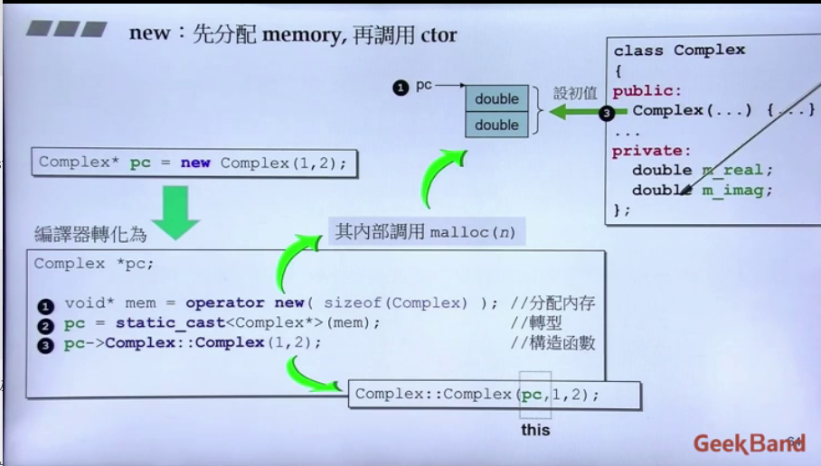

# 1. 语言基础

## 1.1 关键字

### const与volatile

#### **类型限定符**

> const 定义类型为常量
> volatile 定义类型为易变

**const对象**——对象不能被修改。直接尝试修改对象内容，编译器报错。

**volatile对象**——类型为 `volatile-`限定的对象，通过 `volatile`限定的类型的泛左值表达式的每次访问（读或写操作、成员函数调用等），都被当作对于优化而言是可见的副作用（即在单个执行线程内，`volatile`访问**不能被优化掉**)。数据或对象的操作会优化读取和存储，直接使用cache或寄存中的值。


#### **限定成员函数**

在有 cv 限定符的函数体内，`*this` 有同样的 cv 限定

### extern

**1. `extern C`** 在C++中，导入C函数的关键字是extern，表达形式为extern “C”， extern "C"的主要作用就是为了能够正确实现C++代码调用其他C语言代码。加上extern "C"后，会指示编译器这部分代码按C语言的进行编译，而不是C++的。

**2. 静态存储器和外部链接**

extern关键字可以访问到其他翻译单元中的变量或函数，只需要在当前翻译单元声明即可

```c++
//a.cpp
extern int a;//定义和声明
int add();//默认是extern的


//b.cpp
int a = 0;
int add() {
    ...
}


```

### static

> **静态存储期**和**内部链接**

静态存储期：程序开始时分配，并在程序结束时解分配。这类对象只存在一个实例

内部链接:名字可从当前翻译单元（文件）中的所有作用域使用。在**命名空间作用域**声明的下列任何名字均具有内部链接。

*简单来说，当前翻译单元就是内部链接名字的命名空间*

#### 面向过程中的static

**1. 静态全局变量**

- 存放在静态区（BSS段或数据段）
- 无法对其他文件可见(*区别于全局变量*)

**2. 静态局部变量**

- 存放在静态区
  
    > 静态区特性1：变量在运程序开始时分配内存，并且只存在一个
- 局部变量，作用于函数内部

**3. 静态函数**

- 声明函数名是内部链接的，其他文件可以使用同名。

#### 面向对象中的static

**1. 静态数据成员**

静态成员函数不关联到任何对象。*整个程序中只有一个拥有静态存储期的静态数据成员实例*。

**2. 静态成员函数**

静态成员函数不关联到任何对象。调用时，它们没有 this 指针。
静态成员函数的地址可以存储在常规的函数指针中，但不能存储在成员函数指针中。


## 智能指针

基于RAII原理实现：对象销毁时，自动调用析构函数

### auto_ptr（舍弃）

```c++
template<T>
class auto_ptr{
    //数据
private:
    T* M_ptr;
   
public:
    //构造函数
    auto_ptr(T* __p = 0) : _M_ptr(__p) { }

    //拷贝构造
    auto_ptr(auto_ptr& __a): _M_ptr(__a.release()) { }

    //什么都没做，只是将指针置空
    T* release() 
    {
        T* __tmp = M_ptr;
        M_ptr = 0;
        return __tmp;
    }
    //释放内存
    voi reset(T* __p = 0) 
      {
        if (__p != _M_ptr)
        {
            delete _M_ptr;
            _M_ptr = __p;
        }
      }
    //重点
    auto_ptr& operator=(auto_ptr& __a)
    {
        reset(__a.release());
        return *this;
    }
};

```
`auto_ptr`**指针的复制或分配会更改所有权**
```c++
auto_ptr<string> p1 = auto_ptr<string>(new string("123"));
auto_ptr<string> p2;
p2 = p1;

```

`p2`智能指针的拷贝复制会更改资源的所有权，导致原来的智能指针**悬空**

### unique_ptr

```c++
template<T>
class unique_ptr{
    unique_ptr(const unique_ptr&) = delete;
    unique_ptr& operator=(const unique_ptr&) = delete;

};
```

`unique_ptr`采用了**严格所有权**，删除了拷贝构造和拷贝复制，支持**移动构造**和**移动复制**。

### share_ptr

shared_ptr实现**共享式**拥有概念。多个智能指针可以指向相同对象，该对象和其相关资源会在“最后一个引用被销毁”时候释放。

**计数器**的可以通过一个指针实现，指针指向计数器管理类，`share_ptr`的拷贝构造和拷贝复制，同时复计数器管理类指针即可。

```c++
//weak_ptr函数结构

int use_count();
bool expired();//检查被引用的对象是否已经删除
share_ptr<int> lock();//创建管理被引用对象的share_ptr

```

## 静态多态与动态多态

静态多态（函数重载和运算符重载 +类），是在编译的时候，就确定调用函数的类型；动态多态（虚函数实现），在运行的时候，才能确定调用的是哪个函数，动态绑定。运行基类指针指向派生类的对象，并调用派生类的函数。

## C语言

### 实现一个`memcpy`函数

> 注意点:`void*`**不可以进行算术运算**，++--必须要要知道指针的类型

```c
void* memcpy(void* dest, void* src, size_t len) {
    if (dest ==     NULL || src == NULL) {
        return NULL;
    }

    //判断是否内存重叠
    if (dest <= src || (char*) dest > (char*)src + len) {
        //无重叠，从低地址往高地址复制
        while (len --) {
            *(char*)dest = *(char*)src;
            (char*) src ++;
            (char*) dest ++;
        }
    }
    else{
        //有重叠，从高地址往低地址复制
         while (len --) {
            *(char*)dest = *(char*)src;
            (char*) src --;
            (char*) dest --;
        }
    }
}

```

## 有了指针为什么还要引用？

## 异常处理

> 用异常和断言是避免程序错误

# 2. 内存管理

## 内存分配方式

在C++中，内存分成5个区，他们分别是堆、栈、自由存储区、全局/静态存储区和常量存储区。

**栈**： 函数内局部变量的存储单元都可以在栈上创建，函数执行结束时这些存储单元自动被释放。
**堆**：`new`申请的空间
**自由存储区**
**全局/静态存储区**：全局变量和静态变量
**常量存储区**：特殊存储区，不允许被修改

## 程序内存模型

从**低地址到高地址**，一个程序由**代码段**、**数据段**、**BSS段**、**堆**、**共享区**、**栈**等组成。

- 代码段：存放程序的机器指令
- 数据段：存放**已被初始化的**全局变量和静态变量
- BSS段：存放**未被初始化的**全局变量和静态变量
- **堆**
- 共享库：位于堆和栈中间
- **栈**
  

**常量存储区** ：存放常量，不允许修改。

# 3. 面向对象设计

## 3.1. 简介

**目标**

- 好的方式编写类
  - 带有指针的类  （基于对象）
  - 不带有指针的类（面向对象）
- 学习class之间的关系
  - 继承
  - 复合
  - 委托

## 3.2. 头文件与类的声明

**1. 头文件的声明方式**

```c++
#ifndef __COMPLEX__//如果编译器未定义过，则新定义一个COMPLEX
#define __COMPLEX__
....

#endif
```

**2. 头文件的布局**

头文件中尽量只写声明和简单的函数定义， 定义放在源文件中

*模板的头文件要包含定义*

```c++
#ifndef __COMPLEX__//如果编译器未定义过，则新定义一个COMPLEX
#define __COMPLEX__
------------------------------------------------------------
//前置声明
#include <cmath>
class complex;
.....
------------------------------------------------------------
//类声明
class complex {
public:
    complex(double r= 0, double i = 0):re(r), im(i){}
    complex& operator += (const complex&);//body外定义函数，body只有声明
    double real() const {return re;}//body内直接定义函数
    double imag() const {return im;}
private:
    double re, im;

    friend complex& __doapl(complex*, const complex &);
};

------------------------------------------------------------
//类定义
complex::funct
ion...
------------------------------------------------------------
#endif
```

**3. 类模板**

> 避免重复编写相似的类，比如仅有类的字段类型不一样

```c++
template<typename T>
class complex {
public:
    complex(T r= 0, T i = 0):re(r), im(i){}
    complex& operator += (const complex&);
    double real() const {return re;}
    double imag() const {return im;}
private:
    T re, im;

    friend complex& __doapl(complex*, const complex &);
};
```

```c++
complex<double> c1(2.5, 1.5);
complex<int> c2(2, 1);
```

## 3.3 面向对象

### 构造函数

**1. inline函数**

成员函数默认都是**inline函数**，也可以自己用**inline**关键字定义

**2. 访问级别**

数据：private

**3. 构造函数**

```c++
class complex {
public:
    complex(double r = 0, double i = 0) // 参数默认值，其他函数也一样
        :re(r), im(i)//初值列：初始化
        {
            //re = i, im = i;
        }//赋值
    complex& operator += (const complex&);//body外定义函数，body只有声明
    double real() const {return re;}//body内直接定义函数
    double imag() const {return im;}
private:
    double re, im;

    friend complex& __doapl(complex*, const complex &);
};
```

```c++
complex c1(2, 1);
complex c2;
complex *p = new complex(4);
```

**一个变量值的设定经历两个阶段**：

- 初始化：初值列直接初始化。
- 赋值

**4. 函数重载**

```c++
class complex{
public:
	double real()  { return re;}
    void real(double r) { re = r;}
};
```

real函数编译后的实际名称可能是（取决于编译器）:

```c++
?real@Complex@@QBENXZ
?real@Complex@@QAENABEN@Z
```

以下两种构造函数重复，1和2都是默认初始化的构造函数，编译器无法区别

```c++
complex(double r= 0, double i = 0):re(r), im(i){}
```

```c++
complex():re(r), im(i){}
```

**5. 作用域符号**

- class::member
- 全局作用域::

------

### 参数传递和返回值

**1. 常量成员函数**

**不改变数据内容的函数，加上const关键字**

```c++
double real() const {return re;}
```

如果对象是const的，但是成员函数没有加上const，则编译器无法确定成员函数是否会修改数据，报错

```c++
{
    const complex c1(2, 1);
    cout << c1.real();
}
```

**2. 参数传递**

- 值传递
- 引用传递(to const **不修改引用的内容**)
  - **参数传递尽量使用引用传递**
  - **返回值尽量使用引用**

引用传递的一个好处在于**传递者无需知道接受者是以什么形式接受**

```c++
void func_by_pointer(Complex *complex);
void func_by_reference(Complex &complex);

Complex complex();
//对比于指针
func_by_pointer(*complex);
//对比于引用
func_by_reference(complex);//无需关心接收的参数类型
```

**3. 友元**

友元可以自由取得friend的private成员，**比使用函数调用速度要快——不需要类型检查和安全性检查等**

定义在外部的函数或类，需要在类（可以是多个类）中声明

```c++
class complex {
private:
    double re, im;
    friend complex& __doapl(complex*, const complex &);
};
```

```c++
inline complex::complex&  _doapl(complex* this, const complex& r){
    this->re += r.re;
    this->im += r.im;
    return *this;
}
```

>  **注意**:
>
> - 友元关系不可以被继承
> - 单向的
> - 不具有传递性


### 操作符重载

 操作符就是一种函数，可以自定义。类似于java的接口

**1. 成员函数**

**所有的成员函数一定带有一个隐藏的this参数**——调用成员函数的对象指针

```c++
inline complex& complex:: operator += (this, const complex &r){//this是一个指针， this不需要写出来
    return __doapl(this, r);
}
```

**2. 非成员函数与临时对象**

**无this**，均为全局函数

**typename() 临时对象**
为了应对用户的三种可能用法，需要开发三种函数：

```c++
inline complex operator + (const complex& x, const complex& y){
    return complex(real(x) + real(y)), imag(x) + imag(y));//typename() 临时对象
}
```

```c++
inline complex operator + (const complex& x, double y){
    return complex(real(x) + y), imag(x));
}
```

```c++
inline complex operator + (double x, const complex& y){
    return complex(x + real(y)), imag(y));
}
```

```c++
{
    c2 = c1 + c2;
    c2 = c1 + 5;
    c2 = 7 + c1;
}
```

**注意点**：*以上函数绝不可以使用引用传递，因此它们返回的都是局部变量*

> 局部变量的生命周期仅是当前函数体内。如果返回局部变量的引用，则会出现不可知的错误。

3. **一元操作符重载**

- ++ class: `class operator++(){}`
- class ++: `class operator++(int){}`

### body外的各种定义

**1. +，-， ==， !=符号重载**
编译器看参数的个数判断其含义

**2. << 符号重载**

```c++
#include <iostream>
ostream&
operator << (ostream& os, const complex& x){//ostram每一次输入都改变os
    return os << '(' << read(x) << ',' << imag(x) << ')';
}
```

### 总结

编写类，**提高速度**需要注意的点：

- 类的布局
  - 常量成员函数加**const**
  - 类的body
    - body内部定义的函数默认是**inline函数**
    - 构造函数常被重载——尽量用**初值列赋值**
  - 参数和返回值尽量用**引用传递**，该不该加**const**
  - 友元

什么时候可以传引用？
什么时候可以传参数？

- **不可以将局部变量作为引用返回**， 局部变量在函数执行完毕后结束生命周期

## 3.4. 基于对象

### 三大函数：拷贝构造，拷贝赋值，析构函数

> 编译器默认的拷贝，是一个一个bit复制
>
> 编译器默认提供**拷贝构造**、**拷贝赋值**和**析构函数**。如果类中含有指针，需要重写

### 构造函数与析构函数

含有指针的对象死亡前，需要释放指针，否则造成内存泄露

**析构函数在对象死亡前被调用**

```c++
inline String::String(const char* cstr = 0){
    if (cstr){
        m_data = new char[strlen(cstr) + 1];
        strcopy(m_data, cstr);
    }
    else {
        m_data = new char[1];
        *m_data = '\0';
    }
}
//
inline String::~String(){
    delete[] m_data;
}
```

### 拷贝构造与拷贝复制

**带有指针的类一定要写拷贝构造与拷贝赋值**！

编译器默认的拷贝赋值会造成内存泄露（浅拷贝）

```c++
class A = b;//拷贝构造
class A(b); //拷贝构造
```

**拷贝赋值**

- 1.自我复制检查
- 2.删除自身
- 3.申请内存空间
- 4.复制过去

```c++
inline String& operator=(const String &str){
    if (this == &str) return *this;//检查自我复制
    delete[] m_data;
    m_data = new char[strlen(str.m_data) + 1];
    strcpy(m_data, str.m_data);
    return *this;
}
```

### 浅谈内存管理

**栈**：存在于某作用域（scope）的一块内存空间。比如函数本身就会形成一个stack存放它接受的参数以及返回地址。
**函数本体内声明的任何变量其所使用的内存都来自于stack**

**堆**：操作系统提供的全局内存空间，程序可动态分配获得若干区块（**blocks**）

```c++
class Complex{...};
{
    Complex c1(1, 2);
    Complex *p = new Complex(3,2);
}
```

*上述代码中，c1占用的空间来自于stack，p的空间是动态申请的，需要自己释放*

#### 对象的生命周期

**1. 栈中对象的生命周期**

比如c1, 其生命在作用域结束之后结束，会自动调用析构函数。栈中变量会被自动清理

**2. 栈中静态对象的生命周期**

```c++
{
    static Complex c3(2,4);
}
```

一直到程序终止

**3. 全局对象的生命周期**

```c++
class Complex{...};
...
Complex c4(1,3);
...
{
    Complex c1(1, 2);
    Complex *p = new Complex(3,2);
}
```

一直到程序终止与静态对象类似

#### new与delete

**new 动态申请的过程：**

1. 分配内存**malloc**

2. 转型

3. 调用构造函数



**delete**：

1. 调用析构函数

2. 施放内存**free**


#### VC中的动态分配的内存块

> 调用malloc时，实际分配的内存大小

第一个位置用来确定对象的大小,末尾0表示未分配，1表示已分配


**重点：array new 一定要搭配array delete**：
array delete将调用n次析构函数，使用delete只会调用一次析构函数，从而造成内存泄露

## 3.5. 多重继承

### 菱形继承

多继承时很容易产生命名冲突，即使我们很小心地将所有类中的成员变量和成员函数都命名为不同的名字，命名冲突依然有可能发生, 如下：


这时类D中的有两份的类A的成员变量， 一个是类B的A的成员变量，另一个是类C中A的成员变量。

### 虚继承

为了解决多继承时的命名冲突和冗余数据问题，C++ 提出了虚继承，使得在派生类中只保留一份间接基类的成员。

```c++
class A{};
class B:virtual A{};
```

## 3.6. 补充知识

### static

类内存模型中，**成员函数只有一份**，依靠隐藏的**this**指针告诉函数处理一个对象的私有数据

静态成员函数与非静态成员函数：

- 都只有一份，但是**静态成员函数没有this指针**
- **静态成员函数只能处理静态数据**

**静态数据需要在类外写定义**:

```c++
class Account{
public:
    static double m_rate;//声明
    static void set_rate(const double& x){m_rate = x};
};

double Account::set_rate(5.0);//定义
```

**调用静态函数的方式**：

- 通过对象调用
- 通过类调用

---

**单例模式**

```C++
class A{
public :
    static A& getInstance();
private:
    A();
    A(const A&ths);
};
inline A::getInstance(){
    static A a;//只要有人调用a就会一直存在

    return a;
}
```

### 类模板

**函数模板**:函数对于任何类都是一个样的写法

> 编译器会对function template作参数推导，所以不必用<>写出class的类型

比如min函数,编译器会调用class::operator <

```C++
template<class T>
inline const T& min(const T& a, const T& b){
    return a < b ? a : b;
}
```

### 命名空间

将所有的东西包装在命名空间中，可以**防止重名**

```c++
namespace std{

}
using namespace std;//直接使用

using std::cout;//使用声明

std::cout
```

## 3.7. 类之间的关系

### Composition(复合)——has a


容器与适配器：deque的功能几乎满足queue的需求，只是接口和名字不同，需要改造一下deque

```c++
template<calss T>
class queue{
    deque<T> c;
    ....
public:  return "456";
    bool empty(){return c.empty();}
    ....
}
```

**复合关系下的构造和析构**——*编译器内部调用默认的构造函数和析构函数*：


- **构造由内而外**

  **Container的构造函数首先会调用Component的default构造函数**

  ```c++
  Container::Container(...): Component(){...}; // Component()是编译器自动帮我们加上的
  ```

  > Component()是编译器自动添加的default构造函数，也可以自己指定构造函数

- **析构由外而内**

  **Container的析构函数首先执行自己，然后才调用Component的析构函数**
  
  ```c++
  Container::~Container(...){... ~Component()};
  ```

### Delegation(委托)——Composition by references


**与复合的区别：** 生命周期不一致。复合的生命周期是一起出现，而委托只有在引用使用的时候才会出现

**（经典）好处：** pimpl(pointer to implemetation)指针的实现无需关心， 指针指向的类修改无需改动

### Inheritance(继承)——is a

数据可以被继承，**函数继承其实是一种调用权**


继承有public继承、private继承、protect继承

```c++
struct _List_node_base{
    _List_node_base* _M_next;
    _List_node_base* _M_prev;
};

template<typename T>
struct _List_node
    :public _List_node_base
{
    T _M_data;
};
```

**继承关系的构造和析构**：*编译器自动调用默认函数*

- 构造由内而外:Derived的构造函数首先调用Base的default构造函数，然后再执行自己

  ```c++
  Derived::Derived(...):Base(){...};
  ```

- 析构由外而内:Drived的析构函数首先执行自己，然后调用Base的析构函数

  - **base class的析构函数必须是virtual**

  ```c++
  Derived::~Derived(...){...~Base()};
  ```

### 虚函数与多态

> 类似于abstract

**Inheritance(继承) with virtual functions(虚函数)**：

- non-virtual函数：不希望子类重写该方法
- virtual函数：希望子类重新定义该方法
- pure virtual函数: 子类一定要重新定义该方法

```c++
class Shape{
public:
    virtual void draw() const = 0;//pure virtual
    virtual void error(const std::string& msg);//virtual
    int objectID() const;//non-virtual
}
```

### Delegation(委托) + Inheritance(继承)

**观察者模式**

```c++
class Subject
{
    int m_value;
    vector<Observe*> m_views;
public:
    void attach(Observer* obs){
        m_views.push_back(obs);
    }
    void set_val(int value){
        m_value = value;
        notify();
    }
    void notify(){
        for (auto ob : m_views)
            ob->update(this, m_value);
    }
}
class Observer{
public:
    virtual void update(Subject* sb, int m_value = 0);
}
```

# 4. C++ 程序设计兼谈对象模型

## 4.1. 目标

- 泛型编程（template）
- 深入继承关系所形成的对象模型：
  - this指针
  - vptr虚指针
  - vtbl虚表
  - virtual mechanism 虚机制
  - virtual functions 虚函数造成的**多态**效果


## 4.2. 隐式转换——用户自定义转换

### conversion function——转换函数

> 对象->其他类型

比如分数转换为double

```c++
class Fraction
{
public:
    Fraction(int num, int den=1)
        :m_numerator(num), m_denominator(den){}
  
    operator double() const{    //转换不需要参数，返回值可以不用写
        return (double) (m_numerator / m_denominator);
    }
private:
    int m_numerator;
    int m_denominator;
}
```

编译器可能会先找全局的operator+，然后找double的转换函数

```c++
{
    Fraction f(3, 5);
    double d = 4 + f;
}
```

**标准库例子——代理模式**

```c++
template<class Alloc>
class vector<bool, Alloc>{
public:
    typedef __bit_reference reference;
protected:
    reference operator[] (size_type n){///重载了operator[] 本应该返回bool类型，却使用reference做代理返回
        return * (begin() + difference_type(n));
    }
...
}

struct __bit_reference{
    unsigned int *p;
    unsigned int mask;
    ...
public:
    operator bool() const {//reference应当含有bool的转换函数
        return !(!(*p & mask));
    }
};
```

### non-explicit-one-argument ctor

> 其他类型-->对象

two parameters, one argument
两个参数， 一个有默认值， 一个是实参

```c++
class Fraction
{
public:
    Fraction(int num, int den=1)  //一个参数默认值，构造函数实际是可以当成一个实参
        :m_numerator(num), m_denominator(den){}
  
    Fraction operator + (const Fraction &f){
        return Fraction(...)
    }
private:
    int m_numerator;
    int m_denominator;
};
```

编译器找到operator +，但是不符合形式，尝试能否将4转换为Fraction
调用non-**explicit** ctor将4转为Fraction，然后调用opertor+

```c++
{
    Fraction f(3, 5);
    double d = 4 + f;
}
```

> **`注意`：conversion function vs. non-explicit-one-argument ctor：如果同时存在上述两种情况，编译器找到多条路线可行，编译器会不知道怎么办，报错**

### explicit-one-argument ctor

**禁用**编译器自动调用*non-explicit-one-argument ctor*,从而避免隐式转换
大部分情况下用在构造函数前

## 4.3. pointer-like classes——关于智能指针

> 从面向对象编程的角度看，智能指针的设计是面向对象的**复合关系**，内部含有一个指针并重写了`*`和`->`
>
> 从模板编程的角度看，智能指针的设计是类模板

`->`操作符使用后可以被一直使用下去

```c++
template<class T>
class shared_ptr{
public:
    T& operator *() const{return *px;}
    T* operator->() const{return px;}
    shared_ptr(T* p): px(p){}
private:
    T* px;
    long *pn;
}
```

**总结**： 智能指针（比如迭代器）内部包含一个指针，必须要实现*、-> 操作符

**list 迭代器**

```c++
template <class T>
struct __list_node{
void* prev;
void* next;
T data;
};

template<class T>
struct __list_iterator{
typedef __list_node* link_type;
link_type node; //智能指针内必须包含一个真正的指针
reference operator*() const{return (*node).data;}
pointer operator->() const{return &(operator*());}
};
```

## 4.4. functon-like classes——仿函数

类似于python的call，将类作为函数调用

```c++
template <class T>
struct identity {
    const T& operator()(const T& x) const {return x;}
};
```

## 4.5. template模板

### 类模板

### 函数模板

> 编译器会被函数模板进行**参数推导**，不必指明类型

```c++
template<typename T>
inline
const min(const T& a, const T& b) {
    return a < b ? a : b;
}
```

### 成员模板

>  模板类的构造函数一般设计为成员模板

```c++
template<class T1, class T2>
struct pair{
    template<class U1, class U2>
    pair(const pair<U1, U2> &p):first(p.first), second(p.second){}
};
```

**3. specialization模板特化**

锁定模板泛化的某一typename/class

*泛化-full specialization*

```c++
template<class Key>
struct hash{};
```

*特化*

```c++
template<>
struct hash<char>{
  size_t operator() (char x) const {return x;}  
};
```

**4. partial specialization.偏特化**

- 个数上的偏

```c++
template<typename T, typename Alloc=...>
class vector{
    ...
};
```

为第一个模板参数指定类型

```c++
template<typename Alloc=...>
class vector<bool, Alloc>{
    ....
}
```

- 范围上的偏

```c++
template<typename T>
class C{
    ...
}
```

```c++
template<typename U>
class C<U*>{
    ...
}
```

**5. tempalte template parameter.模板模板参数**

参数模板参数本身是一个模板

```c++
template<typename T, template<typename> class Container>
class Xcls
{
private:
    Container<T> c;
public:
    ... 
}
```

## 三个主题

**重要！！ variadic templates.模板参数可变**

``...``就是一个所谓的pack包
用于模板参数就是模板参数包
用于函数参数类型，就是函数参数类型包
用于函数参数，就是函数参数包

```c++
template<typename T, typename...Type>
void print(const T& firstArg. const Types& ...args){//分解为一个参数和一包参数
    cout << firstArg << endl;
    print(args...);//每次递归的输出
}
```

*参数包数量为0，需要专门写一个空函数用作调用*

```c++
void print(){}
```

size...获取包的大小

``size...of(args)``

## reference.引用

**注意：**

- object和其reference的大小相同且地址也相同（逻辑上是，物理上不是）
- 引用不是签名的一部分

**好处**：

- 避免一些复制不可复制的对象
- 参数使用引用时， 调用端接口相同

## 对象模型：vptr和vtbl.概念

**虚函数是面向对象最重要的部分**


八个函数各自占了内存的某块内存

基类A有两个虚函数 ``vfunction1``、``vfuntion2``，派生类B重写了A的vfunction1继承了vfunciton2。

vpt指向vtbl，vtbl存放虚函数的指针

``new C()``得到p指针，``(*(p->vptr)[n])(p)``

**重点的内容**：

- 派生类集成了父类的函数调用权限
- 只要类中含有一个虚函数，内存中就有一个vptr
- 静态绑定： 汇编 ``call.XXXXX(地址)``
- 编译器看到符合3个条件就会动态绑定：根据p指针指向的对象不一样，调用的函数也不一样
  - 通过指针调用
  - 指针向上转型（将派生类基类的部分赋值给基类）
  - 调用虚函数

## 对象模型：this.概念

**虚函数两种用法**：

- 多态
- 模板方法（**设计模式**）

应用框架

```c++
CDocument::OnFileOpen(){
    ....
    Serialize();
    ....
}
virtual Serialise();
```

应用

```c++
class CMyDoc: public CDocument
{
    virtual Serialize(){...}
}
```

```c++
int main(){
    CMyDoc myDoc;
    myDoc.OnFileOpen();
}
```

**虚函数的实现与抽象函数实现基本类似，派生类调用非虚函数时实际上调用的是父类的非虚函数， 而派生类实现了父类的虚函数时，调用的则是自己的虚函数——动态绑定实现**

## New 与 Delete的重载—内存池设计

`new/delete`与`malloc/free`**区别**：

- `new/delete`是关键字， `malloc/free`是函数
- `new`根据类型自动分配内存，`malloc`需要指定申请大小
- `new`申请的内存是自动存储区，`malloc`申请的内存在堆空间
- `new`返回的类型是**对象指针**，`malloc`返回`void*`
- `new`分配失败时抛出异常,`malloc`分配失败时返回`NULL`

使用的new与delete是**表达式**，**不可以改变**，但是分解下来的new()函数可以重载

```c++
Foo* p = new Foo(); 
---> 1. void * mem = operator new(sizeof(Foo))//内部调用malloc为Foo对象分配内存空间
---> 2. p = static_cast<Foo*>(mem);
---> 3. p->Foo::Foo();//调用构造函数，初始化对象

delete p;
---> 1. p->~Foo();//调用对象的析构函数，比如释放指针占用的内存
---> 2. operator delete(p);//内部调用free函数 释放对象占用的内存
```

### new、delete全局重载

```c++
void* myAlloc(size_t size){return malloc(size);}
void myFree(void* ptr){return free(ptr);}
```

```c++
inline void* operator new(size_t size) return {cout << "..."; return myAlloc(size);}
inline void* operator new[](size_t size) return {cout << "..."; return myAlloc(size);}
inline void operator delete(void* ptr){myFree(ptr);}
inline void operator delete[](void* ptr){myFree(ptr);}
```

### 类成员重载new 、delete

c++允许重载类成员operator new() 多个版本，每个版本的声明都必须有一个独特的参数列, **第一个参数**必须是 `size_t`（函数签名唯一）

```c++
class Foo{
public:
    void* operator new(size_t);//这是一般标准的重载
    void* operator new(size_t, void* start)//标准库提供的placement new()的重载
    void operator delelte(void, size_t可选);
  
}
```

*array new 动态分配时，size_t会用一个counter记录array大小*

# 5. Effective C++

## 1. 将C++视为语言联邦

- C
- 面向对象
- STL
- 泛型编程

## 2. 使用 `const`或 `enum`和 `inline`代替 `define`（宏定义）

## 3.尽可能使用 `const`

- 帮助编译器侦查错误
- 尽量避免 `const`版本与 `non-const`版本的重复, 必须用其中一个调用另一个

## 4.尽量在对象使用前确定已被初始化

- 内置类型尽量手动初始化
- 构造函数用初值列初始化（按照声明顺序）
- 用 `local static`对象替换 `non-local static`对象

## 面向对象

### 5. 了解c++编译器默认生成版的函数

- 编辑器可以暗自为class创建`default`构造函数、`copy`构造函数、`copy assignment`操作符以及析构函数
  
### 6. 如果不想使用编辑器自动生成的函数，就将其声明为`private`

### 7. 为多态基类声明`virtual`析构函数

### 8. 析构函数绝对不要吐出异常

### 9. 在构造和析构期间不要调用`virtual`函数

- 这种调用从不会下降至derived class

### 10. 令`operator =`返回一个`reference to *this`

### 11. 在`operator =`中处理“自我赋值”

- 判断“证同”
- `copy and swap`

### 12. `copying`函数勿忘记每一个成份

- 所有成员变量
- **`base class`的成份**

# STL—体系结构与内核分析

## 1. 目标

- 使用C++标准库
- 认识C++标准库
- 良好使用C++标准库
- 扩充C++标准库

## 2. STL体系结构基础

STL 六大部件：

- 容器
- 分配器
- 算法
- 迭代器
- 适配器
- 仿函数

**STL容器：采用 `前闭后开`区间**

**容器间的关系与分类**: 缩进代表复合关系


## 分配器

`operator new()`和 `malloc`。内存分配最终都调用到 `malloc`,根据不同操作系统 `malloc`最终会使用不同的系统调用。`malloc`拿到的内存空间比申请的空间要大称为额外开销，具体细节看**内存管理**

> **总结：** `allocator`只是以 `::operator new`和 `::operator delete`完成 `allocate()`和 `deallocate()`

G4.9的版本分配器默认使用的是 `alloctor`，G2.9较好的设计 `alloc`被命名为 `__pool_alloc`

## Iterator Traits

### Iterator需要遵循的原则

迭代器是算法和迭代器之间的**桥梁**,帮助做算法设计


*算法提问的方式*

```c++
void algorithm(I first, I end){
    I::iterator_category;
    I::value_type;
    ...
}
```

**迭代器必须要提供五种关联的type**, 全部都是 `typedef`的

- `iterator_category`
- `value_type`
- `pointer`
- `reference`
- `difference_type`

**迭代器是一种泛化的指针，native 指针应该也是一个迭代器，但是native 指针无法根据上述内容回答算法的问题**

## 容器

> 均按照handle-body的设计思想

**1. 分类**

- sequence（序列）容器
  - array
  - vector
  - deque
  - list（双链表）
  - forward list（单链表）
- associative（关联）容器
  - set/mutiset
  - map/mutimap
- unordered（无序关联） 容器

### Traits 特性

traits机器必须要有能力分辨它所获得 `iiterator`是 `class iterator T`还是 `native pointer to T`。利用**偏特化**可以达到目的

**加一个中间层即可解决**

```c++
template<class I>
struct iterator_traits{
    typedef typename I::iterator_category iterator_category;
    typedef typename I::value_type value_type;
    typedef typename I::pointer pointer;
    typedef typename I::reference reference;
    typedef typename I::difference_type difference_type;
    ...
}
```

偏特化

```c++
template<class T>
struct iterator_traits<T*>{
    typedef random_access_iterator_tag iterator_category;
    typedef T value_type;
    typedef T* pointer;
    typedef T& reference;
    typedef ptrdiff_t difference_type;

}
template<class T>
struct iterator_traits<const T*>{
    typedef random_access_iterator_tag iterator_category;
    typedef T value_type;
    typedef T* pointer;
    typedef T& reference;
    typedef ptrdiff_t difference_type;
}
```

```c++
template<typename I,...>
void algorithm(...){
    iterator_traits<I>::value_type v1;
    ...
}
```

### list

> 最有代表性

双向循环链表，**刻意在尾端加一个空白结点，用以符合STL“前闭后开”区间**

**GNU2。9**


*__list_node*

```c++
template<class T>
struct __list_node{
    typedef void* void_pointer;
    void_pointer prev;
    void_pointer next;
    T data;
}
```

*__list_iterator*

所有的智能指针都要实现 `*`和 `->`操作，`++，--`操作按照容器逻辑重载

```c++
template<class T, class Ref, class Ptr>
struct __list_iterator{
    typedef bidrectional_iterator_tag iterator_category;//1
    typedef T value_type;//2
    typedef Ptr pointer;//3
    typedef Ref reference;//4
    typedef ptrdiff_t difference_type;//5
    link_type node;
    //上述五个是必要的
    reference operator*() const {return (*node).data;}
    pointer operator->() const {return &(operator*());}
    self& operator++(){node = (link_type)((*node).next); return *this;}
    self operator++(int){self tmp = *this//调用拷贝构造，不会调用operator*; ++*this; return tmp;}
};
```

*list*

```c++
template<class T, class Alloc = alloc>
struct list{
protected:
    typedef __list_node<T> list_node;
public:
    typedef list_node* link_type;
    typedef __list_iterator<T,T&,T*> iterator;
protected:
    link_type node;
...
};
```

### vector

按照GNU2.9设计实现vector

```c++
template<class T>
class vector;

template<class T>
void construct(typename vector<T>::iterator I, const T &x);

template<class T>
class vector {
public:
    typedef T value_type;
    typedef T* iterator;
    typedef T& reference;
    typedef size_t size_type;
protected:
    iterator start = nullptr;
    iterator finish = nullptr;
    iterator end_of_storage = nullptr;
public:
    ~vector(){delete[] start;}
    const iterator begin() const {return start;}
    const iterator end() const {return  finish;}
    void push_back(const T &value){
        if (finish == end_of_storage){
            insert_aux(end(), value);
        }
        else{
            construct(end(), value);
            finish ++;
        }
    }
    void pop_back(){
        if (!empty()){
           finish --;
        }
    }
    const T back() const {return *(end() - 1);}
    const T front()const {return *(start);}
    bool empty(){
        return begin() == end();
    }
    const reference operator[](size_t n) const{ return *(begin() + n);}
    reference operator[](size_t n);
    const size_type size() const {return size_type(end() - begin());}//通过函数调用的好处之一是其他地方发生变化时，哪怕是end和begin变化了，size（）函数也不需要变化
    const size_type capacity(){return size_type(end_of_storage - begin());};
private:
    void insert_aux(iterator position, const T& x);
};

template<class T>
void construct(typename vector<T>::iterator I, const T &x){
    *(I) = x;
}
template<class T>
typename vector<T>::iterator uninitialized_copy(typename vector<T>::iterator &from_start, typename vector<T>::iterator &from_end, typename vector<T>::iterator &to_start){
    auto from = from_start, to = to_start;
    while (from != from_end){
        construct(to, *from);
        from ++;
        to ++;
    }
    return to;
}
template<class T>
void vector<T>::insert_aux(iterator position, const T& x) {
    const size_type old_size = size();
    const size_type len = old_size != 0 ? old_size * 2 : 1;

    iterator new_start = new T[len];
    iterator new_finish = new_start;
    try {
        new_finish = uninitialized_copy<T>(start, position, new_start);
        construct(new_finish, x);
        new_finish ++;
    }
    catch (std::exception &e){

    }
    delete[] start;
    start = new_start;
    finish = new_finish;
    end_of_storage = new_start + len;
}
```

**GNU.4.9**


### array

**TR1**技术报告1

> 没有构造函数与析构函数

### forward_list


### deque

**逻辑**上是一个双端可入的数组

**物理**上分段连续的数组


- map由一个vector实现，buffer是一个连续的数组（node），当buffer空间不足时，新创建一个新的buffer把其指针加入到vector中
- iterator是一个类，node指向map， iterator中的 `first`、和 `last`分别指向 `cur`（当前结点）的首尾指针

```c++
template <class T, class Alloc=std::allocator, size_t BufSize=0>
class deque{
    template<class T, size_t BufSize>//BufSize是指buffer容纳元素的个数
    struct __deque_iterator{
        typedef T value_type;
        typedef T** map_pointer;
        typedef ptrdiff_t different_type;
        T* cur;
        T* first;
        T* last;
        map_pointer node;
    };

public:
    typedef T value_type;
    typedef T* pointer;
    typedef size_t size_type;
    typedef __deque_iterator<T, BufSize> iterator;

protected:
    typedef pointer* map_pointer;
protected:
    iterator start;
    iterator finish;
    map_pointer map;
    size_type map_size;
public:
    iterator begin(){return start;}
    iterator end(){return finish;}
    size_type size() const { return finish - start;}
    //deque的insert函数能以最小的移动次数插入元素
    iterator insert(iterator position, const value_type& x){
        if (position.cur == start.cur){ //如果插入的是前端交给push_front()做
            push_front)x;
            return start;
        }
        else if (position.cur == finish.cur){//如果插入的是尾端，交给push_back()做
            push_back(x);
            iterator tmp = finish;
            -- tmp;
            return tmp;
        }
        else return insert_aux(position, x);
    }
    iterator insert_aux(iterator position, const value_type &x){
        iterator::different_type index = pos - start; //安插点之前的元素个数
        value_type x_copy = x;
        if (index < size() / 2){ // 如果按插点之前的元素个数较少
            push_front(front());//最前端加入第一个元素
            ...
            copy(front2, pos1, front1);//元素般移
        }
        else {
            push_back(back());
            ...
            copy_backward(pos, back2, back1);
        }

        *pos = x_copy;//安插点设定新值
        return pos;
    }
};
```

**deque如何模拟连续空间**：全都是deque iterator的功劳

```c++
reference  operator*() const{return *cur;}
        pointer operator->() const {return &(operator*());}
        //两个iterator距离相当于
        //（1）两个iterator间buffer的总长度 +
        //（2）iterator1至buffer末尾的长度+
        //（3）terator2至buffer起头的长度
        different_type operator - (const self& x) const{
            return different_type (buffer_size()) * (node - x.node - 1) + (cur - first) + (x.last - x.cur);
        }
        void set_node(map_pointer p){
            node = p;
            first = *p;
            last = *(p + different_type(BufSize));
        }

        self& operator ++ (){
            ++ cur;  //切换下一个元素
            if (cur == last){//如果抵达buffer尾部
                set_node(node + 1);//跳至下一个buffer的起点
                cur = first;
            }
            return *cur;
        }
        self& operator++(int){
            self tmp = *this;
            ++*this;
            return tmp;
        }
        self& operator--(){
            if (cur ==first){
                set_node(node - 1);
                cur = last;
            }
            --cur;
            return *cur;
        }
```

**当map满了以后，会将其复制到新空间的中间，以让其前插入**

### 红黑树

红黑树是一种平衡二插树

提供“遍历”操作及iterators，按正常的遍历，得到排序状态。

红黑树提供两种插入操作：`insert_unique`、`insert_equal`

```c++
template<class Key,
         class Value,
         class KeyOfValue,
         class Compare,
         class Alloc=alloc>
class rb_tree{
protected:
    typedef __rb_tree_node<Value> rb_tree_node;
    ...
public:
    size_type node_count;//rb_tree的大小
    link_type header;
    Compare key_compare;//key的大小比较规则，某个仿函数
};
```

**红黑数调用**

```c++
rb_tree<int,int,identity<int>,less<int>> myTree;
```

```c++
template<class Arg, class Result>
struct unary_function{
    typedef Arg argument_type;
    typedef Result result_type;
}

template<Class T>
struct identity:public unary_function<T,T>{
    const T& operator()(const T& x) const {return x;}
}
```

### set与multiset

set/multiset以rb_tree为底层结构，因此有元素自动排序特性。

排序依据是 `key`，而**set/multiset元素的data和key合一为value，value就是key**

```c++
template<class Key,
         class Compare = less<Key>, class Alloc = alloc>
class set{
public:
    typedef Key key_type;
    typedef Key value_type;
    typedef Compare key_compare;
    typedef Compare value_compare;
private:
    typedef rb_tree<key_type, value_type,
                identity<value_type>, key_compare, Alloc> rep_tree;
    rep_type t;

};
```

### map与multimap

map/multimap以rb_tree为底层结构，因此有元素自动排序特性

排序依据是 `key`

```c++
template<class Key,
         class T,
         class Compare = less<Key>, class Alloc = alloc>
class map{
public:
    typedef Key key_type;
    typedef T data_type;
    typedef T mapped_type;
    typedef pair<const Key, T> value_type;
    typedef Compare key_compare;
    typedef Compare value_compare;
private:
    typedef rb_tree<key_type, value_type,
                select1st<value_type>, key_compare, Alloc> rep_tree;
    rep_type t;
public:
    typedef typename rep_type::iterator iterator;

};
```

### hashtable

**实现方式**：“拉链法”

当插入的元素数量超过 `buckets vector`的大小，增加容量，需要**rehashing**

### unordered_*

## 体系结构与内核分析

### 迭代器分类


```c++
//五种迭代器类别
struct input_iterator_tag{};
struct output_iterator_tag{};
struct forward_iterator_tag{}:public input_iterator_tag{};
struct bidirectional_iterator_tag:forward_iterator_tag{};
struct random_access_iterator_tag:bidirectional_iterator_tag{};
```

为什么不用 `枚举`表示

```c++
void _display(random_access_iterator_tag){...}
void _display(input_iterator_tag){...}
void _display(forward_iterator_tag){...}
void _display(bidirectional_iterator_tag){...}
void _display(output_iterator_tag){...}

template<typename I>
void display_category(I itr){
    typename iterator_traits<I>::iterator_category cagy;
    _display(cagy);
}
```

### 迭代器对算法的影响

算法通过“询问”迭代器，对不同的迭代器种类分开设计算法

```c++
template<class InputIterator>
inline iterator_traits<InputIterator>::difference_type
distance(InputIterator first, InputIterator last){
    typedef typename iterator_traits<InputIterator>::iterator_category category;
    return __distance(first, last, category())
}

template<class RandomAccessIterator>
inline iterator_traits<RandomAccessIterator>::difference_type
__distance(RandomAccessIterator first, RandomAccessIterator last,
            random_access_iterator_tag){//模板函数接受random_access_iterator_tag类
      return last - first;
}

template<class InputIterator>
inline iterator_traits<InputIterator>::difference_type
__distance(InputIterator first, InputIterator last,
            input_iterator_tag){//模板函数接受input_iterator_tag类
    iterator_traits<InputIterator>::difference_type n = 0;
    while (last != first){
      ++ first, ++ n;
    }
    return n;
}
```

*注意 `difference_type`不能随便地写成整数*

```c++
template<class Iterator>
inline tyepname iterator_traits<Iterator>::category
    iterator_category(const Iterator &i){
     typedef iterator_traits<Iterator>::category category;
    return category();
}

template<class InputIterator, class Distance>
inline void advance(InputIterator &i, Distance n){
    __advance(i, n, iterator_category(i));
}
template<class RandomAccessIterator, class Distance>
inline void __advance(RandomAccessIterator &i, Distance n,
        random_access_iterator_tag){
      i += n;
}
template<class BidirectionalIterator, class Distance>
inline void __advance(RandomAccessIterator &i, Distance n,
        random_access_iterator_tag){
        if (n > 0)
            while (n --) ++ i;
        else 
            while (n ++) -- i;
}
```

面向对象中，`farword_iterator`类型is a `input_iterator`，最终会调用`__advance(InputIterator,n)`

> 操作符重载与多态（效果一样？？）

### 算法源码中对`iterator_category`的“暗示”

语法上不支持模板函数只接受特定类


### 算法样例

#### accumulate

**蓝色的binary_op被称为`callable entity`（可被调用的实体），传进去任何东西只要能被小括号作用起来就可以**

```c++
template<class InputIterator, class T>
T accumulate(InputIterator first, InputIterator last, T init){
    for (; first != last; ++ first) {
        init = init + *first;
    }
    return init;
}

template<class InputIterator, 
        class T，
        BinarayOperation binary_op>
T accumulate(InputIterator first, InputIterator last, T init){
    for (; first != last; ++ first) {
        init = binary_op(init, *first);
    }
    return init;
}
```

#### replace, replace_if, replace_copy

```c++
template<class ForwardIterator,
        class T>
void replace(ForwardIterator first,
            ForwardIterator last,
            const T& old_value,
            const T& new_value){

    for (; first != last; ++ first){
        if (*first == *old_value){
            *first = new_value;
        }
    }
}
```

```c++
template<class ForwardIterator,
        class Predicate,
        class T>
void replace(ForwardIterator first,
            ForwardIterator last,
            Predicate pred,
            const T& new_value){

    for (; first != last; ++ first){
        if (pred(*first)){
            *first = new_value;
        }
    }
}
```

#### find, find_if

**不具有`find`成员函数**的容器:vecotr,list,deque...
**具有`find`成员函数的容器**：关联式容器

泛化的find函数$O(N)$

```c++
template<class InputIterator,
        class T>
InputIterator find(InputIterator first,
                   InputIterator last,
                   consts T& value)
{
    while (first != last && *first != value)
        ++ first;
        return first;
}
```

### functors仿函数

算术类

```c++
template<class T>
struct plus:public binary_function<T,T>{
    T operator()(const T&x, const T& y){return x + y;}
}
```

逻辑运算类

```c++
template<class T>
struct logical_and:public binary_function<T,T>{
    bool operator()(const T&x, const T& y) }{return x && y;}
}
```

相对关系类

```c++
template<class T>
struct equal_to:public binary_function<T,T>{
    bool operator()(const T& x, const T& y){return x == y;}
}
```

**仿函数的可适配（adaptable）条件**

STL规定每个Adaptable Function都应该挑选适当者继承，因为Function Adapter将会提问红色问题

```c++
template<class Arg, class Result>
struct unary_function{
    typedef Arg argument_type;
    typedef Result result_type;
};
```

```c++
template<class Arg1, class Arg2, class Result>
struct binary_function{
    typedef Arg1 first_argument_type;
    typedef Arg2 second_argument_type;
    typedef Result result_type;  
};
```

### 函数适配器.Function Adapter

`binder2nd`已经被`bind`取代

```c++
cout << count_if(vi.begin(), vi.end(),
        not1(bind2nd(less<int>(), 40))) << endl;
```

```c++
//辅助函数，让用户更加方便使用
//编译器会自动推导Op的类型
template<class Operation, class T>
inline binder2nd<Operation> bind2nd(const Operation& op, const T& x){
    typedef typename Operation::second_argument_type arg2_type;
    return binder2nd<Operation>(op, arg2_type(x));
}
```

```c++

template<class Operation>
class binder2nd
:public unary_function<typename Operation::first_argument_type,
                       typename Operation::result_type>
{
protected:
    Operation op;
    typename Operation::second_argument_type value;
public:
    //constructor
    binder2nd(const Operation& x, const typename Operation::second_argument_type &y)
        :op(x), value(y){}
    typename Operation::result_type operator()(const typename Operation::first_argument_type &x) const {return op(x, value);}

}
```

### 新型适配器.bind(c++11)

`std::bind`可以绑定：

- functions
- function objects
- member function, _1必须是某个object地址
- data members, _1必须是某个object地址

### 迭代器适配器.reverse_iterator


reverse_iterator是与iterator相反的iterator：

- reverse_iterator的begin()就是iterator的end()
- reverse_iterator的end()就是iterator的begin()
- iterator的++就是reverse_iterator的--
- iterator的--就是reverse_iterator的++

```c++
template<class Iterator>
class reverse_iterator
{
protected:
    Iterator current;//对应的正向迭代器
public:
    //5种trait的typedef
    typedef Iterator iterator_type;//正向迭代器
    typedef reverse_iterator<Iterator> self;//逆向迭代器

public:
    explict reverse_iterator(iterator_type x) : current(x) {}
    reverse_iterator (const self& x) : current(x.current){}
    self& operator ++ (){return --current;}//前进变成后退
    self& operator -- (){return ++ current;}//后退变成前进
    reference operator *() const { return *current;}
    pointer operator->() const {return &current;}
    self operator + (different_type n) {return current - n;}
    self operator - (different_type n) {return current + n;}
}
```

### ostream_iterator


## 架构与源码

### Type Traits

c++ 11 type traits


**is_void**

```c++
template<typename _Tp> 
struct is_void:
    public __is_void_heler<typename remove_cv<_Tp>>::type {};//remove const and volatile
```

**is_void_helper**

```c++
template<typename>
struct is_void_helper
    :public false_type
{};

template<typename void>
struct is_void_helper
    :public true_type
{};
```

**remove const**

```c++
template<tyename _Tp>
struct remove_const{
    typedef _Tp type;
};

template<tyename _Tp>
struct remove_const<_Tp const>{
    typedef _Tp type;
};
```

**remove volatile**

```c++
template<typename _Tp>
struct remove_volatile{
    typedef _Tp type;
}
template<typename _Tp>
struct remove_volatile<_Tp volatile>{
    typedef _Tp type;
}
```

**remove const and volatile**

```c++
template<typename _Tp>
struct remove_cv{
    typedef typename remove_const<remove_volatile<_Tp>::type>::type type;
}
```


# 6. 底层原理

## C/C++程序编译过程

### 预处理

预处理器（cpp）根据以字符#开头的命令，修改原始的C程序。
比如宏命令`#define a b`，将源程序中的所有替换为b
`#include`命令将头文件的内容添加进来

### 编译

将处理后的文件通过词法和语法分析，最后编译为汇编代码

### 汇编

将汇编代码翻译为机器指令的目标文件

### 链接

合并目标代码生成一个可执行目标文件

## 函数调用深入分析

### 函数调用

**栈帧**：用来记录函数的一次过程信息，被*esp*和*ebp*包裹

`call 0xxxxx` 跳转到子函数

### 保存现场

将下一个执行的指令地址压入栈内，然后将ebp入栈

执行函数中断

将当前esp作为新的ebp

### 执行子函数

创建子函数的局部变量（可以传递值）

### 恢复现场

子函数执行完后中断返回，出栈读取pc等的值，将当前的esp赋值为ebp， 将esp出栈，函数继续执行
