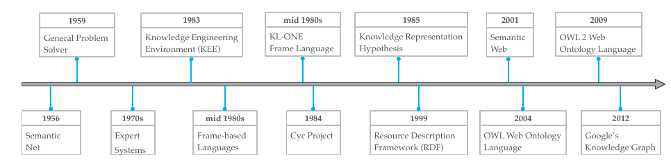

**了解能否将未标记数据放到知识图谱里，相当于一个 label function**

# [A Survey on Knowledge Graphs:Representation, Acquisition and Application](https://ieeexplore.ieee.org/abstract/document/9416312)(knowledge-graph-based research)

> 2020，Published in: IEEE Transactions on Neural Networks and Learning Systems(1 区顶级期刊)

## 概述

### 知识库简史

### 定义与概念

$\mathcal{G=\{E,R,F\}}$，事实是一个三元组$(h,r,t)\in \mathcal{F}$

- $\mathcal{E,R,F}$分别是实体、关系、事实

### 知识图谱研究的分类

**知识表示学习：** 是知识获取和下游应用的基础

- 表示空间：表示实体和关系
- 评分函数：测量事实三元组的合理性
- 编码模型：用于表示和学习关系的交互？？
- 辅助信息：利用额外信息

**知识获取：** 分为知识图谱补全、关系抽取、实体发现

- 知识图谱补全：扩大先存的知识图谱
- 关系抽取和实体发现：发现新知识

**时态知识图谱：** 结合时间信息表示学习

**知识感知应用：** 应用方面

---

## 知识表示学习

综述了近些年分布式表示学习的研究进展

### 表示空间

表示学习的关键问题是学习实体和关系的低纬分布式嵌入
主要使用对点空间，其次是复杂向量空间、高斯空间、流型空间
嵌入空间应该遵循 3 个条件：评估函数的（**可微性、计算的可能性、可定义性**）

**1 对点空间**

- TranR：通过一个仿射矩阵$M_r \in \mathbb{R}^{k\times d}$，将实体$h,t\in \mathbb{R}^k$ 仿射到关系$r\in \mathbb{R}^d$，满足$\bold{h+r\simeq t}$

**2 复杂向量空间**
**3 高斯空间**
**4 流型空间**

### 评价函数

评价事实的合理性，评价函数分为基于距离的评价函数和基于语义相似性的评价函数。
基于距离的评价函数计算实体间的距离（遵循$\bold{h+r\simeq t}$）

**1 基于距离的评价函数**
**2 语义匹配**

### 编码模型

对实体和关系的 interaction 编码的模型

### 嵌入辅助信息

---

## 知识获取

> 目的：构造知识图谱、补全知识图谱、发现与识别实体和关系
> 主要任务：关系抽取、KGC、实体识别和实体对齐

### KGC

补全现有的知识图谱，子任务包括：**link 预测**、**实体预测**、**关系预测**

**1 基于嵌入的方法**
比如实体预测，利用现有的三元组去学习嵌入向量，用每个实体去替换三元组的头实体、或尾实体，计算每个候选实体的分数并将其排列。

**2 关系路径推理**
**3 基于 RL 路径发现**
**6 三元组分类**
三元组分类是确定测试数据中的**事实**是否正确，通常是一个二元分类问题。基于嵌入的方法可以适用。

### 实体发现

细分为几个任务：实体识别、实体消解、实体类型和实体对齐。

**1 实体识别**
标记文本中的实体，一些特定的语言比如地名和书写特征比如大写被应用在许多的文献里。

**2 实体类型**
**3 实体消解**
实体消解或实体串连是一个同一任务，将提到的实体连系到相应的实体。

**4 实体对齐**
实体对齐的目的是融合不同知识图谱的知识。给定两个不同的知识图谱的实体集$\mathcal{E_1}$和$\mathcal{E_2}$，实体对齐的是要找到一个$A=\{(e_1,e_2)\in \mathcal{E_1\times E_2|e_1\equiv e_2}\}$

### 关系抽取

从普通文本中抽取位置关系并将其加进知识图谱。

---

## 时态知识图谱

---

## 下游应用

---

## 未来研究方向
