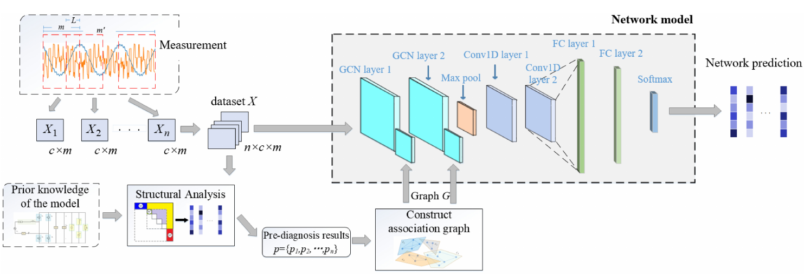

- [1. 2021-04-07](#1-2021-04-07)
  - [1.1. 如何利用 GNN 将知识图谱作为先验知识嵌入神经网络](#11-如何利用-gnn-将知识图谱作为先验知识嵌入神经网络)
- [2. 20210408](#2-20210408)
  - [2.1. 图神经网络综述](#21-图神经网络综述)
    - [2.1.1. 摘要](#211-摘要)
    - [2.1.2. 历史背景](#212-历史背景)
    - [2.1.3. 定义](#213-定义)
    - [2.1.4. GNNs 的分类](#214-gnns-的分类)
    - [2.1.5. GNNs 的框架](#215-gnns-的框架)
  - [2.2. 图卷积网络](#22-图卷积网络)
    - [2.2.1. 基于谱的 GCN](#221-基于谱的-gcn)
      - [2.2.1.1. Spectral CNN](#2211-spectral-cnn)
      - [2.2.1.2. Chebyshev Spectral CNN](#2212-chebyshev-spectral-cnn)
      - [2.2.1.3. First order of ChebNet](#2213-first-order-of-chebnet)
      - [2.2.1.4. Adaptive Graph Convolution Network](#2214-adaptive-graph-convolution-network)
      - [2.2.1.5. 总结](#2215-总结)
- [3. 20210410](#3-20210410)
  - [3.1. 基于 GCN 的测量与先验知识组合的故障检测方法](#31-基于-gcn-的测量与先验知识组合的故障检测方法)
    - [3.1.1. 摘要](#311-摘要)
    - [3.1.2. 介绍](#312-介绍)
    - [3.1.3. GCN](#313-gcn)
    - [3.1.4. GCN-SA](#314-gcn-sa)
      - [3.1.4.1. SA](#3141-sa)
      - [3.1.4.2. 带权重的 GCN](#3142-带权重的-gcn)
- [4. 20210423](#4-20210423)
  - [4.1. 熵](#41-熵)
    - [4.1.1. 信息熵](#411-信息熵)
    - [4.1.2. 条件熵](#412-条件熵)
  - [4.2. 均一性](#42-均一性)
  - [4.3. 完整性](#43-完整性)
  - [4.4. V-measure](#44-v-measure)
  - [4.5. 先验知识的序关系](#45-先验知识的序关系)
  - [4.6. GCN 半监督学习模型的序关系](#46-gcn-半监督学习模型的序关系)
    - [4.6.1. 定义 1 数据集误差](#461-定义-1-数据集误差)
      - [4.6.1.1. 方法一](#4611-方法一)
      - [4.6.1.2. 方法二](#4612-方法二)
    - [4.6.2. 定义 2 先验知识-PAC 规约](#462-定义-2-先验知识-pac-规约)

  - [4.1. 熵](#41-熵)
    - [4.1.1. 信息熵](#411-信息熵)
    - [4.1.2. 条件熵](#412-条件熵)
  - [4.2. 均一性](#42-均一性)
  - [4.3. 完整性](#43-完整性)
  - [4.4. V-measure](#44-v-measure)
  - [4.5. 先验知识的序关系](#45-先验知识的序关系)
  - [4.6. GCN 半监督学习模型的序关系](#46-gcn-半监督学习模型的序关系)

    - [4.6.1. 定义 1 数据集误差](#461-定义-1-数据集误差)
      - [4.6.1.1. 方法一](#4611-方法一)
      - [4.6.1.2. 方法二](#4612-方法二)
    - [4.6.2. 定义 2 先验知识-PAC 规约](#462-定义-2-先验知识-pac-规约)

  - [熵](#熵)
    - [信息熵](#信息熵)
    - [条件熵](#条件熵)
  - [均一性](#均一性)
  - [完整性](#完整性)
  - [V-measure](#v-measure)
  - [先验知识的序关系](#先验知识的序关系)
  - [GCN 半监督学习模型的序关系](#gcn-半监督学习模型的序关系)
    - [定义 1 数据集误差](#定义-1-数据集误差)
      - [方法一](#方法一)
      - [方法二](#方法二)
    - [定义 2 先验知识-PAC 规约](#定义-2-先验知识-pac-规约)

> 类似综述文章，记录相关文章的作者、小组、所在单位, 发表了哪些论文、相关研究做了什么
> 在最后给出一个总结报告

# 1. 2021-04-07

## 1.1. 如何利用 GNN 将知识图谱作为先验知识嵌入神经网络

# 2. 20210408

## 2.1. 图神经网络综述

> Zonghan Wu, Shirui Pan, Member, IEEE, Fengwen Chen, Guodong Long,Chengqi Zhang, Senior Member, IEEE, Philip S. Yu, Fellow, IEEE

### 2.1.1. 摘要

- **数据挖掘**与**机器学习**领域的全面综述
- 以 GCN 为中心，将 GNN 分类
  - Graph Convolution Networks
  - Graph Attention Networks
  - Graph Auto-encoders
  - Graph Generative Networks
  - Graph Spatial-temporal Network
- 讨论在机器视觉、推荐系统、交通、化学以及其他领域的应用
- 总结现有的开源代码与 benchmark

### 2.1.2. 历史背景

1. Scarselli 等人[（2009）]以迭代的方式通过 RNN 框架传播邻节点信息，从而学习目标节点的表示
2. Bruna 等人（2013）基于 spectral graph theory 开发了 GCN
3. 由于 spectral 方法的局限性，基于 spatial 方法的 GCN 得到了快速发展

**图神经网络与网络嵌入**：

网络嵌入或图嵌入：旨在将网络特征表示成低维的向量空间，同时保持网络拓扑结构与节点内容信息

### 2.1.3. 定义

一个图伴随一个节点属性 X（特征矩阵），称为属性图
**定义 时空图** 是一个属性图，属性会随着时间变化而变化

### 2.1.4. GNNs 的分类

1. GCNs 将传统数据的卷积推广到了图数据的卷积，关键在于学习一个函数 f 去聚合节点特征以及邻居节点特征来生成节点表示。GCNs 是其他模型的 building block
2. GANs 与 GCNs 的区别，关键在于 GANs 加入了**注意力**机制（越重要的节点、walk、模型，权重更大）
3. Graph Auto-encoders（非监督）旨在通过编码器学习一个低维的节点向量，再用解码器重构图数据。编码器使用 GCN 作为 building block
4. Graph Generative Networks 旨在从数据中生成合理的结构？
5. Graph Spatial-temporal Network 旨在从时空图中学习不可见的模式

### 2.1.5. GNNs 的框架

GCN 的输出可以通过以下机制之一以专注于不同的图形分析任务

1. Nodel-level
   节点回归、分类
2. Edge-level
   边分类、关系预测
3. Graph-level
   图分类任务

**训练框架**：

1. 半监督学习用作 nodel-level 分类
   给定一个网络，其中部分节点有标签，GCN 能够高效的识别未标记的节点标签
2. 监督学习用作 graph-level 分类
   组合图卷积层与 pooling 层的框架。使一路向西用图卷积层能获得每个节点固定维度的表示，通过 pooling 聚合所有节点的表示向量得到整个图的表示
3. 非监督学习用作图嵌入

## 2.2. 图卷积网络

GCNs 分为**基于谱**与**基于空间**的方法。基于谱的方法是从图信号处理的角度引入过滤器来定义图卷积，其图卷积操作可被解释为从图信号中移除噪声

### 2.2.1. 基于谱的 GCN

图的一种矩阵表示方式是标准化拉普拉斯矩阵 $L = I - D^{-1/2}AD^{-1/2}$，由于它是实对称半正定矩阵，可以将其表示成$L = UΛU^{T}$
$U$是特征向量组成的特征矩阵，$Λ$是相应特征值顺序的特征值对角矩阵。由于是实对称矩阵，$UU^{T} = I$构成了一个正交空间，基向量是标准化后的特征向量
傅里叶变换定义为$F(x) = U^{T}x$，将$x$与其基坐标矩阵$U$相乘，做了一次坐标变换，$F(x)$表示在新空间下的坐标。简单说，傅里叶变换将$x$向量投影到了正交空间下。
傅里叶变换的逆运算$F^{-1}(x̂) = Ux̂$，由此，$x = \sum_{i}x̂_{i}u_{i}$
**图卷积**被简化定义为$x*Gg_{\theta} = Ug_{\theta}U^{T}x$

#### 2.2.1.1. Spectral CNN

[基于谱的 GCN](Spectrual-based%20GCN.md)

#### 2.2.1.2. Chebyshev Spectral CNN

#### 2.2.1.3. First order of ChebNet

#### 2.2.1.4. Adaptive Graph Convolution Network

#### 2.2.1.5. 总结

# 3. 20210410

## 3.1. 基于 GCN 的测量与先验知识组合的故障检测方法

> 顶级期刊 IEEE Transactions on Cybernetics
> Zhiwen Chen , Member, IEEE, Jiamin Xu, Tao Peng , and Chunhua Yang , Member, IEEE
> Zhiwen Chen 中南大学自动化学院

### 3.1.1. 摘要

首先使用 structure analysis(SA)预诊断错误，将其转成关联图。然后将图和测量数据送入 GCN 模型，并引入一个权重系统调整测量数据与先验知识之间的影响程度。

### 3.1.2. 介绍

GCN 通过引入关联图获取数据之间的关系，从而加快了训练速度，提高了模型性能一般的基于 GCN 故障检测的局限：

1. 从所有数据中抽取特征，根据特征之间的相似性确定关联图。但是这种图无法保证准确率，可能会有负影响
2. 很依赖标签数据

本文贡献：

1. 提出 GCN-SA 模型，整合 measurement 和先验知识
2. 此模型能处理少量标签数据的实际问题
3. 引入权重系数，平衡 measurement 与先验知识之间的影响程度

### 3.1.3. GCN

> GCN 本质是：将输入数据集中每个度量的关系图作为先验知识，其目的是提振模型性能或减少训练时间
> 这里的一个度量实际就是一个数据点

**基于谱的 GCN 主要包含两步**：

1. 构造关联图
   数据集$X^{p} = \{X^{p}_{1}, ..., X^{p}_{n}\}$，包含$n$个度量数据点，每个度量是一个$m$长的时间序列
   $X^{p}$的关联图$G(V,A)$，$V = {V_{1}, ..., V_{n}}$是图的节点集合，每节点代表一个度量。
2. 前向传播
   卷积算子$f*x$，$x=\{x_{1},...,x_{n}\}\in R^{n}$表示 n 个数据，$f=\{f_{1},...,f_{n}\}\in R^{n}$表示可训练参数
   略。。
   前向传播公式：$Z=σ((I_{n}-D^{-0.5}AD^{-0.5})X^{p}\Theta)$
   $X^{p}\in R^{n\times m}$，$\Theta \in R^{m\times d}$，$d$表示输出的特征维度

### 3.1.4. GCN-SA

#### 3.1.4.1. SA

**总体框架**

- 假设总的错误类型为$M$，原始时间序列波形$X_{ori}$由传感器采样，它被滑动窗口方法切分从而得到数据集$X=\{X_1,...,X_n\}$。
- 将数据集$X$导入$SA$模型，得到预诊断结果$p=\{p_1,...,p_n\}$，它可以用来获得整个数据集$X$的关联图$G$。
- 根据关联图$G$，构造 GCN 框架的权重系数
- 标签数据组成训练数据集，并且所有的数据都可以被塞到数据集中训练$GCN$
- 最终获得错误诊断结果

---

**滑动窗口方法**
滑动窗口方法是数据处理广泛使用的方法，可以用来将长波测量分割成多个短波测量。通过使用此方法，能得到数据集$X=\{X_1,...,X_n\}\in R ^{n\times c\times m}$。
$n$个测量，每个测量有$c$个变量，每个变量有长度为$m$的波长。

---

**使用 SA 方法对数据集做预诊断**
基于系统已知的数学模型，就能方便快速地实现错误诊断。具体的诊断过程可以分为如下步骤：

- 分析错误系统结构：基于系统现存的 fitting model， 等式组中所有列出的等式和变量被分为未知变量、错误变量、已知变量。然后
  系统的结构模型图被构造处反映等式组中变量和等式的关系。
- 错误分析：FD（错误检测）和 FI（错误隔离）是由 DM 分解和 FI 矩阵分析的。DM 是一个操作工具用来重新排列类似于上三角形式的系数矩阵。
  它可以将原系统的结构模型图分解为 3 个类型区域
  - $M^{-}$该区域未知变量数量超过等式数量
  - $M^{0}$未知变量数量等于等式数量
  - $M^{1}$未知变量数量少于等式数量
- 构造残差：在所有故障都能完全被检测与隔离的基础上，产生多个残差进行故障诊断。残差的含义是残差包含了错误变量，当错误变量值为 0，残差值也相应为 0。因为每个残差包含多个错误变量，残差值与 0 的偏差表示残差中包含的所有故障都有可能发生。因此可以列出残差错误关系表。
- 确定错误诊断策略。为每个残差设置一个门槛值，如果超过门槛值，则认为发生了错误。综合考虑各残差的异常情况，确定故障诊断规则表。
- 所有数据$X_1$到$X_n$用 SA 方法进行故障争端并分别计算其残差。然后将所有残差与门槛值相比较，诊断结果 p 通过参考故障诊断规则表获得。每个诊断结果以 one hot 向量的形式给出。

#### 3.1.4.2. 带权重的 GCN

> 关联图被认为是模型先验知识，不完全正确。当训练集较少时，关联图可以将 GCN 准确率提高很多；相反，训练集充分大时，关联图的作用就不明显了

**单层 GCN 的前向传播**
$y_{GCN} = \sigma((I_{n}-D^{-0.5}AD^{-0.5})X\Theta)$

# 4. 20210423

> 给出先验知识的关联图的评价标准，参考聚类算法的外部评价标准

**参考论文**： [V-Measure: A conditional entropy-based external cluster evaluation measure-Andrew Rosenberg and Julia Hirschberg-2007](https://www.aclweb.org/anthology/D07-1043.pdf)

假设一个数据集有$N$个数据点。类别集合$C=\{c_{i}|i=1,...,n\}$和簇集合$K=\{k_{i}|i=1,...,m\}$。A 是聚类结果，$A={a_{ij}}$其中$a_{ij}$表示数据点是$c_i$类以及是$k_j$簇的数量。

均一性与完整性有时是相对的，比如两个极端的例子：

1. 所有数据点都在聚在一个簇中，完全满足了完整性，但是失去了均一性。
2. 每个数据点都在聚在一个簇中，完全满足了均一性，但是失去了完整性。

## 4.1. 熵

熵本质是指系统“内在的混乱程度”。概率轮中熵指随机变量 X 的不确定性程度。

### 4.1.1. 信息熵

根据香农(Shannon)给出的信息熵公式，对于任意一个随机变量 X，它的信息熵定义如下，单位为比特(bit)：

$$
H(X)=-\sum_{x\in X}P(x)\log {P(x)}
$$

### 4.1.2. 条件熵

**条件熵**是变量$Y$（$X$条件）的熵对$X$的**期望**。**条件熵**$H(Y|X)$表示在已知随机变量$X$的条件下随机变量$Y$的不确定性。随机变量$X$给定的条件下随机变量$Y$的条件熵$H(Y|X)$。

$$
H(Y|X)=\sum_{x\in X}p(x)H(Y|X=x)=-\sum_{x\in X}p(x)\sum_{y\in Y}P(y|x)\log {P(y|x)}=-\sum_{x\in X}\sum_{y\in Y}P(xy)\log {P(y|x)}
$$

---

## 4.2. 均一性

均一性（Homogeneity）指每个簇中只包含单个类别的样本。如果一个簇中的类别只有一个，则均一性为 1；如果有多个类别，计算该类别下的簇的条件经验熵$H(C|K)$，值越大则均一性越小。

$$
h=\left\{
\begin{aligned}
1 &   & if & & H(C|K)=0 \\
1- \frac {H(C|K)}{H(C)} &   & else \\
\end{aligned}
\right.
$$

$$
H(C|K) = -\sum_{k=1}^{|K|}\sum_{c=1}^{|C|} \frac {a_{ck}}{N} log \frac {a_{ck}}{\sum_{c=1}^{|C|}a_{ck}}
$$

$$
H(C)=-\sum^{|C|}_{c=1} \frac {\sum_{k=1}^{|k|}a_{ck}}{n}log \frac {\sum_{k=1}^{|K|}a_{ck}}{n}
$$

## 4.3. 完整性

完整性（Completeness）指同类别样本被归类到相同的簇中。如果同类样本全部被分在同一个簇中，则完整性为 1；如果同类样本被分到不同簇中，计算条件经验熵 H(K|C)，值越大则完整性越小。

$$
c=\left\{
\begin{aligned}
1 & & if & & H(K,C)=0 \\
1 - \frac {H(K|C)}{H(K)} & & else & & \\
\end{aligned}
\right.
$$

$$
H(K|C) = -\sum_{c=1}^{|C|}\sum_{k=1}^{|K|} \frac {a_{ck}}{N} log \frac {a_{ck}}{\sum_{k=1}^{|K|}a_{ck}}
$$

$$
H(K)=-\sum^{|K|}_{k=1} \frac {\sum_{c=1}^{|C|}a_{ck}}{n}log \frac {\sum_{c=1}^{|C|}a_{ck}}{n}
$$

## 4.4. V-measure

单独考虑均一性或完整性都是片面的，因此引入两个指标的加权平均 V-measure。如果$β>1 则更注重完整性，如果 β<1 则更注重均一性。

$$
V_{\beta}=\frac {(1+\beta)*h*c}{(\beta*h)+c}
$$

## 4.5. 先验知识的序关系

$$
\forall i,j(i\neq j),if\quad  h_{i} \le h_{j} \wedge c_{i} \le c_{j}, then\quad A_{i} \sqsubseteq A_{j}, where\quad A\quad is\quad a \quad adjacency\quad matrix
$$

**邻接矩阵 A 可以看做是 GCN 的先验知识**.

## 4.6. GCN 半监督学习模型的序关系

**总体目标**：定义先验知识与机器学习模型的序关系

> 假设 1：先验知识构造的邻接矩阵 A，相连顶点的标签相同

上述假设太强，想利用 PAC 规约的方式改变假设 1，使其变得更加合理。

修改后的假设：已知邻接矩阵 A，相连顶点集合 E，有$ 1- \delta $的概率使得E预测的标签与真实标签的误差不超过 $\delta$

- [ ] 1、根据评价标准，能够计算出数据集误差
- [ ] 2、根据定义 2，能够计算出数据集的 PAC

### 4.6.1. 定义 1 数据集误差

#### 4.6.1.1. 方法一

$$
L= \beta *H(C|K)+( 1- \beta)* H(K|C)
$$

#### 4.6.1.2. 方法二

$$
  Err(H)=P(H(X)\neq G(K))=\sum_{k=1}^{|K|}{p(k)p(C\neq g(k) | k)}=\sum_{k=1}^{|K|}{\sum_{c=1 \wedge c\neq g(k)}^{|C|}}{p(k)p(c | k)}
$$

- $$
  g(k)=\left\{
  \begin{aligned}
  f(x) & & if & & \exists x,x\in K_{k} \wedge x\in X_{train}  \\
  \top & & else & & \\
  \end{aligned}
  \right.
  $$
- $C_i$表示 i 类别的数据集合
- $K_i$表示 i 簇的数据集合
- $X_{train}$训练数据集合

- [ ] **定理 1** 如果$h_1 \le h_2 \wedge c_1 = c_2 $，则$Err(H_1)) \ge Err(H_2))$
- [ ] **定理 2** 如果$h_1 = h_2 \wedge c_1 \leq c_2$，则$Err(H_1)) \ge Err(H_2))$

### 4.6.2. 定义 2 先验知识-PAC 规约

$$
P(L_{x\in K_i}(h(x)\neq g(k))\leq \epsilon) \ge 1- \delta
$$
