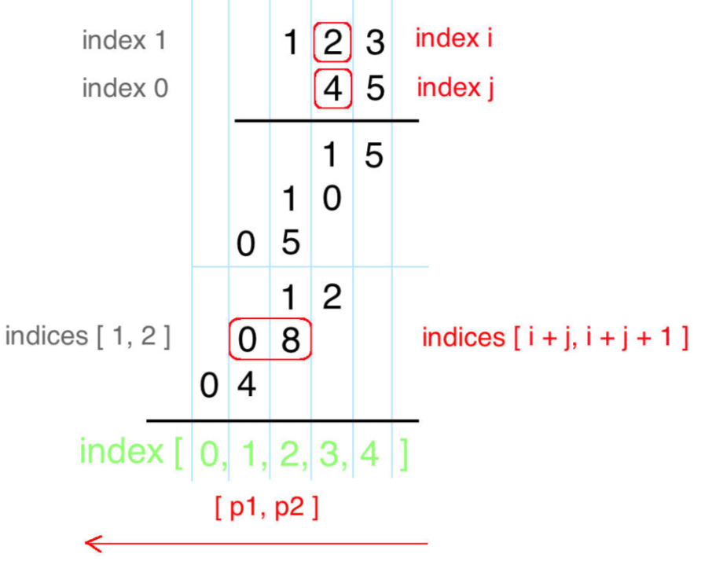
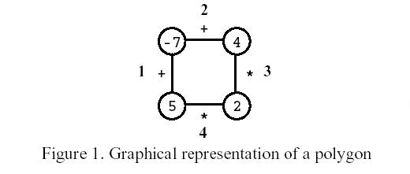
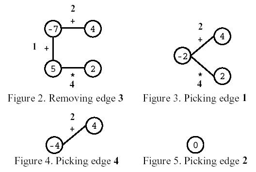

# 1. 1基础算法

## 1.1. 算法技巧

### 常用优化

- 前缀和 $O(N)\rightarrow O(1)$
- 双指针和滑动指针 $O(N^2)\rightarrow O(N)$

### **循环不变式**

> 算法导论第二章分析提及的概念，主要用来帮助理解算法正确性。关于循环不变式，需要证明三个性质：
>
> - **初始化**：循环第一次迭代之前，不变式为真
> - **保持**：如果循环的某次迭代之前为真，那么下次迭代之前不变式仍为真
> - **终止**：在循环终止时，不变式提供了一个有用的性质，有助于证明算法是正确的

运用此思想，在设计算法时，应当有算法实现的**循环体**，依次按照上述三个性质考虑算法实现，以降低实现算法的 bug 率

- **初始化**：开始阶段循环体成立
- **保持**：循环体在执行中的任一步骤成立
- **终止**：保证循环体终止时成立

### 数组中位数

**链表：**快慢指针

**数组：**(b - a) / 2

### 给变量/函数名添加特殊的含义

比如`functionNoCopy`表示function函数没有拷贝动作

### 代理层

对于一个不好处理的数据，但又希望以一个统一的接口获取，可以增加接口实现需求

比如： 小于0的索引返回负无穷，大于n的所有返回负无穷，而0~n之间的索引返回数组元素

```c++
int getElement(int id){
    return id < 0 || id > n ? INT_MIN : nums[i];
}
```


### 单函数尽量只完成单工作

一个函数尽量只完成一个简单的任务，这样任务间工作分明，接口清晰，思路也相对简单。将多个工作交给一个函数完成，会有各种边界值和**逻辑情况**繁杂的情况。

## 1.2. 排序

### 快速排序

#### 代码模板

```c++
int A[N]
void q_sort(int l, int r){
 if (l >= r) return;
 int i = l - 1, j = r + 1, pivot = A[l + r >> 1];
  while (i < j){
    do i ++; while (A[i] < pivot);
    do j ++; while (A[j] > pivot);
    if (i < j) swap(A[i], A[j]);
  }
  q_sort(l, j), q_sort(j + 1, r);
}
```

### 归并排序

#### 代码模板

```c++
int A[N], t[N];
void merge_sort(int l, int r){
    if (l >= r) return;
    int mid = l + r >> 1;
    merge_sort(l, mid), merge_sort(mid + 1, r);
    int i = l, j = mid + 1, k = 0;
    while (i <= mid && j <= r)
        if (A[i] < A[j]) t[k ++] = A[i ++];
    else t[k ++] = A[j ++];
    while (i <= mid) t[k ++] = A[i ++];
    while (j <= r) t[k ++] = A[j ++];
    for (j = 0, i = l; j < k; j ++, i ++) A[i] = t[j];
}
```

### 计数排序

适用于**数据范围较少且重复元素较多**的情况

时间复杂度度O(N)，空间复杂度O(N)

#### 代码模板

```c++
// 假设数据范围[a,b]将其映射到[0,k)准备k个桶存放对应结果
vector<int> buckets(k);
for (int i = 0; i < n; i ++) {
  bucket[nums[i]] ++;
}
```

## 1.3. 二分

### 中位点

**左半点**

数组： $(a + b) / 2$,$a,b$为数组两个端点(0或1开始均可)

**右半点**

数组: $(a+b+1)/2$

### 整数二分

二分的本质是边界：对于区间$[l,r]$有左子数组不满足某性质和右子数组满足某性质或左子数组满足某性质和右子数组不满足某性质。二分法通过不断缩短含有目标的区间，寻找左子数组的右边界或右子数组的左边界。

**1. 基本步骤**：

- 找到某个性质将整个区间划分为左右子区间（一个True、一个False）
- 根据需求选择木板模板

**2. 左子数组的右边界**：左True

```c++
mid = l + r + 1 >> 1;
check(mid) = True --> k in [mid, r] --> l = mid
check(mid) = False --> k in [l, mid - 1] --> r = mid - 1
```

**3. 右子数组的左边界**:右True

```c++
mid = l + r >> 1;
check(mid) = True --> k in [l, mid] --> r = mid
check(mid) = False --> k in [mid + 1, r] --> l = mid + 1
```

**4. 如何选择Check性质**

- Check(mid)中的mid看作一个数组中的一个动点$x$，观察数组特点构造bool公式
  - [剑指 Offer II 069. 山峰数组的顶部](https://leetcode-cn.com/problems/B1IidL/)
  - [剑指 Offer II 070. 排序数组中只出现一次的数字](https://leetcode-cn.com/problems/skFtm2/)
- 可选：数组中的某些固定常量元素a[0]or a[n-1]、与mid相关的mid-1 or mid+1等变量元素

#### 代码模板

```c++
/*检查mid是否满足某性质*
**算法将返回第一个满足性质的位置*/
bool check(int mid){
    .......
}

int bseach1(int l, int r){
    while (l < r){
        int mid = l + r >> 1;
        if (check(mid)) r = mid;
        else l = mid + 1;
    }
    return l;
}
int bseach2(int l, int r){
    while (l < r){
        int mid = l + r + 1 >> 1;
        if (check(mid)) l = mid;
        else r = mid - 1;
    }
    return l;
}
// 通用的二分模板
int bsearch3(int l, int r) {
    while (l <= r) {
        int mid = l + r >> 1;
        if (satisfy(mid)) return mid;
        if (check(mid)) {
            l = mid + 1;
        }
        else r = mid - 1;
    }
    return - 1;
}
```

#### 寻找重复数-Leetcode287

##### 题目描述

给定一个包含 n + 1 个整数的数组 nums ，其数字都在 1 到 n 之间（包括 1 和 n），可知至少存在一个重复的整数。

假设 nums 只有 一个重复的整数 ，找出 这个重复的数 。

你设计的解决方案必须不修改数组 nums 且只用常量级 O(1) 的额外空间。

##### 示例

```
Input: nums = [1,3,4,2,2] output: 2

Input: nums = [3,1,3,4,2] output: 3
```

##### 二分查找

**关键：** 定义*cnt[i]*表示*nums*数组中小于等于*i*的数有多少。*[1, target - 1]*里*cnt[i]<=i*，*[target, n]*里*cnt[i] > i*

### 变型1 有序数组的旋转点

#### [Leetcode153. 寻找旋转排序数组中的最小值](https://leetcode.cn/problems/find-minimum-in-rotated-sorted-array/)

已知一个长度为 n 的数组，预先按照升序排列，经由 1 到 n 次 旋转 后，得到输入数组。例如，原数组 nums = [0,1,2,4,5,6,7] 在变化后可能得到：
若旋转 4 次，则可以得到 [4,5,6,7,0,1,2]
若旋转 7 次，则可以得到 [0,1,2,4,5,6,7]
注意，数组 [a[0], a[1], a[2], ..., a[n-1]] 旋转一次 的结果为数组 [a[n-1], a[0], a[1], a[2], ..., a[n-2]] 。

给你一个元素值 互不相同 的数组 nums ，它原来是一个升序排列的数组，并按上述情形进行了多次旋转。请你找出并返回数组中的 最小元素 。

你必须设计一个时间复杂度为 O(log n) 的算法解决此问题。

**思路1：** 找到第一个满足nums[mid] >=nums[0]的数

- 如果没有旋转或旋转偶数次，则满足条件的是nums[1]。结果索引需要减一
- 如果旋转奇数次，则满足条件的是最大数。结果索引需要加1

```c++
int findMin(vector<int>& nums) {
        int n = nums.size(), l = 0, r = n - 1;
        while (l < r) {
            int mid = l + r + 1 >> 1;
            if (nums[mid] >= nums[0]) l = mid;
            else r = mid - 1;
        }
        l ++;
        return l == n ? nums[0] : nums[l];
}
```


### 浮点数二分

#### 代码模板

```c++
bool check(double x) {/* ... */} // 检查x是否满足某种性质

double bsearch_3(double l, double r)
{
    const double eps = 1e-6;   // eps 表示精度，取决于题目对精度的要求
    while (r - l > eps)
    {
        double mid = (l + r) / 2;
        if (check(mid)) r = mid;
        else l = mid;
    }
    return l;
}
```

### 二分模型

#### 变型1：求最大值的最小值/最小值的最大值

#### [Leetcode410. 分割数组的最大值](https://leetcode.cn/problems/split-array-largest-sum/)

给定一个非负整数数组 `nums` 和一个整数 `m` ，你需要将这个数组分成 `m` 个非空的连续子数组。

设计一个算法使得这 `m` 个子数组各自和的最大值最小。

**基本思路:** 假定`mid`代表最大值，边界值就是最小/大的`mid`。先考虑最终结果的情况下`mid`一定是可以划分成`m`个非空连续子数组的，但是保证`mid`的二段性，右区间结果应该是`true`，左区间应该是`false`。

再考虑到小于`mid`的情况下分出非空连续子数组一定大于`m`，大于`mid`的情况下分出的非空连续子数组一定小于等于`m`，这样保证了`mid`的二段性

```c++
bool check(vector<int> &nums, int x, int m) {
    long long sum = 0, cnt = 1;
    for (int n : nums) {
        if (sum + n > x) {
            sum = n;
            cnt ++;
        }
        else sum += n;
    }
    return cnt <= m; // 最终结果一定是cnt == m的
}
int splitArray(vector<int>& nums, int m) {
    long long  n = nums.size(), l = nums[0], r = 0;
    for (int x : nums) {
        r += x;
        l = max(l, (long long)x);
    }
    while (l < r) {
        long long mid = (l + r) >> 1;
        if (check(nums, mid, m)) r = mid;
        else l = mid + 1;
    }
    return l;
}
```


## 1.4. 高精度

> 存储数字的方式：**从低位到高位**

### 高精度加法

```c++
vector<int> add(vector<int> &A, vector<int> &B) {
  int t = 0;
  vector<int> res;
  for (int i = 0; i < A.size() || i < B.size(); i ++) {
    t += (i < A.size() ? A[i] : 0) + (i < B.size() ? B[i] : 0);
    res.push_back(t % 10);
    t /= 10;
  }
  if (t) res.push_back(t);
  return res;
}
```

### 高精度减法

```c++
vector<int> sub(vector<int> &A, vector<int> &B) {//默认A >= B
  vector<int> res;
  int t;
  for (int i = 0; i < A.size() || i < B.size(); i ++) {
      t = (i < A.size() ? A[i] : 0) - (i < B.size() ? B[i] : 0) - t;
      res.push_back((t + 10) % 10);  
      t = t < 0 ? 1 : 0;
  }
  while (res.size() > 1 && res.back() == 0) res.pop_back();
  return res
}
```

### 高精度乘法

**高精度乘低精度**

```c++
vector<int> mul(vector<int> &A, int b)
{
    vector<int> C;

    int t = 0;
    for (int i = 0; i < A.size() || t; i ++ )
    {
        if (i < A.size()) t += A[i] * b;
        C.push_back(t % 10);
        t /= 10;
    }

    while (C.size() > 1 && C.back() == 0) C.pop_back();

    return C;
}
```

**高精度乘高精度**：优化版竖式乘法



```c++
vector<int> mul(vector<int> &A, vector<int> &B) {
  vector<int> res(A.size() + B.size() , 0);
  for (int i = 0; i < A.size(); i ++) {
      for (int j = 0; j < B.size(); j ++) {
          int t = res[i + j] + A[i] * B[j];
          res[i + j] = t % 10;
          res[i + j + 1] += t / 10;
      }
  }
  while (res.size() > 1 && res.back() == 0) res.pop_back();
  return res;
}
```

### 高精度除法

## 1.5. 前缀和与差分

### 代码模板

```c++
/**前缀和*/
S[i] = S[i - 1] + A[i] //一维
S[i][j] = S[i][j - 1] + S[i - 1][j] - S[i - 1][j - 1] + A[i][j] //二维
/**差分*/
给区间[l, r]加上c： B[l] += c, B[r + 1] -= c //一维
给矩阵[x1,y1][x2,y2]加上c：
    B[x1][y1] += c, B[x1 + 1][y2] -= c, B[x2][y1 + 1] -= c, B[x2][y2]+= c //二维
```

### 增减序列 算法竞赛进阶指南[差分]

#### 题目描述

给定一个长度为 **n**的数列 **a1,a2,…,an**，每次可以选择一个区间 **[****l****,****r****]**，使下标在这个区间内的数都加一或者都减一。

求至少需要多少次操作才能使数列中的所有数都一样，并求出在保证最少次数的前提下，最终得到的数列可能有多少种。

#### 输入格式

第一行输入正整数 **n**。

接下来 **n**行，每行输入一个整数，第 **i**+****1行的整数代表 a c****i。

#### 算法思路

将原数组转化为差分数组，*b1,b2,...,bn*。进行上述操作后将*b2,...,bn*变为0，将区间[l,r]增加1或减1，对应在*bl*加1或减1，在*br*减1或加1。

a=b2-bn的所有正数之和，b=b2-bn的所有负数之和

**最少操作次数：** abs(a - b) + min(a, b)

**得到的所有数列：** abs(a - b) + 1

```c++
#include <iostream>
using namespace std;
typedef long long ll;
const int N = 1e5 + 10;
ll a[N];
void f(int l, int r, ll c){
    a[l] += c, a[r + 1] -= c;
}

int main(){
    int n;
    cin >> n;
    if (!n) return 0;
    for (int i = 0; i < n; i ++){
        ll c;
        cin >> c;
        f(i, i, c);
    }
    ll c = 0, d = 0;
    for (int i = 1; i < n; i ++){
        if (a[i] < 0) c -= a[i];
        if (a[i] > 0) d += a[i];
    }
    cout << abs(c - d) + min(c, d) << endl;
    cout << abs(c - d) + 1 << endl;
    return 0;
}
```

### 和为 K 的子数组-Leetcode.560.中等[[前缀和](#25-前缀和与差分)][[哈希表](#38-哈希表)]

#### 题目描述

给你一个整数数组 ``nums``和一个整数 ``k``，请你统计并返回该数组中和为 ``k``的连续子数组的个数。

#### 示例

```
输入：nums = [1,1,1], k = 2
输出：2

输入：nums = [1,2,3], k = 3
输出：2
```

#### 代码

```c++
int subarraySum(vector<int>& nums, int k) {
        int n = nums.size();

        unordered_map<int, int> hp;
        int sum = 0, ans = 0;
        for (int i = 0; i < nums.size(); i ++){
            hp[sum] ++;
            sum += nums[i];
            if (hp[sum - k]) ans += hp[sum - k];
        }
        return ans;
}
```

## 1.6. 双指针

### 快慢指针

> 求第一个进入环的节点

```c++
slow = startNode, fast = startNode;
while (fast && fast.next) {
    // 慢指针走一步，快指针走两步
    slow = slow.next;
    fast = fast.next.next;
    // 快慢指针相遇，说明含有环
    if (slow == fast) {
      // 任一一节点指向头节点
      fast = head;
      // 同步向前进
      while (fast != slow) {
        fast = fast.next;
        slow = slow.next;
      }
      // 返回入口节点
      return fast;
    }
  }
  // 不包含环
  return null;
```

> 折半链表

右半点

```c++
slow = startNode, fast = startNode
while (fast & fast.next) {
    slow = slow.next;
    fast = fast.next.next;
}
```

左半点

```c++
slow = startNode, fast = startNode.next
while (fast & fast.next) {
    slow = slow.next;
    fast = fast.next.next;
}
```


### 双指针缩进

> 设i, j指向的区间为一个集合S

适用数组中满足解的两个点

往某个方向优化时：

- 必须证明被减去的集合是无效解
- 降低一个时间维度


### 滑动窗口

静态滑动窗口

#### 动态滑动窗口

##### 代码模板

```c++
while (j < n) {
    while (j < n && 不满足/满足条件) {
        ...
        j ++;
	}
    maxWindowLength = max(maxWindowLength, j - i); // 不满足条件的最大窗口
    
    while (i < j && 满足/不满足条件) {
        minWindowLength = max(minWindowLength, j - i); // 满足条件的最小窗口
		...
        i ++;
    }
}
```

**模板2:**只有条件不满足时左边界收缩，同时滑动窗口整体平移，因此窗口会保持最大的大小

```C++
while (r < n) {
   	...
    r ++;
    if (满足/不满足条件) {
		l ++;
    }
}
return r - l;
```

### 经典例题

1. N数之和

2. [二维数组中的查找](https://leetcode-cn.com/problems/er-wei-shu-zu-zhong-de-cha-zhao-lcof)

3. [167. 两数之和 II - 输入有序数组](https://leetcode.cn/problems/two-sum-ii-input-array-is-sorted/)

## 1.7. 位运算

### (1) 与运算

#### 截取二进制的任意几位

```c++
//
n = 10_0010_1010
//取出后四位
int res = n & 0xf
```

#### 返回n的最后一位1：lowbit(n) = n & -n

#### 判断被两个集合中的元素的交集[[集合论](#5-数论与集合论)]

```c++
//集合A和集合B，集合中的元素用二进制表示
//如A={'a', 'c', 'd'};B={'a', 'b', 'a'}
bits(A) = 1101, bits(B) = 11
bits(A) & bits(B) = 0001//可知，交集元素是a
```

### 最大单词长度乘积-Leetcode318 中等[二进制球元素交集]

#### 题目描述

给定一个字符串数组 words，找到 length(word[i]) * length(word[j]) 的最大值，并且这两个单词不含有公共字母。你可以认为每个单词只包含小写字母。如果不存在这样的两个单词，返回 0。

#### 输入格式

```
输入: ["abcw","baz","foo","bar","xtfn","abcdef"]
输出: 16 
解释: 这两个单词为 "abcw", "xtfn"。
```

#### 位运算

```c++
int maxProduct(vector<string>& words) {
       int n = words.size(), res = 0;
       vector<int> bits;
       for (auto s : words){
           int  a = 0;
           for (int i = 0; s[i]; i ++){
               a |= (1 << (s[i] - 'a'));
           }
           bits.push_back(a);
       }
       for (int i = 0; i < n; i ++){
           for (int j = i + 1; j < n; j ++){
               if (! (bits[i] & bits[j]) && res <(int) words[i].size() * (int)words[j].size()) 
                res = (int)words[i].size() * (int)words[j].size();
           }
       }
       return res;
    }
```

### Leetcode 137. 只出现一次的数字 II

#### 题目描述

给你一个整数数组 nums ，除某个元素仅出现 一次 外，其余每个元素都恰出现 三次 。请你找出并返回那个只出现了一次的元素。

#### 示例

**示例1**

```
输入：nums = [2,2,3,2]
输出：3
```

#### 位运算，依次求每位二进制值

所有元素都恰巧出现三次，统计每一位二进制的1或0的个数，其结果一定是3的倍数。

```c++
int singleNumber(vector<int>& nums) {
      int res = 0;
      for (int i = 0; i < 32; i ++) {
          int ans = 0;
          for (auto &x : nums) {
              if ((x >> i) & 1) {
                  ans ++;
              }
          }
          if (ans % 3) {
              res |= 1 << i;
          }
      }
      return res;
  }
```

## 1.8. 离散化

### 代码模板

```c++
vector<int> alls;
sort(alls.begin(), alls.end());
alls.erase(unique(alls.begin(), alls.end()), alls.end());//去重
int find(x){
  int l = 0, r = alls.size() - 1;
  while (l < r){
    int mid = l  + r >> 1;
    if (alls[mid] >= x) r = mid;
    else l = mid + 1;
  }
  return l + 1;
}markdown


## 2.10. 区间合并

### 2.10.1. 代码模板

```c++
void merge(vector<PII> &seg){
  int st = -INF, ed = -INF;
  sort(segs.begin(), segs.end());
  vector<PII> res;
  for (auto i : segs){
    if (ed < i->first){
      if (st != -INF) res.push_back({st, ed});
      st = i->first, ed = i->second;
    }
    else ed = max(ed, i->second);
  }

  if (st != -INF) res.push_back({st, ed});
  segs = res;
}
```

## 1.9. 计数法

### 摩尔投票

**统计出现次数超过$n/k$的数, 假设当前遍历的元素是$x$**

- 如果$x$本身是候选者， 则对其出现次数+1
- 如果$x$本身不是候选者， 检查是否有候选者的出现次数为0
  - 若有， 则让$x$代替成为新的候选者， 并记录出现次数为1
  - 若无， 则让所有候选者的出现次数-1

**上述做法正确性的关键是：若存在出现次数超过 $n / k$的数，最后必然会成为这 $k - 1$个候选者之一**

```python
x1 = 0, c1 = 0;
....
xk-1 = 0, ck-1 = 0;
for x : nums
  if c1 !=0 and x == x1:
    c1 ++
  elif ...
  elif ck-1 !=0 and x == xk-1:
    ck-1 ++
  
  elif c1 == 0
    x1 = x, c1 ++
  elif ...
  elif ck-1 == 0
    xk-1 = x, ck-1 ++
  
  else c1--, c2--, ..., ck-1 --


  ##验证k-1个数哪些是最终的解
  c1 = c2 = ... = ck- 1 = 0
  for x : nums:
    if x == x1 :
      c1 ++
    elif x == x2:
      c2 ++

  
  if c1 > n / k: 
    res.add(x1)
  if ...
  if ck-1 > n / k:
    res.add(xk-1)
```

---

## 1.10. 轮转数组

#### [LeetCode189. 轮转数组](https://leetcode.cn/problems/rotate-array/)

给你一个数组，将数组中的元素向右轮转 `k` 个位置，其中 `k` 是非负数。

思路: 数组分为ab，根据==逆==的性质，可得: $(a^{T}b^{T})^{T}=ba$

```c++
void rotate(vector<int>& nums, int k) {
        int n = nums.size();
        k %= n;
        if (!k) return;
        reverse(nums.begin(), nums.begin() + n - k);
        reverse(nums.begin() + n - k, nums.end());
        reverse(nums.begin(), nums.end());
}
```


# 2. 数据结构

## 2.1. 链表

### 技巧

**为单链表设置头结点**——优点

- 对第一个结点的插入删除与其他结点统一
- 保证元素插入在当前结点的后面，与循环链表的操作统一

### 算法思想

略

- [2.6.3.4.1. 样例](#26341-样例)

### LRU 缓存机制-LeetCode146 中等[链表]

#### 题目描述

运用你所掌握的数据结构，设计和实现一个   LRU (最近最少使用) 缓存机制。实现 LRUCache 类：

- LRUCache(int capacity) 以正整数作为容量  capacity 初始化 LRU 缓存
- int get(int key) 如果关键字 key 存在于缓存中，则返回关键字的值，否则返回 -1 。
- void put(int key, int value)  如果关键字已经存在，则变更其数据值；如果关键字不存在，则插入该组「关键字-值」。当缓存容量达到上限时，它应该在写入新数据之前删除最久未使用的数据值，从而为新的数据值留出空间。

你是否可以在 **O(1)** 时间复杂度内完成这两种操作？

##### 样例

```c++
示例：

输入：
["LRUCache", "put", "put", "get", "put", "get", "put", "get", "get", "get"]
[[2], [1, 1], [2, 2], [1], [3, 3], [2], [4, 4], [1], [3], [4]]

输出:
[null, null, null, 1, null, -1, null, -1, 3, 4]

解释：
LRUCache lRUCache = new LRUCache(2);
lRUCache.put(1, 1); // 缓存是 {1=1}
lRUCache.put(2, 2); // 缓存是 {1=1, 2=2}
lRUCache.get(1);    // 返回 1
lRUCache.put(3, 3); // 该操作会使得关键字 2 作废，缓存是 {1=1, 3=3}
lRUCache.get(2);    // 返回 -1 (未找到)
lRUCache.put(4, 4); // 该操作会使得关键字 1 作废，缓存是 {4=4, 3=3}
lRUCache.get(1);    // 返回 -1 (未找到)
lRUCache.get(3);    // 返回 3
lRUCache.get(4);    // 返回 4
```

---

#### 链表模拟算法

```c++
大部分时间都花在了思考步骤实现上，被重复操作和各种考虑情况拖慢了速度
仔细思考，其实有些操作是重复的，因此我们可以单独将这些操作领出来实现，既可以减少思考量，又可以代码复用

算法思路：
1、LRU每次读都需要将cache内元素移动到最顶端，如果插入cache时超过容量，需要从最低端弹出元素。因此整个过程作用于线性结构上，并且频繁的插入和移动节点，选择链表可以实现以o(1)的时间复杂度。
2、观察发现，get若命中需要将链表内元素移动，put若命中也需要将元素移动，所以将链表内某个存在元素移动至尾端作为元操作封装。


/*将链表某元素移动至链尾*
**keyToAdres存放key与所在前驱节点指针地址的映射，addresToKey存放指针地址到key的映射*
**只需要注意将key所在指针从链表移除后，同时也要更新keyToAdres与addresToKey的映射关系*
*/
void shiftNodeToRightest(int key){
  ListNode *pre = keyToAdres[key], *tt = pre->next;
  if (tt == tail) return;
  int key_tt = addresToKey[pre], key_tp = addresToKey[tt];
  pre->next = tt->next;
  tail->next = tt;
  keyToAdres[key_tp] = pre;
  addresToKey[pre] = key_tp;
  keyToAdres[key_tt] = tail;
  addresToKey[tail] = key_tt;
  tail = tail->next;
}
```

##### 时间复杂度 o(1)

##### C++ 代码

```c++tt
int cc = 0, capacity;
    ListNode *head, *tail;
    unordered_map<int, ListNode*> keyToAdres;
    unordered_map<ListNode*, int> addresToKey;

    void addNode(int key, int value) {
        keyToAdres[key] = tail;
        addresToKey[tail] = key;
        tail->next = new ListNode(value);
        tail = tail->next;
        cc ++;
    }
    void shiftNodeToRightest(int key) {
        ListNode *pre = keyToAdres[key], *tt = pre->next;
        if (tt == tail) return;
        int key_tt = addresToKey[pre], key_tp = addresToKey[tt];
        pre->next = tt->next;
        tail->next = tt;
        keyToAdres[key_tp] = pre;
        addresToKey[pre] = key_tp;
        keyToAdres[key_tt] = tail;
        addresToKey[tail] = key_tt;
        tail = tail->next;
    }
    LRUCache(int capacity) {
        head = new ListNode();
        tail = head;
        this->capacity = capacity;
    }

    int get(int key) {
        int res = - 1;
        if (keyToAdres[key]) {
            res = keyToAdres[key]->next->val;
            shiftNodeToRightest(key);
        }
        return res;
    }

    void put(int key, int value) {
        if (!keyToAdres[key]){
            while (cc >= this->capacity){
             keyToAdres[addresToKey[head]] = 0;
             head = head->next;
             cc--;
            }
            addNode(key,value);
        }
        else {
            keyToAdres[key]->next->val = value;
            shiftNodeToRightest(key);
        }tt
    }
};
```

## 2.2. 栈

### 中缀表达式->后缀表达式

- 初始化两个栈S1,S2
- 从左往右扫描中缀表达式
- 遇到操作数时，将其压入S2
- 遇到运算符时，比较其与S1栈顶的运算符优先级：
  - 如果S1为空则直接将运算符入栈
  - 若优先级比栈顶运算符优先级高，压入S1
  - 否则，将S1栈顶运算符压入S2中，继续比较
- 将S1剩余的运算符压入S2中

## 2.3. 单调栈

> 特性1 : **找出每个数左边离它最近的比它大/小的数**

### 代码模板

```c++
int A[N];
stack<int> st;
//单调递增栈求小数、单调递减栈求大数
for (int i = 0; i < n; i ++){
  while (!st.empty() && A[i] < st.top()) {
      st.pop();
  }
  st.push(A[i]);
}
```

**总结**：

- `>` 单调递增栈，`<`单调递减栈
- `>=` 严格单调递增栈, `<`严格单调递减栈

**特性的常数优化:** 一个栈一次求出每个数左边和右边离它最近的比它小/大的数

比如单调递增栈， 求每个数左和右边离它最近的比它小的数

```c++
leftLeastMin, rightLeastMin;
for (int i = 0; i < n; i ++){
  while (!st.empty() && A[i] < A[st.top()]) { // 单调递增栈的条件
      int u = st.top(); // 弹出栈顶元素u
      rightLeastMin[st.top()] = i;
      // u的右边
      st.pop();
  }
  if (!st.empty()) {
      leftLeastMin[i] = st.top(); // 每个数左边离它最近的比它小的数
  }
  st.push(i);
```

证明: 一个单调递增栈，当前处理位置是$j$,栈顶元素是$i$，$i$一定小于$j$。

若$A[i] > A[j]$，则一定不存在某个$k\in\{i...j\}$，使得$A[i] > A[k]$。因为若存在，则$i$就已经被弹出

### 最小字符串

[Leetcode402. 移掉 K 位数字](https://leetcode.cn/problems/remove-k-digits/)

给你一个以字符串表示的非负整数 `num` 和一个整数 `k` ，移除这个数中的 `k` 位数字，使得剩下的数字最小。请你以字符串形式返回这个最小的数字。

**思路: **比如字符串`cdeab`移除`3`位数字，应该删掉`cde`才使得字符串最小。维护单调递增栈，删掉前面大的字符。

```c++
 string removeKdigits(string num, int k) {
        int n = num.size();
        int ans = 0;
        string res;
        for (int i = 0; i < n; i ++) {
            while (!res.empty() && res.back() > num[i]) {
                if (ans < k) {
                    ans ++;
                    res.pop_back();
                }else break;
            }
            res.push_back(num[i]);
        }
        while (res.size() > 1 && res[0] == '0') res.erase(0, 1);
        while (ans < k && !res.empty()) {
            res.pop_back();
            ans ++;
        }
        return res == "" ? "0" : res;
    }
```


## 2.4. 单调队列

> 求出滑动窗口内的最大值/最小值

思路与单调栈类似，队列中元素按照原数组顺序保持单调关系，滑动窗口的应用为单调队列增加了大小限

### 代码模板

```c++
int A[N];
dequeue<int> q;
for (int i = 0; i < n; i ++){
  while (!q.empty() && q.front() > slideWindow_size) q.pop_front();
  while (!q.empty() && A[i] > A[q.back()]) q.pop_back();
  q.push(i);
}
```

### 单调队列与栈的总结

单调队列与单调栈的模板基本是一致的，**除了单调队列增加了从左/右边出队列的操作**

单调队列/栈中的元素是已经遍历过的数组元素和当前正在遍历的元素的**一种单调关系**

$nums[i] = \{x_0,...,x_i,...,x_n\}$
比如当前从左往右访问到元素$x_i$

单调关系即第一个大于/小于$x_i$的元素$x_j$,$j\leq i$，以此类推

## 2.5. 滑动窗口

### 固定大小

### 可变大小

保证整个数组或字符串是所求区间的上近似

```python
def findSubArray(nums):
    N = len(nums) # 数组/字符串长度
    left, right = 0, 0 # 双指针，表示当前遍历的区间[left, right]，闭区间
    sums = 0 # 用于统计 子数组/子区间 是否有效，根据题目可能会改成求和/计数
    res = 0 # 保存最大的满足题目要求的 子数组/子串 长度
    while right < N: # 当右边的指针没有搜索到 数组/字符串 的结尾
        sums += nums[right] # 增加当前右边指针的数字/字符的求和/计数
           # 到 while 结束时，我们找到了一个符合题意要求的 子数组/子串
        res = max(res, right - left + 1) # 需要更新结果
        right += 1 # 移动右指针，去探索新的区间

        while 区间[left, right]不符合/符合题意：# 此时需要一直移动左指针，直至找到一个符合题意的区间
            sums -= nums[left] # 移动左指针前需要从counter中减少left位置字符的求和/计数
            left += 1 # 真正的移动左指针，注意不能跟上面一行代码写反
  
    return res
```

#### 例题

#### [Leetcode3. 无重复字符的最长子串](https://leetcode.cn/problems/longest-substring-without-repeating-characters/)

## 2.6. 字符串

### KMP 代码模板

```c++
// s[]是长文本，p[]是模式串，n是s的长度，m是p的长度
int p[N], s[M], n, m, ne[N];
//求模式串的Next数组：
void getNex(){
  for (int i = 2, j = 0; i <= n; i ++){
    while (j && p[i] != p[j + 1]) j = ne[j];
    if (p[i] == p[j + 1] ) j ++;
    ne[i] = j;
  }
}

/**匹配*/
for (int i = 1, j = 0; i < m; i ++){
  while (j && s[i] != p [j + 1]) j = ne[j];
  if (s[i] == p[j + 1]) j ++;
  if (j == n){
    //匹配成功
    ....
    j = ne[j];
  }
}
```

## 2.7. Trie树

### 代码模板

```c++
int son[N][26], idx, cnt[N];
void insert(string s){
  int p = 0;
  while (int i = 0; s[i]; i ++){
    int u = s[i] - 'a';
    if (!son[p][u]) son[p][u] = ++ idx;
    p = son[p][u];
  }
  cnt[p] ++;
}
int query(string s){
  int p = 0;
  while (int i = 0; s[i]; i ++){
    int u = s[i] - 'a';
    if (!son[p][u]) return 0;
    p = son[p][u];
  }
  return cnt[p];

}
```

### 算法思想

略

#### 题目描述

请你设计一个数据结构，支持 添加新单词 和 查找字符串是否与任何先前添加的字符串匹配 。

实现词典类 WordDictionary ：

- WordDictionary() 初始化词典对象
- void addWord(word) 将 word 添加到数据结构中，之后可以对它进行匹配
- bool search(word) 如果数据结构中存在字符串与  word 匹配，则返回 true ；否则，返回   false 。word 中可能包含一些 '.' ，每个  . 都可以表示任何一个字母。

##### 样例

```c++
输入：
["WordDictionary","addWord","addWord","addWord","search","search","search","search"]
[[],["bad"],["dad"],["mad"],["pad"],["bad"],[".ad"],["b.."]]

输出:
[null,null,null,null,false,true,true,true]

解释：
WordDictionary wordDictionary = new WordDictionary();
wordDictionary.addWord("bad");
wordDictionary.addWord("dad");
wordDictionary.addWord("mad");
wordDictionary.search("pad"); // return False
wordDictionary.search("bad"); // return True
wordDictionary.search(".ad"); // return True
wordDictionary.search("b.."); // return True
```

---

#### 字典树+DFS

```c++
与字典树不同的是查找的时候可能会出现'.'，这个时候需要遍历树的所有后继，并且只要有一个后继全部匹配就可以返回false。
算法思想：递归
/*p：树的父节点，从父节点->孩子节点，处理和判断在孩子节点进行*
**i：word指针，存放当前匹配到word的位置*
**n：word字的总长度*/
字典树、 word、p、i、n
1、递归出口：
  i==n - 1时匹配借宿，返回cnt[p]
  i < n - 1时 若父节点为空 则匹配失败返回false
2、递归主体：从父节点p出发判断孩子节点是否匹配，若匹配继续往下走，否则返回false
  若孩子节点 u ！= '.' 时，直接判断
  若孩子节点u == '.' 时， 遍历p的孩子节点，只要有一个孩子节点返回true，结果就返回true，否则返回false
```

##### 时间复杂度 o(n)

if

##### C++ 代码

```c++
class WordDictionary {
public:
    /** Initialize your data structure here. */
    int son[100010][26], cnt[100010], idx;
    WordDictionary() {
        memset(son, 0, sizeof(son));
        memset(cnt, 0, sizeof(cnt));
        idx = 0;
    }

    void addWord(string word) {
        int p = 0;
        for (int i = 0; word[i]; i ++){
            int u = word[i] - 'a';
            if (!son[p][u]) son[p][u] = ++ idx;
            p = son[p][u];
        }
        cnt[p] ++;
    }

    bool dfs(string word,int p, int i, int n){
        if (!p) return false;
        if (i == n - 1) return cnt[p];
        if (word[i + 1] != '.'){
            int u = word[i + 1] - 'a';
            return dfs(word, son[p][u], i + 1, n);
        }
        else{
            for (int j = 0; j < 26; j ++){
                if (son[p][j] && dfs(word, son[p][j], i + 1, n)) return true;
            }
        }
        return false;
    }

    bool search(string word) {
        int n = word.size();
        if (!n) return false;
        if (word[0] != '.') return dfs(word, son[0][word[0] - 'a'], 0, n);
        else {
            for (int i = 0; i < 26; i ++){
                if (dfs(word, son[0][i], 0, n)) return true;
            }
        }
        return false;
    }
};
```

## 2.8. 并查集

### 代码模板

```c++
/*朴素并查集*
**/
//存放每个节点的祖宗节点
int p[N];
//返回x的父节点
int find(int x){
  if (p[x] != x) p[x] = find(p[x]);
  return p[x];
}
//初始化，所有节点都是父节点
for (int i = 1; i <= n; i ++) p[i] = i;
//将a合并到b
p[find(a)] = find(b);

/*维护size的并查集*
**/
//size[]只有祖宗有意义，存放祖宗节点的集合中点的数量
int p[N], size[N];

int find(x){
  if (p[x]!= x) return p[x] = find(p[x]);
  return p[x];
}
for (int i = 1; i <= n; i ++) p[i] = i, size[i] = 1;

p[find(a)] = find(b);
size[find(b)] += size[find(a)];

/*维护到祖宗节点距离的并查集*
*/
//d[x]存放x到p[x]的距离
int p[N], d[N]

int find(int x){
  if (p[x] != x){
    int u = find(p[x]);
    d[x] += d[p[x]];
    p[x] = u;
  }
  return p[x];
}

for(int i = 1; i <= n; i ++){
  p[i] = i;
  d[i] = 0;
}

p[find(a)] =find(b);
d[find(a)] = distance;
```

### 算法思想

略

### 食物链-算法竞赛进阶指南中等[并查集]

#### 题目描述

动物王国中有三类动物 A,B,C，这三类动物的食物链构成了有趣的环形。

A 吃 B，B 吃 C，C 吃 A。

现有 N 个动物，以 1∼N 编号。

每个动物都是 A,B,C 中的一种，但是我们并不知道它到底是哪一种。

有人用两种说法对这 N 个动物所构成的食物链关系进行描述：

第一种说法是 1 X Y，表示 X 和 Y 是同类。

第二种说法是 2 X Y，表示 X 吃 Y。

此人对 N 个动物，用上述两种说法，一句接一句地说出 K 句话，这 K 句话有的是真的，有的是假的。

当一句话满足下列三条之一时，这句话就是假话，否则就是真话。

- 当前的话与前面的某些真的话冲突，就是假话；
- 当前的话中 X 或 Y 比 N 大，就是假话；
- 当前的话表示 X 吃 X，就是假话。
  你的任务是根据给定的 N 和 K 句话，输出假话的总数。

#### 输入格式

第一行是两个整数 N 和 K，以一个空格分隔。

以下 K 行每行是三个正整数 D，X，Y，两数之间用一个空格隔开，其中 D 表示说法的种类。

若 D=1，则表示 X 和 Y 是同类。

若 D=2，则表示 X 吃 Y。

#### 输出格式

只有一个整数，表示假话的数目。

#### 数据范围

1≤N≤50000,
0≤K≤100000

##### 样例

```c++
输入：
100 7
1 101 1
2 1 2
2 2 3
2 3 3
1 1 3
2 3 1
1 5 5
输出:
3
```

---

#### 算法思路

**并查集-维护到祖宗节点距离**
d 维护节点到祖宗节点距离，初始化为 0（自己到自己的距离为 0）。整个距离只有 3 种情况 0、1、2（取模处理）

union 有两种：

1. **x 和 y 是同类**
   1. 判断 x 和 y 是否在一个集合中，若在则直接判断 d[x]%3 == d[y]%3
   2. 如果不在一个集合中，则将 y 并如 x 集合，导出距离关系公式为$d[find(x)] = (d[x] - d[y] + 3) \% 3$
2. **x 吃 y**
   1. 判断 x 和 y 是否在一个集合中，若在则直接判断$d[x]\% 3 == (d[y] +1) \% 3$
   2. 如果不在一个集合中，则将 y 并如 x 集合，导出距离关系公式为$d[find(x)] = (d[x] - d[y] + 2) \% 3$

##### 时间复杂度 o(n)

##### C++ 代码

```c++
#include <iostream>
#include <string>
using  namespace std;
const int N = 1e5;
int f[N], dis[N];
int n, k, d, x, y;
void init(){
    for (int i = 1; i <= n; i ++)
        f[i] = i, dis[i] = 0;
}
int find(int x){
    if (f[x] != x) {
        int  u = find(f[x]);
        dis[x] += dis[f[x]];
        dis[x] %= 3;
        f[x] = u;
    }
    return f[x];
}
bool D1(int x, int y){
    int px = find(x), py = find(y);
    if (px == py) return dis[x] % 3 == dis[y] % 3;
    int k = (dis[x] - dis[y] + 3) % 3;
    dis[py] = k;
    f[py] = px;
    return true;
}
bool D2(int x, int y){
    int px = find(x), py = find(y);
    if (px == py) return dis[x] % 3 == (dis[y] + 1) % 3;
    int k = (dis[x] - dis[y] + 2) % 3;
    dis[py] = k;
    f[py] = px;
    return true;
}
int main() {
    cin >> n >> k;
    init();
    int res = 0;
    while (k--) {
        cin >> d >> x >> y;
        if (x > n || y > n){
            res ++;
            continue;
        }
        if (d == 1 && !D1(x, y)) res ++;
        if (d == 2 && !D2(x, y)) res ++;

    }
    cout << res << endl;
    return 0;
}
```

## 2.9. 堆

### 代码模板

#### 优先级队列

```c++
priority_queue<int, vector<int>, less<int>> pq;//最大堆
priority_queue<int, vector<int>, greater<int>> pq;//最小堆

/*方法1重载()**/
struct cmp{
  bool operator()(ListNode *a , ListNode *b){
    return a->val > b->val;
  }
}
// priority_queue自定义函数的比较与sort正好是相反的
// 也就是说，如果你是把大于号作为第一关键字的比较方式，那么堆顶的元素就是第一关键字最小的
 priority_queue<ListNode*, vector<ListNode*>, cmp> pq;
// 此时pq就按照节点的值将最小的放在堆顶


/*方法2重载<**/
struct Status{
    int val;
    ListNode* node;
    bool operator < (const Status &tmp) const{
    // 函数必须是静态的 使得该函数可以被 const 对象也就是常量所调用
    // 形参可以加上const关键字和&，保证安全性，提高效率
        return val > tmp.val;
    }
};
priority_queue<Status> pq;

/*方法3利用友元函数重载<**/
struct Status{
      int val;
      ListNode* node;
      friend bool operator<(Status a, Status b)  // 形参可以加上const关键字和&，保证安全性，提高效率
      {
          return a.val > b.val;
      }
};
priority_queue<Status> pq;
```

##### 堆

```c++
/*h[N]存放堆中的值，h[1]是堆顶*
**ph[k]存储第k个插入的点在堆中的位置*
**hp[k]存储堆中下标是k的点是第几个插入的*/
int h[N], ph[N], hp[N], size;
void heap_swap(int a, int b){
  swap(ph[hp[a]],ph[hp[b]]);
  swap(hp[a], hp[b]);
  swap(h[a], h[b]);
}

//h[1]不满足堆的性质
void down(int u){
  int t = u;
  if (u * 2 <= size && h[u * 2] < h[t]) t = u * 2;
  if (u * 2 +1 <= size && h[u * 2 + 1] < h[t]) t = u * 2 + 1;
  if(u != t){
    heap_swap(u, t);
    down(t);
  }
}

void up(int u){
  while (u / 2 && h[u] < h[u / 2]){
    heap_swap(u, u / 2);
    u >>= 1;
  }
}

//o(n) 建堆
for (int i = n / 2; i; i --) down(i);
```

### 算法思想

> 堆逻辑上是一个完全二叉树，树中每个 node 都比其孩子小称为**小根堆**，相反称为**大根堆**
> 数组可以模拟完全二叉树，从 1 开始存放，左孩子的位置是**2x**，右孩子的位置是**2x+1**

**向上调整、向下调整：堆中只有一个位置不满足堆的性质**
**向下调整建堆**：n/2 处的 node 是树中拥有孩子的最小子树，大于 n/2 的叶子 node 均满足堆的性质。因此将 n/2 到 1 处 node 向下调整的过程，就是一步一步将子树根节点向下调整的过程（子树中只有根节点可能不满足堆性质）

**总结调整规则**：向下调整-根节点 h[1]不满足性质、向上调整-尾节点 h[n]不满足性质

### 例题

#### [Leetcode347. 前 K 个高频元素](https://leetcode.cn/problems/top-k-frequent-elements/)

#### 合并 K 个升序链表-Leetcode23 困难[堆][合并有序组]

##### 题目描述

给你一个链表数组，每个链表都已经按升序排列 。

请你将所有链表合并到一个升序链表中，返回合并后的链表。

样例 1

```c++
输入：  lists = [[1,4,5],[1,3,4],[2,6]]
输出:   [1,1,2,3,4,4,5,6]
解释：  链表数组如下：
[
  1->4->5,
  1->3->4,
  2->6
]
将它们合并到一个有序链表中得到。
1->1->2->3->4->4->5->6
```

**样例 2**

```c++
输入：  lists = [[]]
输出:   []
```

**样例 3**

```c++
输入：  lists = []
输出:   []
```

---

##### 合并有序链表+堆

**合并有序数组**
此题思路与合并有序数组类似，只不过所有的数组换成了链表并且是多有序链表合并，但是思路一样(遍历数组中的链表，返回一个最小值的地址，然后 next，最重要的就是**从一串数中返回一个最小值**)

**堆**
从数组中以$o(logn)$的时间复杂度返回一个最大值或最小值，与快排不同（以$o(n)$的时间复杂度返回第 k 小的数）

**除非题目会修改堆中元素，否则一般情况下使用优先级队列**。

##### 时间复杂度 o(nlogn)

##### C++ 代码

```c++
class Solution {
public:
    static struct cmp{
      bool operator()(ListNode *a , ListNode *b){
          return a->val > b->val;
      }
    };
    ListNode *mergeKLists(vector<ListNode *> &lists) {
        int n = lists.size();
        if (!n) return nullptr;
        priority_queue<ListNode*, vector<ListNode*>, cmp> h;
        ListNode *head = new ListNode(), *p = head;
        for (auto x : lists){
            if (!x) continue;
            h.push(x);
        }
        while (!h.empty()){
            ListNode* top = h.top();
            h.pop();
            p ->next = top;
            if (top->next) h.push(top->next);
            p = p->next;
        }
        return head->next;
    }
};
```


### 会议室 II-LeetCode-253

#### 题目描述

给你一个会议时间安排的数组 intervals ，每个会议时间都会包括开始和结束的时间 intervals[i] = [starti, endi] ，返回 所需会议室的最小数量 。

#### 示例

```
输入：intervals = [[0,30],[5,10],[15,20]]
输出：2
```

#### 优先级队列

这道题抽象为**求出最大区间重叠数**。
将会议室按照开始时间排序，优先级队列中存放前k-1次会议的结束时间（堆顶为最早结束时间）。如果k会议开始的时间晚于（大于）前k-1次会议的最早结束时间，则可以让出会议室给k使用。

#### 时间复杂度 `O(nlogn)`

#### 代码

```c++
int minMeetingRooms(vector<vector<int>>& intervals) {
        sort(intervals.begin(), intervals.end());
        priority_queue<int, vector<int>, greater<int>> q;
        for (auto &meet : intervals) {
            if (!q.empty() && q.top() <= meet[0]) q.pop();
            q.push(meet[1]);
        }
        return q.size();
    }
```

## 2.10. 哈希表

### 哈希表计数

**朴素算法**

```c++
for (x : nums)
  hash[x]++
```

**摩尔投票：统计出现次数超过n/k的数**, 假设当前遍历的元素是$x$

- 如果$x$本身是候选者， 则对其出现次数+1
- 如果$x$本身不是候选者， 检查是否有候选者的出现次数为0
  - 若有， 则让$x$代替成为新的候选者， 并记录出现次数为1
  - 若无， 则让所有候选者的出现次数-1

**上述做法正确性的关键是：若存在出现次数超过 $n / k$的数，最后必然会成为这 $k - 1$个候选者之一**

```python
x1 = 0, c1 = 0;
....
xk-1 = 0, ck-1 = 0;
for x : nums
  if x1 !=0 and x == x1:
    x1 ++
  elif ...
  elif xk-1 !=0 and x == xk-1:
    xk-1 ++
  
  elif c1 == 0
    x1 = x, c1 ++
  elif ...
  elif ck-1 == 0
    xk-1 = x, ck-1 ++
  
  else c1--, c2--, ..., ck-1 --


  ##验证k-1个数哪些是最终的解
  if c1 > n / k: 
    res.add(x1)
  if ...
  if ck-1 > n / k:
    res.add(xk-1)
```

---

### 原地哈希

常用于哈希解法，但要求空间复杂度O(1)

​	

### Vector的erase优化

结合哈希表，将要删除的元素与最后的元素交换，然后pop_back()，vector的erase函数可以从O(N)降低到O(1)的时间复杂度

```c++
vector<int> arr;
unordered_map<int, int> hp; // 从值到enry的映射
void remove(int x){
    arr[hp[x]] = arr.back();
    hp[arr.back()] = hp[x];
    arr.pop_back();
    hp.erase(x);
}
```


## 2.11. 线段树

### 代码模板

#### 线段树结构

```c++
//一般使用结构体来存储线段树,空间大小开四倍
struct Node{
    int l,r;  //维护的区间
    int v;   //维护的信息...
} tree[N*4];
```

#### 线段树的建树

```c++
//build
void build(int u,int l,int r){ //构建节点u，其维护的是区间[l,r]
    tr[u]={l,r};
    if(l==r) return ; //已经是叶子节点
    int mid=l+r>>1;
    build(u<<1,l,mid),build(u<<1|1,mid+1,r);
}
```

#### push_up操作

```c++
//push_up操作,用子节点信息来更新父节点信息,以维护最大值为例
void push_up(int u){
    tree[u].v=max(tree[u<<1].v,tree[u<<1|1].v);
}
```

#### 查询操作

```c++
//查询以u为根节点向下找区间[l,r]，并且返回区间[l, r]中的最大值
int query(int u,int l,int r){
    //      Tl-----Tr      (当前根节点的区间)
    //   L-------------R   (要查询的区间[l,r])
    //1.表示[Tl,Tr]这个区间的完全包含在要查询的区间内部，那么它的区间最大值是可取的，
    //所以不必分治，直接返回
    if(tr[u].l >= l && tr[u].r <= r) return tr[u].v;


    //要查询的区间不能完全包含当前根节点的区间，所以要进行左右分治
    int mid = tr[u].l + tr[u].r >> 1;
    int v = 0;

    //     Tl----m----Tr
    //        L-------------R 
    //2.[Tl,m]区间中的最大值[L,R]未必能取到，所以
    //需要在u的左区间[Tl, m]继续分治，直到区间完全包含在[L,R]里面
    if(l <= mid) v = query(u << 1, l, r);

    //     Tl----m----Tr
    //   L---------R 
    //2.[m,Tr]区间中的最大值[L,R]未必能取到，所以
    //需要在u的右区间[m,Tr]继续分治，直到区间完全包含在[L,R]里面
    if(r > mid) v = max(v, query(u << 1 | 1, l, r));

    //     Tl----m----Tr
    //        L-----R 
    //2和3涵盖了这种情况
    return v;
}
```

#### 修改操作

```c++
//修改x位置(指的是区间下标为x的值)的值，同时更新以u为结点编号，更新该结点的区间最大值
void modify(int u,int x,int v){
    //递归到叶子节点了，找到x下标所对应树节点的位置，并且修改这个位置的值
    if(tr[u].l==x && tr[u].r==x) tr[u].v = v;
    else{
        int mid = tr[u].l + tr[u].r >> 1;
        if(x <= mid) modify(u << 1,x,v);
        else modify(u << 1 | 1,x,v);

        //回溯，拿子结点的信息更新父节点的最大值(从下到上), 即pushup操作
        tr[u].v = max(tr[u << 1].v,tr[u << 1 | 1].v);
    }
}
```


# 3. 搜索与图论

## DFS

### 全排列


#### 代码模板

**全排列-无重复对象**

```c++
/*全排列*
**全排列有n个排列对象，每个对象有k个排列方式*/
void dfs(int u, int n, ...){
  if (u == n){
    .....//递归处理出口，表示遍历完所有对象的全排列方式
  }
  for (int i = 0; i < k; i ++){
    if (check(i)){//处理逻辑，判断当前排列是否可行，也可以看做是一种剪纸
      ....//记录此排列
      dfs(u + 1, n, ...);//递归处理
      ...//回溯
    }
  }
}
```

**全排列-去重复对象**

> **前提保证元素有序**， 在放入第s位元素时，重复元素只需要放入一次即可
>
> ```c++
> 对象[i - 1] == 对象[i] && !vis[i - 1]
> 对象[i - 1] == 对象[i] && vis[i - 1]  均可

```c++
/*全排列*
**全排列有n个排列对象，k个slot*/
void dfs(int s, int n, ....) {
    if (s == k) {
        .....//递归处理出口，表示遍历完所有对象的全排列方式
    }
    for (int i = 0; i < n; i ++) {
        if (i && 对象[i] == 对象[i - 1] && !vis[i - 1]) continue; //去重
        /// 记录
        dfs(s + 1, n, ....)
        /// 回溯
    }
}
```
#### 题目例题

[Leetcode 89. 格雷编码](https://leetcode-cn.com/problems/gray-code/ )

#### 解数独-LeetCode37 困难[全排列]

##### 题目描述

编写一个程序，通过填充空格来解决数独问题。

数独的解法需 遵循如下规则：

- 数字  1-9  在每一行只能出现一次。
- 数字  1-9  在每一列只能出现一次。
- 数字  1-9  在每一个以粗实线分隔的  3x3  宫内只能出现一次。（请参考示例图）

数独部分空格内已填入了数字，空白格用  '.'  表示。

##### 样例 1

```c++
输入：  board =
[["5","3",".",".","7",".",".",".","."],
["6",".",".","1","9","5",".",".","."],
[".","9","8",".",".",".",".","6","."],
["8",".",".",".","6",".",".",".","3"],
["4",".",".","8",".","3",".",".","1"],
["7",".",".",".","2",".",".",".","6"],
[".","6",".",".",".",".","2","8","."],
[".",".",".","4","1","9",".",".","5"],
[".",".",".",".","8",".",".","7","9"]]

输出:   [["5","3","4","6","7","8","9","1","2"],
["6","7","2","1","9","5","3","4","8"],
["1","9","8","3","4","2","5","6","7"],
["8","5","9","7","6","1","4","2","3"],
["4","2","6","8","5","3","7","9","1"],
["7","1","3","9","2","4","8","5","6"],
["9","6","1","5","3","7","2","8","4"],
["2","8","7","4","1","9","6","3","5"],
["3","4","5","2","8","6","1","7","9"]]
```

---


##### 时间复杂度 ()

##### C++ 代码

```c++
class Solution {
public:
    bool check(char v, int x, int y, vector<vector<char>> board){
        for (int j = 0; j < 9; j ++) if (board[x][j] == v) return false;
        for (int j = 0; j < 9; j ++) if (board[j][y] == v) return false;
        for (int nx = x - (x % 3), xd = nx + 3; nx < xd; nx ++)
            for ( int ny = y - (y % 3), yd = ny + 3; ny < yd; ny ++)
                if (board[nx][ny] == v) return false;
        return true;
    }

    bool dfs(int u, int n, vector<vector<char>> &board){
        if (u == n) return true;
        int x = u / 9, y = u % 9;
        if (board[x][y] != '.') return dfs(u + 1, n, board);
        for (int i = 1; i <= 9; i ++){
            char v = '0' + i;
            if (check(v, x, y, board)){
                board[x][y] = v;
                if (dfs(u + 1, n, board)) return true;
                board[x][y] = '.';
            }
        }
        return false;
    }
    void solveSudoku(vector<vector<char>>& board) {
       dfs(0,81, board);
    }
};
```

### 组合

#### 代码模板

**回溯法**

```c++
vector<int> tmp;
vector<vector<int>> res;
void dfs(int last, vector<int> &nums, vector<bool> &vis) {
    res.push_back(tmp);
    for (int i = last + 1; i < nums.size(); i ++) {
        if (i && !vis[i - 1] && nums[i] == nums[i - 1]) continue;//去重，前提是nums数组有序
        vis[i] = true;
        tmp.push_back(nums[i]);
        dfs(i, nums, vis);
        vis[i] = false;
        tmp.pop_back();
    }
}
```

**二进制枚举**

```c++
 for (int mask = 0; mask < 1 << n; mask ++) {
            vector<int> tmp;
            bool flag = true;
            for (int j = 0; j < n; j ++) {
                if (mask & (1 << j)) {
                    if (j && nums[j] == nums[j - 1] && (mask >> (j - 1) & 1) == 0) {//去重，前提是nums数组有序
                        flag = false;
                        break;
                    }
                    tmp.push_back(nums[j]);
                }
            }
            if (flag) res.push_back(tmp);
        }
```

#### 例题

[Leetcode 93. 复原 IP 地址](https://leetcode-cn.com/problems/restore-ip-addresses/)

### 回溯

```c++
u-->v
!!!推荐//第一种：先处理u然后迁移到v,这样做的好处在于不需要考虑头尾数据的处理，只需要注意递归出口即可
Process（u)-->v

//第二种，先处理v，然后再从u迁移到v。好处思路简单，但是需要注意头尾数据的处理。
u-->Process(v)
```

### 先序非递归版

```c++
void preOrder(TreeNode* root) {
  if (!root) return;
  stack<TreeNode*> st;

  while (!st.empty() || root){
      while (root) {
        cout << root->val << endl;
        st.push(root->left);
        root = root->left;
      }
      root = st.top();
      root = root->right;
  }
}
```

### 中序非递归版

```c++
void inOrder(TreeNode* root) {
  stack<TreeNode*> st;
  while (!st.empty() || root) {
    while (root) {
      st.push(root);
      root = root->left;
    }
    root = st.top();
    cout << root->val << endl;
    st.pop();
    root = root->right;
  }
}
```

### 后序非递归版

```c++
void postOrder(TreeNode* root) {
  stack<TreeNode*> st;
  vector<int> res;

  while (!st.empty() || root) {
    while (root) {
      res.push_back(root->val);
      st.push(root);
      root = root->right;
    }
    root = st.top();
    st.pop();
    root = root->left;
  }
  reverse(res.begin(), res.end());
}
```

## BFS

### 代码模板

```c++
void bfs(int s){
  queue<int> q;
  q.push(s);
  while (!q.empty()){
    int n = q.size();
    for (int i = 0; i < n; i ++){
      int u = q.front();
      q.pop();
      if (check(u->next)) q.push(u->next);
    }
  }
}
```

### 例题

BFS变体，依靠next指针层序遍历
[Leetcode 116. 填充每个节点的下一个右侧节点指针](https://leetcode-cn.com/problems/populating-next-right-pointers-in-each-node/)

### 删除无效的括号-LeetCode301 困难[BFS][枚举]

#### 题目描述

给你一个由若干括号和字母组成的字符串 s ，删除最小数量的无效括号，使得输入的字符串有效。

返回所有可能的结果。答案可以按 任意顺序 返回。

##### 样例 1

```c
输入：  "()())()"

输出:  ["()()()", "(())()"]
```

---

#### BFS 暴力枚举

BFS 与 DFS 都可以做暴力枚举，大部分情况下都应用 DFS，因为 BFS 容易超时。但是 BFS 有一个很好的特性：可以**求最值**。

这道题要求返回删除最小数量的无效括号，选择使用 BFS。

#### 时间复杂度 $(n*2^n)$

#### C++代码

```c++
class Solution {
public:
    vector<string> res;
    unordered_map<string, bool> mp, ht;
    bool check(string u){
        int cnt = 0;
        for (int i = 0; u[i]; i ++){
            if (u[i] == '(') cnt ++;
            if (u[i] == ')'){
                if (!cnt) return false;
                cnt --;
            }
        }
        return !cnt;
    }
    bool bfs(string s){
        queue<string> q;
        q.push(s);
        bool flag = false;
        while (!q.empty()) {
            int n = q.size();
            for (int i = 0; i < n; i++) {
                string u = q.front();
                q.pop();
                if (check(u) && !mp[u]) {
                    mp[u] = true;
                    res.push_back(u);
                    flag = true;
                }
                if (flag) continue;
                for (int j = 0; u[j]; j++) {
                    if (u[j] == '(' || u[j] == ')') {
                        string v = u.substr(0, j);
                        if (j + 1 < u.size()) v += u.substr(j + 1, u.size() - j - 1);
                        if (!ht[v]){
                            ht[v] = true;
                            q.push(v);
                        }
                    }
                }

            }
            if (flag) return true;
        }
        return false;
    }
    vector<string> removeInvalidParentheses(string s) {
        bfs(s);
        return res;
    }
};
```

---

## 拓扑排序

### 算法思想 BFS+入度

$dg[N]$数组存放顶点的入度

**BFS:** 拓扑逻辑图的遍历顺序正是树的层次遍历，初始化时将所有度 0 的结点放入队列中，bfs 遍历树，每遍历一个子结点，将其度-1，减到度为 0 时，将此节点加入队列。

### 代码模板

```c++
bool topsort()
{
    queue<int> q;
    vector<int> ans;

    // d[i] 存储点i的入度
    for (int i = 1; i <= n; i ++ )
        if (!d[i])
          q.push(i);

    while (!q.empty())
    {
        int n = q.size();
        for (int i = 0; i < n; i ++){
          int u = q.front();
          ans.push_back(u);//存储拓扑结果
          q.pop();
          for (G;u->v){
            if (--d[v] == 0) q.push(v);
          }

    }

    // 如果所有点都入队了，说明存在拓扑序列；否则不存在拓扑序列。
    return ans.size() == n;
}
```

## 最短路径


### Dijkstra

#### 算法思路

集合$S$为已经确定的最短路径点集，$\Omega$为所有点的集合，$dist(\cdot)$某结点的最短距离

- **初始化：** 出发结点的距离赋值为 0，其他结点为无穷大
- **循环 n 次：** $S=S\cup\argmin_{x\in\Omega/S}{dist[x]}$，$\forall y \cdot x\rightarrow y \Rightarrow dist[y]=\min{dist[y],dist[x]+dist(x,y)}$

**时间复杂度：** $O(n^2)$,$O(nm)$

#### 代码模板

```c++
//堆优化
int dijkstra()
{
    memset(dist, 0x3f, sizeof(dist));
    dist[0] = 1;
    priority_queue<PII, vector<PII>, greater<PII>> heap; // 定义一个小根堆
    // 这里heap中为什么要存pair呢，首先小根堆是根据距离来排的，所以有一个变量要是距离，其次在从堆中拿出来的时
    // 候要知道知道这个点是哪个点，不然怎么更新邻接点呢？所以第二个变量要存点。
    heap.push({ 0, 1 }); // 这个顺序不能倒，pair排序时是先根据first，再根据second，这里显然要根据距离排序
    while(heap.size())
    {
        PII k = heap.top(); // 取不在集合S中距离最短的点
        heap.pop();
        int ver = k.second, distance = k.first;

        if(st[ver]) continue;
        st[ver] = true;

        for(int i = h[ver]; i != -1; i = ne[i])
        {
            int j = e[i]; // i只是个下标，e中在存的是i这个下标对应的点。
            if(dist[j] > distance + w[i])
            {
                dist[j] = distance + w[i];
                heap.push({ dist[j], j });
            }
        }
    }
    if(dist[n] == 0x3f3f3f3f) return -1;
    else return dist[n];
}
```

### Bellman-Ford

#### 算法思路

假设$E$是边集合，$dist(\cdot)$是最短距离

- **初始化：** 起始结点距离为 0，其他结点距离为无穷大
- **循环$K$次：** $\forall e\in E\cdot dist_{new}(e_j)=\min(dist_{old}(e_j),dist_{old}[e_i]+dist(e_i,e_j))$

#### 代码模板

```c++
int bellman_ford() {
    memset(dist, 0x3f, sizeof dist);
    dist[1] = 0;
    for (int i = 0; i < k; i++) {//k次循环
        memcpy(back, dist, sizeof dist);
        for (int j = 0; j < m; j++) {//遍历所有边
            int a = e[j].a, b = e[j].b, w = e[j].w;
            dist[b] = min(dist[b], back[a] + w);
            //使用backup:避免给a更新后立马更新b, 这样b一次性最短路径就多了两条边出来
        }
    }
    if (dist[n] > 0x3f3f3f3f / 2) return -1;
    else return dist[n];
}
```

### SPFA（队列优化的 Bellman-Ford）

#### 算法思想

Bellman 是算法主要思想是松弛，每次松弛所有边，但是其实只有被松弛过的结点才能去松弛其后继结点，因此有 SPFA 算法利用队列优化了 Bellman 算法

**SPFA V.S BFS:** 形式上有点类似，BFS 无法求负权图的最短路径而 SPFA 可以，这是因为 BFS 算法的每个结点只会被放入队列一次，遇到负边无法反过来松弛已经访问的结点。

$S$是队列中的结点集合，$dist(\cdot)$是最短距离

- **初始化：** 起始结点距离为 0，其他结点距离为无穷大
- **循环直到 S 为空集：** $\forall x \in S\cdot \left(\forall y\cdot x\rightarrow y \Rightarrow dist(y):=\min\left(dist(x)+dist(x,y)\wedge (y\notin S \Rightarrow S:= S\cup y)\right)\right)$

#### 代码模板

```C++
int n;      // 总点数
int h[N], w[N], e[N], ne[N], idx;       // 邻接表存储所有边
int dist[N];        // 存储每个点到1号点的最短距离
bool st[N];     // 存储每个点是否在队列中

// 求1号点到n号点的最短路距离，如果从1号点无法走到n号点则返回-1
int spfa()
{
    memset(dist, 0x3f, sizeof dist);
    dist[1] = 0;

    queue<int> q;
    q.push(1);
    st[1] = true;

    while (q.size())
    {
        auto t = q.front();
        q.pop();

        st[t] = false;

        for (int i = h[t]; i != -1; i = ne[i])
        {
            int j = e[i];
            if (dist[j] > dist[t] + w[i])
            {
                dist[j] = dist[t] + w[i];
                if (!st[j])     // 如果队列中已存在j，则不需要将j重复插入
                {
                    q.push(j);
                    st[j] = true;
                }
            }
        }
    }

    if (dist[n] == 0x3f3f3f3f) return -1;
    return dist[n];
}
```

## 二分图

### 染色法判定二分图

**c++模板代码**

```c++
static const int N; // 二分图顶点数
vector<int> graph[N]; // 邻接表
uint8_t color[N]; // 0 代表未着色， 1代表白色， 2代表黑色

bool dfs(int u, int c) {
    // 着色
    color[u] = c;
    for (auto &v : graph[u]) {
        if (!color[v]) {
         	if (!dfs(u, 3 - c)) return false; // 着色子节点为不同的颜色，如果失败返回false
        }
        else {
            if (color[v] == c) return false;
        }
    }
    return true;
}
bool check() {
    for (int i = 1; i <= n; ++ i) {
        if (!color[i]) {
            if (!dfs(i, 0)) return false;
        }
    }
    return true;
}
```

### **二分图最大匹配**

**c++代码模板**

```c++
static const int N; // 二分图顶点数
vector<int> graph[N]; // 邻接表
bool st[N];
int match[N];
bool dfs(int u) {
	for (auto &v : graph[u]) {
     	if (st[v]) continue;
        st[v] = true;
        if (match[v] == -1 || dfs(match[v])) {
            match[v] = u;
            return true;
        }
    }
    return false;
}
int maxMath() {
    memset(match, -1, sizeof (match));
    int ans = 0;
    for (int i = 1; i <= n; ++ i) {
        memset(st, 0, sizeof (st));
        if (dfs(i)) {
            ++ ans;
        }
    }
    return ans;
}
```


# 4. 数论与集合论

## 质数

### 重要知识点

**n!中的质因数个数等于[1,n]中每个数的质因子之和**

**n不变，质因数越大，质因数个数越少**

### 试除法判断质数

```c++
bool isPrime(int x){
  if (x < 2) return false;
  for (int i = 2; i <= x / i; i ++){
    if (x % i == 0) return false;
  }
  return true;
}
```

### 试除法分解质因数

```c++
void divide (int x){
  for (int i = 2; i <= x / i; i ++){
    if (x % i == 0){
      int s = 0;
      while (x % i == 0) x /= i, s ++;
      cout << i << '' << s << endl;
    }
  }
  if (x > 1) cout << x << ' ' << 1 << endl;
}
```

### 筛选法求质数

```c++
vector<int> primes;
bool st[N];
void getPrimes(int n){
  for (int i = 2; i <= n; i ++){
    if (st[i]) continue;
    primes.push_back(i);
    for (int j = i * 2; j <= n; j += i)
      st[j] = true;
  }
}
```


## 约数

### 试除法求约数

```c++
void divisors(int x){
  if (x < 2) res.push_back(x)
  for (int i = 2; i <= x / i;i ++){
    if (x % i == 0){
      res.push_back(i);
      if (i != x / i) res.push_back(x / i);
    }
  }
}
```

### 约数个数

$X = P_{1}^{c_1}|\times P_{2}^{c_2}\times ...\times P_{n}^{c_n}$

约数个数=$(c_1 + 1)\times (c_2 + 1)\times ...\times (c_n + 1)$
约数之和=$(1 + P_{1}+ ...+P_{c_1})\times...\times(1 + P_{n} + P_{n}^{c_n})$

### 最大公约数

```c++
int gcd(int a, int b){
  return !b ？ gcd(b, a % b) : a;
}
```

## 欧拉函数

**概念：** 在数论，对正整数n，欧拉函数是小于n的正整数中与n互质的数的数目（φ(1)=1）

### 求欧拉函数

```c++
int phi(int x)
{
    int res = x;
    for (int i = 2; i <= x / i; i ++ )
        if (x % i == 0)
        {
            res = res / i * (i - 1);
            while (x % i == 0) x /= i;
        }
    if (x > 1) res = res / x * (x - 1);

    return res;
}
```

## 快速幂

### 递归发法求快速幂

```c++
求m^k % p时间复杂度O(logk)
int qmi(int m, int k, int p){
  if(!k) return 1;
  if (k &1 ){
    return m * qmi(m, k - 1, p) % p;
  }
  else {
    int t = qmi(m, k / 2, p);
    return t * t % p;
  }
}
```

### 二进制求快速幂

```c++
求m^k % p时间复杂度O(logk)
int qmi(int m, int k, int p){
  int res = 1 % p, t = m;
  while (k){
    if (k & 1) res = res * t % p;
    t = t * m % p;
    k >>= 1;
  }
  return res;
}
```

## 扩展欧几里得

```c++
// 求x, y，使得ax + by = gcd(a, b)
int exgcd(int a, int b, int &x, int &y)
{
    if (!b)
    {
        x = 1; y = 0;
        return a;
    }
    int d = exgcd(b, a % b, y, x);
    y -= (a / b) * x;
    return d;
}
```

## 逆元

如果$a*b\equiv 1(mod p)$，称a和b在模意义下互为乘法逆元，记作$a=inv(b)$

**用途:模意义下除法**

### 快幂求逆元

**乘法逆元结论：当b与m互质时，b的乘法逆元为$b^{m-2}$——模m, 费马小定理**

### 扩展欧基本里得求逆元

## 组合数

### 递归法求组合数

$C_{a}^{b}=C_{a-1}^{b}+C_{a-1}^{b-1}$

**使用条件：** 适合询问次数非常多的情况：$1<=N<=10^{5}, 1<=b<=a<=2000$

```c++
// c[a][b] 表示从a个苹果中选b个的方案数, 0(n^2)
for (int i = 0; i < N; i ++ )
    for (int j = 0; j <= i; j ++ )
        if (!j) c[i][j] = 1;
        else c[i][j] = (c[i - 1][j] + c[i - 1][j - 1]) % mod;
```

### 逆元求组合数

$C^b_a=\frac{a!}{b!*(a-b)!}=a!*infact(b!)*infact((a-b)!)$

**使用条件：** $1<=n<=10^{4},1<=b<=a<=10^5$

```c++

```

## 集合

集合的交、并、补、差

**时间复杂度：$O(1)$——适用于集合元素少的情况:**``<128``

```c++
//集合A和集合B，集合中的元素用二进制表示
//如A={'a', 'c', 'd'};B={'a', 'b', 'a'}
bits(A) = 1101, bits(B) = 11
bits(A) & bits(B) = 0001//可知，交集元素是a
bits(A) | bits(B) = 1111//补集元素
bits(A) ^ bits(B) = 1110//等
```

**区间集合**

```c++
// 区间的交集
// 如A = [1, 3] B = [2, 4], 去左边界的最大值和有边界的最小值

int leftMax = max(A[0], B[0]);
int rightMin = min(A[1], B[1]);

if (leftMax <= rightMin) {
    InterSec = {leftMax, rightMin};
}
```


## 多重集合[[滑动窗口](#332-滑动窗口)]

**时间复杂度$O(N)$——常见题型**：求多重集合a是否是多重集合b的子集

```c++
bool checkInclusion(string s1, string s2) {
        int n = s1.size(), m = s2.size();
        if (n > m) return false;
        vector<int> n1(26, 0), n2(26, 0);
        for (int i = 0; i < n; i ++)
        {
            n1[s1[i] - 'a'] ++;
            n2[s2[i] - 'a'] ++;
        }
        if (n1 == n2) return true;
        for (int i = n; i < m; i ++){   
            n2[s2[i] - 'a'] ++;
            n2[s2[i - n] - 'a'] -- ;
            if (n1 == n2) return true;
        }
        return false;

    }
```

# 5. 动态规划

> 动态规划问题不能脱离**状态和决策**，**时间复杂度=状态×决策**
> **化零为整（状态表示）， 化整为零（状态迁移）**

动态规划方法适用于解决一类最优化问题，这类问题包含两个要素：最优子结构和重叠子问题

- 一个问题的最优解包含了子问题的最优解—— 通过筛选，对子问题的最优解进行选择性整合，**避免对次优解进行后续计算**
- 各个子问题包含公共的子子问题—— 通过记录，避免对公共子问题的重复计算。

**两种方式避免越界:**

- 状态函数f，从1~n转移
- 从0开始，先计算出f[0]的初始值，再从1~n-1转移

## 滚动数组

2维状态空间，$f[i][j]$，其中i只和i-1相关，就可以复用f[j]，将2维压缩维1维

## 1. 背包问题

### 0-1 背包

#### 代码模板

```c++
//f[V]状态，f[v]表示v体积的背包的最大价值
//状态迁移公式f[i] = max(f[i], f[i - v] + w);
for (int i = 1; i <= n; i ++){
  for (int j = V; j >= v; j--)
    f[j] = max(f[j], f[j - v] + w);
}
```

### 完全背包

> 代码模板与 0-1 背包基本类似，只不过体积 V 的枚举不同。0-1 背包是倒序枚举，完全背包是正序枚举。

思考其状态迁移公式$f[j]=max(f[j],f[j - v] + w)$, 其**每一步都是最优**。换句话说，考虑某物品$i$，体积$j$的背包状态$f[j]$表示前i-1物品能够放入$j$体积的最大价值，

- 如果正序枚举体积，从小的背包体积过渡到大的背包体积，大的背包体积（比如$j*2$、$j*4$、$j*6*$、。。。）将会重复考虑小体积的背包（$j$、$j*2*$、$j*4$、。。。），导致物品 i 会被无限次重复选取。
- 如果倒序枚举体积，从大体积背包过渡到小体积背包，大体积的背包首先确定其最优状态，其次是小体积背包。因此整个过程中，每个体积的背包只会考虑物品 i 一次。

#### 代码模板

```c++
//f[V]状态，f[v]表示v体积的背包的最大价值
//状态迁移公式f[i] = max(f[i], f[i - v] + w);
for (int i = 1; i <= n; i ++){
  for (int j = v; j <= v; j ++)
    f[j] = max(f[j], f[j - v] + w);
}
```

#### 题目

[322. 零钱兑换](https://leetcode.cn/problems/coin-change/)

### 多重背包

n种物品，每种物品有k个，体积是v

#### 二进制优化

0-1背包问题中$f[V]$状态的更新是从大背包体积过渡到小背包体积。当选择一个物品是否放入某背包体积中时，将遍历$f[1\sim V]$，此时满足状态迁移的背包体积将会被更新。如果我们选择将 n 个物品放入某背包体积，假设放入 k 个物品是最优的（会被放入某背包体积），则前 k-1 个物品也是最优的（也会被放入某背包体积）。并且每放入一次物品，其状态 f[1-V]都会被更新一次，根据其状态更新的顺序，物品更新是可以叠加的。换句话说，连续放两次同一物品，相当于一次性放两个。

##### 时间复杂度 $O(N*V*logV）$

##### 代码模板

```c++
//二进制优化
int f[maxv]；//状态迁移公式
/*v w s*
**1 2 3*/
//用二进制优化物品数量
int k = 1;
vector<int> res;
while (s > k){
  res.push_back(k);
  s -= k;
  k <<= 1;
}
if (s) res.push_back(s);

//状态更新
for (int k = 0; k < res.size(); k ++){
  for (int j = V; j >= res[k] * v; j --){
    f[j] = max(f[j], f[j - res[k]*v] +res[k]*w);
  }
}
```

#### 单调队列优化

##### 时间复杂度 $O(NV)$


### 分组分背包

#### 代码模板

```c++
/*输入格式
第一行有两个整数 N，V，用空格隔开，分别表示物品组数和背包容量。

接下来有 N 组数据：

每组数据第一行有一个整数 Si，表示第 i 个物品组的物品数量；
每组数据接下来有 Si 行，每行有两个整数 vij,wij，用空格隔开，分别表示第 i 个物品组的第 j 个物品的体积和价值；
3 5
2
1 2
2 4
1
3 4
1
4 5
**/
#include <iostream>
using namespace std;
const int maxv = 101;
int N, V, s;
int f[maxv], v[maxv], w[maxv];
int main(){
    cin >> N >> V;
    for (int i = 1; i <= N; i ++){
        cin >> s;
        for (int j = 1; j <= s; j ++){
            cin >> v[j] >> w[j];
        }
        for (int j = V; j >= 0; j --){
            for (int k = 1; k <= s; k ++){
                if (j >= v[k])
                    f[j] = max(f[j], f[j - v[k]] + w[k]);
            }
        }

    }
    cout << f[V] << endl;
    return 0;
}
```

### 拓展知识

#### 路径状态

用二维数组记录第i物品在体积j的情况下选择or没选择

```c++
path[N][N];
if (f[j] < f[j - v] + w) {
    path[i][j] = xxx;
}
```


### 背包问题总结

**最重要**的是 0-1 背包的模板，其他问题都是 0-1 背包问题的转化。且 0-1 背包问题的**状态迁移**的状态更新（大背包体积状态依赖于小背包体积状态）

**重要**，先体积后物品（先遍历背包体积后遍历物品）与先物品后体积有巨大的差别。先遍历物品，再遍历体积，状态会被更新且可叠加。先遍历体积，后遍历物品，状态会被更替（从物品中选择一个最优的物品）。**没有完整的遍历体积，将不会出现可叠加性**

- 0-1背包问题：倒序遍历背包体积
- 完全背包问题：顺序遍历背包体积
- 多重背包问题：倒序遍历背包体积
- 分组背包问题：倒序遍历背包体积

**求排列与组合总数**

  - 组合：先物品后体积，正序or倒序（是否允许数字重复出现）
  - 排列：先体积后物品

### 背包模型

#### 变型1 二维费用01背包

##### [Acwing1022. 宠物小精灵之收服](https://www.acwing.com/problem/content/1024/)

**傻东西**和 **皮神**一起去抓**宝可梦**

一共会遇到**n**个野生宝可梦，小智有 m 个 精灵球，皮神有 t 滴 血

对于每个野生宝可梦来说，如果要捕捉他，需要 $v_1i$ 个 精灵球，战斗后皮神要掉 $v_2i$ 滴 血

如果皮神 **血量 ≤0**，则小智停止狩猎

小智对于每个野生宝可梦 要么收服，要么逃跑

求一种方案：收服 **尽可能多** 的 **野生宝可梦** ；如果收服数量一样，要皮神 **血量最多**

输出该方案的 野生宝可梦 **收服数量**，以及皮神战斗结束后的 **剩余血量**


根据题目描述，**第一维费用**是野生宝可梦**收服数量**，**第二维费用**是皮神的**剩余血量**

过程与一维费用01背包问题求解一致(多一维循环和状态)，再遍历一次**第二维费用**求解与结果一致$f[n][m]$一致的最大/最小第二维度结果

```c++
#include <iostream>
using namespace std;
int f[1001][1001]; // 存放二维费用的状态
int main(){
    int n, m, t, x, y;
    cin >> m >> t >> n;
    for (int i = 1; i <= n; i ++) {
        cin >> x >> y;
        for (int j = m; j >= x; j --) {
            for (int k = t - 1; k >= y; k --) {
                f[j][k] = max(f[j][k], f[j - x][k - y] + 1);
            }
        }
    }
    cout << f[m][t - 1] << " ";
    int cost_health = t;
    for (int k = 0; k <= t - 1; ++ k)
    {
        if (f[m][k] == f[m][t - 1]) // 收服数量一样，迭代求出最多的剩余血量
        {
            cost_health = min(cost_health, k);
        }
    }
    cout << t - cost_health << endl;
    return 0;
}
```


##### [Acwing1020. 潜水员](https://www.acwing.com/problem/content/1022/)

潜水员为了潜水要使用特殊的装备。

他有一个带2种气体的气缸：一个为氧气，一个为氮气。

让潜水员下潜的深度需要各种数量的氧和氮。

潜水员有一定数量的气缸。

每个气缸都有重量和气体容量。

潜水员为了完成他的工作需要特定数量的氧和氮。

他完成工作所需气缸的总重的最低限度的是多少？

> `注意`：本题目**费用**可以**超出限制**，因此在遍历的过程中需要注意不要漏更新状态

```c++
for (int i = 0; i < n; i++) {
    for (int j = 费用1; j >= 0; j--) {
        for (int k = 费用2; k >= 0; k--) {
            f[j][k] = min(f[j][k], f[max(0, j - a[i])][max(0, k - b[i])] + w[i]);
        }
    }
}
```

#### 变型2 混合背包

[Acwing7. 混合背包问题](https://www.acwing.com/problem/content/7/)

有 **n** 种物品和一个 **容量** 为 **m** 的背包

物品分三类：

- 第一类物品只能用 1 次（01背包）；
- 第二类物品可以用无限次（完全背包）；
- 第三类物品最多只能用 $s_i$ 次（多重背包）；

每种体积是 $v_i$，价值是 $w_i$
求解一个选物品的方案，物品 **总体积** 不超过背包的 容量，且 **总价值最大**

**思路很简单: 每种物品按照相应的模板解法，注意：多重背包可以被优化成0-1背包一起求解**

```c++
#include <iostream>
#include <vector>
using namespace std;
const int N = 1010;
int f[N];
int main(){
    int n, t, V, v, w, s;
    cin >> n >> V;
    for (int l = 0; l < n; l ++) {
        cin >> v >> w >> s;
        if (s == 0) {
            for (int j = v; j <= V; j ++) {
                f[j] = max(f[j], f[j - v] + w);
            }
        }
        else {
            vector<int> res;
            int k = 1;
            if (s == -1) {
                res.push_back(1);
            }
            else {
                while (s > k) {
                    res.push_back(k);
                    s -= k;
                    k <<= 1;
                }
                if (s) {
                    res.push_back(s);
                }
                
            }
            for (int i = 0; i < res.size(); i ++) {
                for (int j = V; j >= res[i] * v; j --) {
                    f[j] = max(f[j], f[j - res[i] * v] + res[i] * w);
                }
            }
        }
    }
    
    cout << f[V] << endl;
    return 0;
}
```

#### 变型3 有依赖关系的背包问题

[Acwing10. 有依赖的背包问题](https://www.acwing.com/problem/content/10/)

有 N 个物品和一个容量是 V 的背包。

物品之间具有依赖关系，且依赖关系组成一棵树的形状。如果选择一个物品，则必须选择它的父节点。

如下图所示：


如果选择物品5，则必须选择物品1和2。这是因为2是5的父节点，1是2的父节点。

每件物品的编号是 $i$，体积是 $v_i$，价值是 $w_i$，依赖的父节点编号是 $p_i$。物品的下标范围是 $1…N_1$。

求解将哪些物品装入背包，可使物品总体积不超过背包容量，且总价值最大。

输出最大价值。

**思路：**将0-1背包问题转化为树状DP，对于任意一个树$u$,以及它所有子树$v_{i}$。$u$是必选的，然后通过0-1背包的方式选取其所有子树$v_{i}$

```c++
#include <iostream>
#include <vector>
using namespace std;
const int N = 110;
int f[N][N], W[N], V[N];
vector<int> graph[N];
void dfs(int u, int m) {
    for (int j = m; j >= V[u]; j--) f[u][j] = W[u];
    for (auto v : graph[u]) {
        dfs(v, m);
        for (int j = m; j >= V[v]; j --) { // 0-1背包选择子树
            for(int k=0; k <= j - V[u]; k++) // 通过遍历的方式，间接获取子树体积
            {
                f[u][j] = max(f[u][j], f[u][j - k] + f[v][k]);
            }
        }
    }
}
int main(){
    int n, m, v, w, p, root;
    cin >> n >> m;
    for (int i = 1; i <= n; i ++) {
        cin >> v >> w >> p;
        V[i] = v;
        W[i] = w;
        if (p != -1) {
            graph[p].push_back(i);
        }
        else root = i;
    }
    dfs(root, m);
    cout << f[root][m];
    return 0;
}
```

## 2. 线性 DP

> 线性dp问题是指递推方程具有明显的线性关系，有一维线性和二维线性

### 最长上升子序列

#### 状态表示

**状态表示**：$f[i]$

- **集合**：$a[1\sim i]$中以$i$结尾的上升子序列的长度
- **属性**：最长的子序列长度

#### 状态计算

$\forall k \in {0...i}\wedge a[k] < a[i],f[i] = max(f[i],f[k] + 1)$

#### 代码模版 $O(NlogN)$

模拟单调栈的一个思路，分为下面两种情况：

- 如果当前的元素，大于栈顶的元素，则直接将当前元素放入栈中；
- 如果当前的元素，小于栈顶的元素，则到单调栈中，去寻找第一个大于等于当前元素的位置，并将它替换掉（贪心思想，长度没变，但是潜力增大了）
  
```c++
/*a[N]待定数组*
**f[N]单调数组*
**/
 for (int i = 1; i <= n; i ++) {
        if (!_idx || a[i] > f[_idx - 1]) f[_idx ++] = a[i];
        else {
             int l = lower_bound(f, f + _idx, a[i]) - f;
             f[l] = a[i];
        }
    }
    cout << _idx << endl;
```

### 最长公共子序列

> 求出两个字符串最长的公共子序列

#### 状态表示

**状态表示**：$f[i][j]$

- **集合**：$a[1\sim i]$与 $b[1\sim j]$中所有的公共子序列的长度
- **属性**：最长的子序列长度

#### 状态计算

> 从最后一步考虑，根据 a[i]与 b[j]划分集合

- $a[i] = b[j]，f[i][j] = f[i - 1][j - 1] + 1$
- $a[i] \neq b[j]，f[i][j] = max(f[i - 1][j]， f[i][j - 1])$

#### 代码模板

```c++
 for (int i = 1; i <= n; i ++){
     for (int j = 1; j <= m; j ++){
         if (text1[i - 1] == text2[j - 1])
             f[i][j] = f[i - 1][j - 1] + 1;
         else 
             f[i][j] = max(f[i - 1][j], f[i][j - 1]);
     }
 }
return f[n][m];
```

#### 变型1 最长回文子序列

[最长回文子序列](https://leetcode-cn.com/problems/longest-palindromic-subsequence)

给你一个字符串 s ，找出其中最长的回文子序列，并返回该序列的长度。

子序列定义为：不改变剩余字符顺序的情况下，删除某些字符或者不删除任何字符形成的一个序列。

**基本思路:** 将字符串翻转得字符串ss，求s和ss的最长公共子序列也就是最长回文子序列

```c++
static const int N = 1010;
int f[N][N];
int longestPalindromeSubseq(string s) {
    int n = s.size();
    for (int i = 1; i <= n; i ++) {
        for (int j = n; j >= 1;j --) {
            if (s[i - 1] == s[j - 1]) {
                f[i][j] = f[i - 1][j + 1] + 1;
            }
            else f[i][j] = max(f[i - 1][j], f[i][j + 1]);
        }
    }
    return f[n][1];
}
```


### 最长公共上升子序列

#### 状态表示

**状态表示**：$f[i][j]$

- **集合**：$a[1\sim i]$与 $b[1\sim j]$中以$b[j]$结尾的所有公共上升子序列的长度
- **属性**：最长的子序列长度

#### 状态计算

- 包含$a[i]$的集合，$f[i][j] = max(f[i][j]， f[i - 1][j])$

- 包含$a[i]$的集合并满足$a[i]=b[j]$，则$\forall k \in {0...j-1}\wedge b[k] < b[j],f[i][j] = max(f[i][j],f[i - 1][k] + 1)$

### 数字三角形模型

#### 经典（走一次）

[LeetCode62. 不同路径](https://leetcode.cn/problems/unique-paths/)

一个机器人位于一个 m x n 网格的左上角 （起始点在下图中标记为 “Start” ）。

机器人每次只能向下或者向右移动一步。机器人试图达到网格的右下角（在下图中标记为 “Finish” ）。

问总共有多少条不同的路径？


#### 变型（走两次）

[Acwing 1027.方格取数](https://www.acwing.com/problem/content/1029/)

设有 N×N 的方格图，我们在其中的某些方格中填入正整数，而其它的方格中则放入数字0。

某人从图中的左上角 A出发，可以**向下**行走，也可以**向右**行走，直到到达右下角的 B 点。

在走过的路上，他可以取走方格中的数（取走后的方格中将变为数字0）。

此人从 A 点到 B 点**共走了两次**，试找出两条这样的路径，使得取得的数字和为最大。

> 每步同时走 i1 + j1 == i2 + j2 必然成立
> 可令k = i1 + j1
> 则$dp[i_1][j_1][i_2][j_2] $可转化为$ dp[k][i_1][i_2]$

```c++
// 只需考虑同时走的情况
// 状态表示：f[k][i1][i2],k是一起走的总步数, i1是第一次走的i坐标，i2是第二次走的i坐标
for (int k = 2; k <= n + m; k ++) {
        for (int i1 = 1; i1 <= n; i1 ++) {
                int j1 = k - i1;
                if (j1 < 1 || j1 > m) continue;//排除越界情况
                for (int i2 = 1; i2 <= n; i2 ++) {
                    int j2 = k - i2;
                    if (j2 < 1 || j2 > m) continue;//排除越界情况
                    
                    int &t = f[k][i1][i2];
                    t = max(t, f[k - 1][i1][i2]);
                    t = max(t, f[k - 1][i1 - 1][i2 - 1]);
                    t = max(t, f[k - 1][i1 - 1][i2]);
                    t = max(t, f[k - 1][i1][i2 - 1]);
                   
                    t += matrix[i1][j1];
                    if (i1 != i2) t += matrix[i2][j2];//走到相同点时，只加一次；求出的路径不相交
                } 
            }
}
```

### 最长上升子序列模型

#### 变型1（先上升再下降）

[Acwing 482. 合唱队形](https://www.acwing.com/problem/content/484/)

N位同学站成一排，音乐老师要请其中的 (N−K)位同学出列，使得剩下的 K位同学排成合唱队形。     

合唱队形是指这样的一种队形：设 K 位同学从左到右依次编号为 1，2…，K，他们的身高分别为 T1，T2，…，TK，则他们的身高满足 T1<…<Ti>Ti+1>…>TK(1≤i≤K)。     

你的任务是，已知所有 N位同学的身高，计算最少需要几位同学出列，可以使得剩下的同学排成合唱队形。

```c++
// 状态表示：f[i][0]表示前i个数上升的最大值，f[i][1]表示前i个数下降的最大值
for (int i = 0; i < n; i ++) {
        f[i][0] = f[i][1] = 1;
        for (int j = 0; j < i; j ++) {
            if (nums[i] > nums[j]) f[i][0] = max(f[i][0], f[j][0] + 1);
            if (nums[i] < nums[j]) f[i][1] = max(f[i][1], max(f[j][1], f[j][0]) + 1);
            
        }
}
// 遍历最大结果
int res = 0;
for (int i = 0; i < n; ++ i) res = max(res, max(f[i][0], f[i][1]));
```

#### 变型2（单调子序列划分）

[Acwing1010. 拦截导弹](https://www.acwing.com/problem/content/1012/)

某国为了防御敌国的导弹袭击，发展出一种导弹拦截系统。

但是这种导弹拦截系统有一个缺陷：虽然它的第一发炮弹能够到达任意的高度，但是以后每一发炮弹都不能高于前一发的高度。

某天，雷达捕捉到敌国的导弹来袭。

由于该系统还在试用阶段，所以只有一套系统，因此有可能不能拦截所有的导弹。

输入导弹依次飞来的高度（雷达给出的高度数据是不大于30000的正整数，导弹数不超过1000），计算这套系统最多能拦截多少导弹，如果要拦截所有导弹最少要配备多少套这种导弹拦截系统。

```c++
// Dilworth定理：偏序集的最少反链划分数等于最长链的长度
// 问题归约为求反序集的最长链长度
```

#### 变型3（二维LIS）

[Leetcode354. 俄罗斯套娃信封问题](https://leetcode.cn/problems/russian-doll-envelopes/)

给你一个二维整数数组 envelopes ，其中 envelopes[i] = [wi, hi] ，表示第 i 个信封的宽度和高度。

当另一个信封的**宽度和高度都比这个信封大**的时候，这个信封就可以放进另一个信封里，如同俄罗斯套娃一样。

请计算 最多能有多少个 信封能组成一组“俄罗斯套娃”信封（即可以把一个信封放到另一个信封里面）。

注意：不允许旋转信封。

> 本题一个二维严格单调上升子序列。在第一个维度升序排序的基础上，将第二维度降序，能够保证宽度相同时，只会选择一个高度

```c++
class Solution {
    static const int N = 1e5 + 10;
    int st[N], tt = 0;
public:
    int maxEnvelopes(vector<vector<int>>& envelopes) {
        // 先排序固定w维度是单调上升
        sort(envelopes.begin(), envelopes.end(), [](const vector<int> &a, const vector<int> &b){
            return a[0] < b[0] || a[0] == b[0] && a[1] > b[1];
        }); 
        for (int i = 0; i < envelopes.size(); i ++) {        
            auto h = envelopes[i][1];
            if (!tt || h > st[tt - 1]) st[tt ++] = h;
            else {
                int t = lower_bound(st, st + tt, h) - st;
                st[t] = h;
            } 
        }
        return tt;
    }
};
```

### 状态机模型

[Acwing1058.股票买卖V](https://www.acwing.com/problem/content/1060/)

给定一个长度为 N 的数组，数组中的第 i 个数字表示一个给定股票在第 i 天的价格。

设计一个算法计算出最大利润。在满足以下约束条件下，你可以尽可能地完成更多的交易（多次买卖一支股票）:

- 你不能同时参与多笔交易（你必须在再次购买前出售掉之前的股票）。
- 卖出股票后，你无法在第二天买入股票 (即冷冻期为 1 天)。

**定义状态:** t = 0(可用),t = 1(持仓), t = 2(冷冻期)

**定义行为:** 

- 买入: $0\rightarrow1$
- 卖出: $1\rightarrow2$
- 什么都不做: $2\rightarrow0$

```c++
#include <iostream>
#include <cstring>
using namespace std;
const int N = 1e5 + 10;
int f[N][3], p[N];
int main(){
    int n;
    cin >> n;
    for (int i = 1; i <= n; i ++) cin >> p[i];
    /*
        0:可用
        1：持仓
        2：冷冻期
        买入：0 -> 1
        卖出: 1 -> 2
        什么都不做：2->0
    */
    memset(f, 0x80, sizeof (f));
    f[0][0] = 0;
    for (int i = 1; i <= n; i ++) {
        f[i][0] = max(f[i - 1][0], f[i - 1][2]);
        f[i][1] = max(f[i - 1][1], f[i - 1][0] - p[i]);
        f[i][2] = max(f[i - 1][2], f[i - 1][1] + p[i]);
        // cout << f[i][2] << " ";
    }
    cout << max(f[n][1], max(f[n][2], 0)) << endl;
    return 0;
}
```


## 3. 区间 DP

> **环形数组**，破环形成 2 倍链

### 状态表示

**状态表示**：$f[i][j]$

- **集合**：从 $i$ 到 $j$ 合成一堆的方案
- **属性**：$Min$

### 状态计算

- $i < j$ 时，$f[i][j] = \min_{i\leq k \leq j - 1}{f[i][k] + f[k + 1][j] + s[j] - s[i - 1]}$
- $i = j$ 时，$f[i][j] = 0$

### 代码模板

> 所有的区间 dp 问题，第一维都是枚举区间长度，一般 len = 1 用来初始化，枚举从 len = 2 开始，第二维枚举起点 i （右端点 j 自动获得，j = i + len - 1）

```c++
//区间DP常用模板
for (int i = 1; i <= n; i++)
{
    dp[i][i] = 初始值
}
for (int len = 2; len <= n; len++)
{      //区间长度
    for (int i = 1; i + len - 1 <= n; i++)
    { //枚举起点
        int j = i + len - 1;                 //区间终点
        for (int k = i; k < j; k++)
        {        //枚举分割点，构造状态转移方程
            dp[i][j] = max(dp[i][j], dp[i][k] + dp[k + 1][j] + w[i][j]);
        }
    }
}
```

### 戳气球-LeetCode312.困难

#### 题目描述

有 n 个气球，编号为 0 到 n - 1，每个气球上都标有一个数字，这些数字存在数组  nums  中。

现在要求你戳破所有的气球。戳破第 i 个气球，你可以获得 $nums[i - 1] \times nums[i] \times nums[i + 1]$枚硬币。  这里的 i - 1 和 i + 1 代表和  i  相邻的两个气球的序号。如果 i - 1 或 i + 1 超出了数组的边界，那么就当它是一个数字为 1 的气球。

求所能获得硬币的最大数量。

#### 样例

```c++
输入：nums = [3,1,5,8]
输出：167
解释：
nums = [3,1,5,8] --> [3,5,8] --> [3,8] --> [8] --> []
coins =  3*1*5    +   3*5*8   +  1*3*8  + 1*8*1 = 167
```

#### 区间表示

**算法思路**：
戳破气球可以视作一个区间合并，最终结果要求算出戳破所有气球后获得的最大硬币数量。区间 dp 最重要的是**明白区间$[l,r]$代表的含义**（这题应表示为区间$[l,r]$内的所有气球都被戳破），其次是$[l,r]$区间的划分。

**区间表示**：f[i][j]表示为区间$[l,r]$戳破所有气球获得的最大硬币数量

#### 区间划分

明白区间表示的含义后，区间$[l,r]$划分为子区间再合并后变得容易得多。

$f[i][j]=\max_{k=i}^{j}{f[i][k - 1] + f[k + 1][j] + nums[i - 1]\times nums[k]\times nums[r + 1]}$

#### c++代码

```c++
class Solution {
public:
    int maxCoins(vector<int> &nums) {
        int n = nums.size();
        int f[n + 2][n + 2];
        memset(f, 0, sizeof (f));
        nums.insert(nums.begin(), 1);
        nums.push_back(1);
        for (int i = 1; i <= n; i ++) {
            f[i][i] = nums[i - 1] * nums[i] * nums[i + 1];
        }
        for (int len = 2; len <= n; len ++) {
            for (int l = 1; l + len - 1 <= n; l ++){
                int r = l + len - 1;
                for (int k = l; k <= r; k ++){
                    f[l][r] = max(f[l][r], f[l][k - 1] + f[k + 1][r] + nums[l - 1] * nums[k] * nums[r + 1]);
                }
            }
        }
        return f[1][n];
    }
};
```

### 多边形-算法竞赛进阶指南.中等

##### 问题描述

“多边形游戏”是一款单人益智游戏。

游戏开始时，给定玩家一个具有 N 个顶点 N 条边（编号 1∼N）的多边形，如图 1 所示，其中 N=4。

每个顶点上写有一个整数，每个边上标有一个运算符 +（加号）或运算符 \*（乘号）。



第一步，玩家选择一条边，将它删除。

接下来在进行 N−1 步，在每一步中，玩家选择一条边，把这条边以及该边连接的两个顶点用一个新的顶点代替，新顶点上的整数值等于删去的两个顶点上的数按照删去的边上标有的符号进行计算得到的结果。

下面是用图 1 给出的四边形进行游戏的全过程。



最终，游戏仅剩一个顶点，顶点上的数值就是玩家的得分，上图玩家得分为 0。

请计算对于给定的 N 边形，玩家最高能获得多少分，以及第一步有哪些策略可以使玩家获得最高得分。

##### 输入格式

输入包含两行，第一行为整数 N。

第二行用来描述多边形所有边上的符号以及所有顶点上的整数，从编号为 1 的边开始，边、点、边…按顺序描述。

其中描述顶点即为输入顶点上的整数，描述边即为输入边上的符号，其中加号用 t 表示，乘号用 x 表示。

##### 输出格式

输出包含两行，第一行输出最高分数。

在第二行，将满足得到最高分数的情况下，所有的可以在第一步删除的边的编号从小到大输出，数据之间用空格隔开。

##### 样例

```c++
输入样例：
4
t -7 t 4 x 2 x 5

输出样例：
33
1 2
```

##### 区间表示

**区间含义**： $f_{max}[l,r]$表示区间$[l,r]$获得的最大分数；$f_{min}[l,r]$表示区间$[l,r]$获得的最小分数。将$f_{max}$和$f_{min}$的值视作区间上的一个点。

##### 区间划分

石子合并所用的都是加法，但是本题的运算包含了乘法，乘法的**负负得正**也需要考虑在内。

$f_{max}[l,r]=\max_{k=l}^{k< r}{\{f_{max}[l,k]*f_{max}[k+1,r]},f_{min}[l,k]*f_{min}[k+1,r]\}$

$f_{min}[l,r]=\min_{k=l}^{k< r}{\{f_{min}[l,k]*f_{min}[k+1,r]},f_{max}[l,k]*f_{min}[k+1,r],f_{min}[l,k]*f_{min}[k+1,r]\}$

##### c++代码

```c++
#include <iostream>
#include <string>
#include <cstdio>
#include <cstring>
#include <climits>

using namespace std;
const int N = 102, MIN = 0x80, MAX = 0x3f;
int a[N], b[N], f_max[N][N], f_min[N][N];
void merge_dp(int n){
    for (int len = 2; len <= n; len ++){
        for (int l = 1; l + len - 1 <= n * 2 ; l ++){
            int r = l + len - 1;
            for (int k = l; k < r; k ++){

                if (b[k + 1]){
                    f_max[l][r] = max(f_max[l][r], f_max[l][k] * f_max[k + 1][r]);
                    f_max[l][r] = max(f_max[l][r], f_min[l][k] * f_min[k + 1][r]);
                    f_min[l][r] = min(f_min[l][r], f_min[l][k] * f_min[k + 1][r]);
                    f_min[l][r] = min(f_min[l][r], f_min[l][k] * f_max[k + 1][r]);
                    f_min[l][r] = min(f_min[l][r], f_max[l][k] * f_min[k + 1][r]);
                }
                else {
                    f_max[l][r] = max(f_max[l][r], f_max[l][k] + f_max[k + 1][r]);
                    f_min[l][r] = min(f_min[l][r], f_min[l][k] + f_min[k + 1][r]);
                }
            }
        }
    }
}
int main(){
    memset(f_min, MAX, sizeof (f_min));
    memset(f_max, MIN, sizeof (f_max));
    int n;
    cin >> n;
    for (int i = 1; i <= n; i ++){
        int e; string s;
        cin >> s >> e;
        a[i] = e;
        a[i + n] = a[i];
        b[i] = s[0] == 't' ? 0 : 1;
        b[i + n] = b[i];
        f_min[i][i] = f_min[i + n][i + n] = e;
        f_max[i][i] = f_max[i + n][i + n] = e;
    }
    merge_dp(n);
    int res = INT_MIN;
    for (int i = 1; i <= n; i ++)
    {
        res = max(res, f_max[i][i + n - 1]);
    }
    cout << res << endl;
     for (int i = 1; i <= n; i ++)
    {
       if (f_max[i][i + n - 1] == res) cout << i << " ";
    }
    return 0;
}
```

### 猜数字大小 II.Leetcode.375[中等]

#### 题目描述

我们正在玩一个猜数游戏，游戏规则如下：

- 我从 1 到 n 之间选择一个数字。
- 你来猜我选了哪个数字。
- 如果你猜到正确的数字，就会 赢得游戏 。
- 如果你猜错了，那么我会告诉你，我选的数字比你的 更大或者更小 ，并且你需要继续猜数。
- 每当你猜了数字 x 并且猜错了的时候，你需要支付金额为 x 的现金。如果你花光了钱，就会 输掉游戏 。
- 给你一个特定的数字 n ，返回能够**确保你获胜**的最小现金数，**不管我选择那个数字** 。

#### 示例

#### 区间dp

## 4. 数位统计

求1在第4位上的出现的次数

$1\leq xxx1yyy \leq abcdefg$

- xxx = 000~abc - 1, y = 000~999, abc * 1000
- xxx = abc,
  - d < 1, 0
  - d = 1, yyy = 000~efg, efg + 1
  - d > 1, yyy = 000~999, 1000

```c++
//1-n， i出现的次数
int count(int n, int i){
    if (!n) return 0;
    int res = 0, d = log10(n) + 1;
    for (int j = 1; j <= d; ++ j) // 从右到左第j位上数字i出现多少次
    {
        // l和r是第j位左边和右边的整数 (视频中的abc和efg); dj是第j位的数字
        int p = pow(10, j - 1), l = n / p / 10, r = n % p, dj = n / p % 10;
        // 计算第j位左边的整数小于l (视频中xxx = 000 ~ abc - 1)的情况
        if (i) res += l * p; 
        if (!i && l) res += (l - 1) * p; // 如果i = 0, 左边高位不能全为0(视频中xxx = 001 ~ abc - 1)
        // 计算第j位左边的整数等于l (视频中xxx = abc)的情况
        if ( (dj > i) && (i || l) ) res += p;
        if ( (dj == i) && (i || l) ) res += r + 1;
    }
    return res;

  
}
```

## 5. 状态压缩

### 蒙德里安的梦想

#### 算法思想

**核心：先放横着的，再放竖着的**

- 总方案数只等于横着放的小方块合法方案数
- 如何判断当前的方案是否合法？所有剩余位置能否填充满竖着的小方块。每一列内部，所有连续的空小方块**只能是偶数个**。

## 子串统计

### 解题思路

**提示1**：将**所有子串**按照其末尾字符的下标分组。
**提示2**：考虑两组**相邻**的子串：以s[i−1]结尾的子串、以s[i]结尾的子串。
**提示3**：以s[i]结尾的子串，可以看成是以s[i−1]结尾的子串，在末尾添加上s[i]组成。

### 例题

[2262. 字符串的总引力](https://leetcode-cn.com/problems/total-appeal-of-a-string/)


# 6. 外部排序

**“排序-归并”**

假定现在有20个数据的文件A：{5 11 0 18 4 14 9 7 6 8 12 17 16 13 19 10 2 1 3 15}，但一次只能使用仅装4个数据的内容，所以，我们可以每趟对4个数据进行排序，即5路归并：

- **划分**，我们先把“大”文件A，分割为a1，a2，a3，a4，a5等5个小文件，每个小文件4个数据
  - a1文件为：5 11 0 18
  - a2文件为：4 14 9 7
  - a3文件为：6 8 12 17
  - a4文件为：16 13 19 10
  - a5文件为：2 1 3 15
- **排序**，然后依次对5个小文件分别进行排序
  - a1文件完成排序后：0 5 11 18
  - a2文件完成排序后：4 7 9 14
  - a3文件完成排序后：6 8 12 17
  - a4文件完成排序后：10 13 16 19
  - a5文件完成排序后：1 2 3 15  
- **归并**
  - 最终多路归并，完成整个排序
    - 可以将有序的小文件两两进行归并
    - 构造容量4的小根堆， 同时归并四个文件

**位图法**

适合不重复且数据量不是特别大的情况

# 7. 设计模式